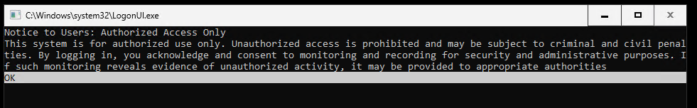

# Symptoms
Azure Local 24H2 deployment is stuck for long time and eventually it will fail with error "RestartHostNode step for 10 hours". 

Or, if you log on to the deployment node (first node in your cluster) via BMC, you may see a legal notice prompt on the screen and ask you to press the `OK` button to acknowledge.

# Issue Validation
Go to admin portal and check the deployment failure. See if it is at RestartHostNode step with "RestartHostNode step for 10 hours" message. If deployment fails due to this cause, it is usually due to this time out error. 

If you don't see any deployment error but still waited hours without seeing progress, you can go check the BMC as described below. 

Go to your deployment node via BMC virtual console and check if there is the legal notice prompt in console window with an `OK` button below the text. If you see the prompt the issue is validated.

# Mitigation

Go to BMC virtual console of your deployment node where you found this legal notice prompt, click that `OK` button using `Enter` key. Once clicked, the deployment process will proceed. 

However, if you monitor the progress from admin portal, you won't be able to see any update automatically refreshes if it is already showing error state with error message. Once deployment is done on your cluster, please raise support ticket to Microsoft to sync the actual deployment status with portal. 