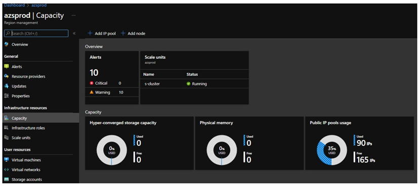
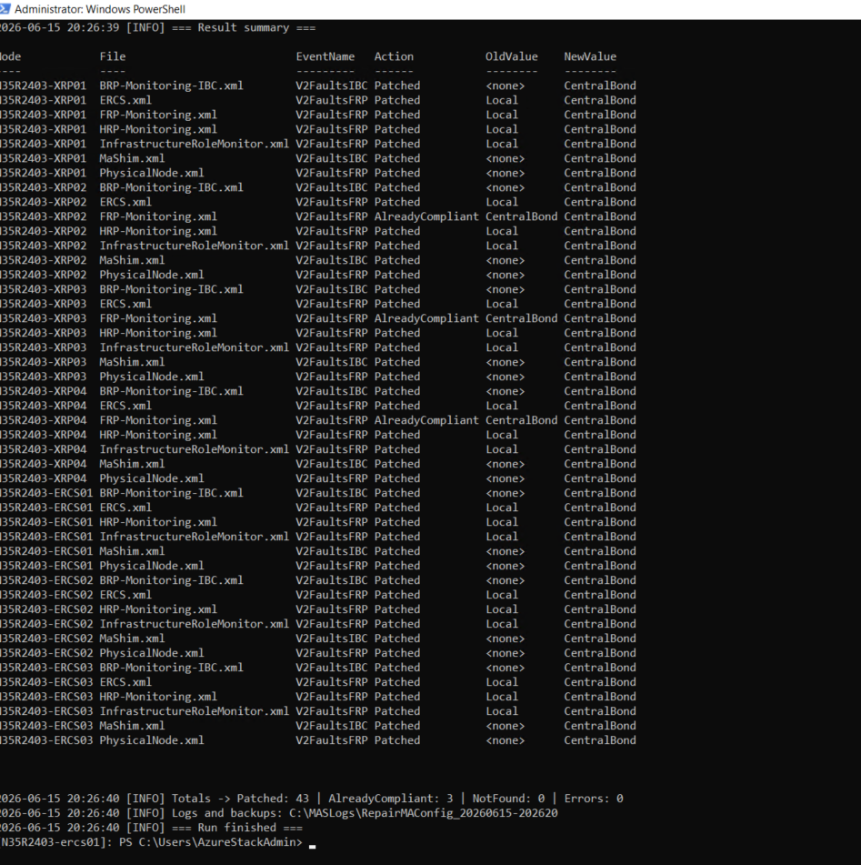

# TSG | Hub Empty Admin Portal Display: Monitoring Agent crash loop

## Table of Contents

- [1. Summary](#1-summary)
- [2. Before you start](#2-before-you-start)
- [3. Behavior & safety](#3-behavior--safety)
- [4. The script](#4-the-script)
- [5. How to run](#5-how-to-run)
- [6. Output / what to share](#6-output--what-to-share)
- [7. Validation — confirm the agent recovers](#7-validation--confirm-the-agent-recovers)
- [8. Rollback](#8-rollback)
- [9. Notes & assumptions](#9-notes--assumptions)

## 1. Summary

On Azure Stack Hub **ERCS** and **XRP** VMs, the Monitoring Agent (MA) **fails to start** and
enters a **crash loop**. The agent's config compiler rejects the init configuration because the
fault event `V2FaultsIBC` is **defined more than once with conflicting `storeType` values** (one
resolves to `Local`/empty, another to `CentralBond`). MA only allows a single, consistent non-table
`storeType` per event name, so configuration compilation fails and **no monitoring runs on the
node** until the conflict is resolved.

A related misconfiguration exists for `V2FaultsFRP` in `FRP-Monitoring.xml` (`storeType` should be
`CentralBond`, not `Local`/empty). This TSG harmonizes **both** fault events to `CentralBond` across
**all** init-config files so the agent compiles and starts cleanly.

### Symptoms
In the Azure Stack Hub Admin Portal under Infrastructure -> Capacity, Physical Memory and Hyper-Converged
Storage Capacity will show zeroes.


In `C:\Monitoring\data\MonAgentHost*.log` (and the MA event-table dumps) you will see this
error repeating every few seconds, with the agent restarting each time:

```
Error: ConfigurationReader - MAEventTable: ... Message:Cannot define an event multiple times with
       different non-table based store types; eventName=V2FaultsIBC
Error: ConfigurationReader - ... Message:CompileEtwEvent(...) failed
Error: ConfigurationReader - ... Message:CompileEventMap() failed
Error: MonAgent - ... Message:Failed to load the configuration file
       C:\Monitoring\agent\initconfig\2.0\Standard\BaseManifest.xml
Error: MonAgentCore.exe - ... Message:Could not start the monitoring agent: mdresult:80040004.
Info : MonAgentManager.exe - MonAgentCore has exited.
```

> The same logs may also show `MetricsExtension` DLL "size mismatch / checksum mismatch" and
> "Expected file ... is missing" errors. Those are **separate** package-integrity warnings and are
> **not** what stops the agent — the fatal, start-blocking error is the `V2FaultsIBC` store-type
> conflict above (`mdresult:0x80040004`).

### Root cause

`V2FaultsIBC` is declared in two places that the compiler merges (MA's `BaseManifest.xml` pulls in
many init-config files). One declaration resolves to `Local` (or empty/inherited) and another to
`CentralBond`. Because `Local` and `CentralBond` are **both non-table store types**, MA treats the
divergence as illegal and aborts the whole config load — taking the entire agent down, not just the
fault events.

### The fix

Set `storeType="CentralBond"` directly on each **`<Event>`** element for `V2FaultsIBC` and
`V2FaultsFRP`, in **every** init-config file that declares them. Per the MA schema (`mds2.xsd`),
`storeType` is a valid attribute on the `<Event>` element (`EtwEventType` → `EventWithNameAndIdType`
→ `EventWithNameType` → `EventBaseType`). Setting it on the `<Event>`:

- **overrides** any value inherited from a parent `<EtwProvider>`, so it deterministically wins;
- affects **only** the target event, never sibling events under the same provider; and
- makes **all** declarations agree on `CentralBond`, which removes the compile-time conflict and
  lets the agent start.

| Event | Files patched | Element set | From | To |
|-------|---------------|-------------|------|-----|
| `V2FaultsIBC` | every `*.xml` under the init-config folder that declares it (e.g. `BRP-Monitoring-IBC.xml`) | `<Event eventName="V2FaultsIBC">` `storeType` | `Local` / empty / inherited | `CentralBond` |
| `V2FaultsFRP` | every `*.xml` that declares it (e.g. `FRP-Monitoring.xml`) | `<Event eventName="V2FaultsFRP">` `storeType` | `Local` / empty / inherited | `CentralBond` |

Init-config folder on each node: `C:\Monitoring\agent\initconfig\2.0\Standard`.

### Example — before / after

`FRP-Monitoring.xml` (attribute already on the `<Event>`):

```xml
<!-- BEFORE -->
<Event id="100" eventName="V2FaultsFRP" storeType="Local" priority="High" duration="PT10S"/>
<!-- AFTER -->
<Event id="100" eventName="V2FaultsFRP" storeType="CentralBond" priority="High" duration="PT10S"/>
```

`BRP-Monitoring-IBC.xml` (storeType was inherited from the provider; we set it explicitly on the
`<Event>` so it wins and no sibling is affected):

```xml
<!-- BEFORE -->
<EtwProvider name="Microsoft-AzureStack-BackupController-Alerts"
        format="EventSource" storeType="Local" account="MASBRPMoniker" priority="High">
  <Event id="7000" eventName="V2FaultsIBC" />
</EtwProvider>
<!-- AFTER -->
<EtwProvider name="Microsoft-AzureStack-BackupController-Alerts"
        format="EventSource" storeType="Local" account="MASBRPMoniker" priority="High">
  <Event id="7000" eventName="V2FaultsIBC" storeType="CentralBond" />
</EtwProvider>
```

> The provider's own `storeType` is intentionally left as-is; the explicit `storeType` on the
> `<Event>` overrides it for `V2FaultsIBC` only. This is the smallest change that resolves the
> conflict without altering any other event's routing.

---

## 2. Before you start

- **Run from the active ERCS VM.** The script's built-in node discovery uses ECEClient, which is
  present on ERCS VMs only. From the ERCS VM the repair script fans out to every xrp/ercs node via
  `Invoke-Command`.
- **Discovery is automatic but needs FullLanguage.** When run on a FullLanguage ERCS VM the script
  discovers the nodes itself. ECEClient discovery uses .NET method calls, so under
  ConstrainedLanguage (CLM) it fails — in that case pass the nodes explicitly via `-NodeNames`
  (§5). The repair/fan-out logic itself is CLM-safe.
- **PowerShell 5.1** is required and sufficient — the script uses only built-in 5.1 features.
- **Permissions:** run in an elevated PowerShell session with an account that can open
  remote PowerShell sessions to the fabric nodes (standard within the fabric trust boundary).
- **No manual agent restart is required.** Because the agent is already crash-looping,
  `MonAgentManager` relaunches `MonAgentCore` every few seconds; the **next** relaunch after the
  config is made consistent will start cleanly and pick up the corrected files. The script does not
  stop or start any service. (See §7 to confirm recovery.)
- **Backups are automatic.** Each file that is modified is backed up:
  - on the node, next to the original as `<file>.<timestamp>.bak`, and
  - copied into the run's log folder as `<NodeName>_<file>_<timestamp>.bak`.

---

## 3. Behavior & safety

- **Resolves the conflict, not just one file.** For each target event, the script scans **every**
  `*.xml` in the init-config folder and harmonizes **all** declarations to `CentralBond`. It does
  not stop at the first file — that is essential, because the crash is caused by a *second*,
  conflicting declaration.
- **Event-level, sibling-safe.** `storeType` is set on the `<Event>` element itself, which overrides
  any inherited provider value and never changes other events.
- **Idempotent:** declarations already effectively `CentralBond` are reported as `AlreadyCompliant`
  and left untouched.
- **Handles missing/empty/inherited `storeType`:** the explicit `CentralBond` is applied whether the
  current value on the event tag is `Local`, empty, or absent (inherited from the provider).
- **ConstrainedLanguage-safe:** runs under Hub WDAC/AppLocker CLM (cmdlets + operators only; no
  `New-Object`, XML DOM, or .NET static methods).
- **`-DryRun` switch:** reports exactly what *would* change without writing anything.
- **Robust logging:** every run produces a self-contained, shareable folder under
  `C:\MASLogs\RepairMAConfig_<timestamp>\` containing a transcript, a line log, a CSV and JSON
  result summary, and all backups.

---

## 4. The script

If PowerShell is running in **FullLanguage** mode on the active ERCS VM, you can use the following script to discover the XRP and ERCS nodes. If the host is in ConstrainedLanguage mode (CLM), ECEClient discovery will fail — in that case, supply the node names explicitly via `-NodeNames` (see §5).


```powershell
Import-Module -Name ECEClient.psm1 -Verbose:$false -DisableNameChecking
$eceClient      = Create-ECEClientWithApplicationGateway
$null           = $eceClient.GetActionPlanInstances().GetAwaiter().GetResult()
$customerConfig = [xml] $eceClient.GetCloudDefinition().GetAwaiter().GetResult().CloudDefinitionAsXmlString

$customerConfig.CustomerConfiguration.Role.Roles.Role.Roles.Role.Nodes.Node |
    Where-Object { $_.Name -match 'xrp' -or $_.Name -match 'ercs' } |
    ForEach-Object { $_.Name } |
    Select-Object -Unique
```

This yields the fabric's xrp/ercs nodes. The exact count varies by stamp — there may be any number
of xrp and ercs VMs (e.g. `<prefix>-Xrp01 … <prefix>-XrpNN`, `<prefix>-ERCS01 … <prefix>-ERCSNN`).

Save the following as `Repair-MAFaultStoreType.ps1` on the active ERCS VM.
```powershell
#requires -Version 5.1
<#
.SYNOPSIS
    Resolves the Monitoring Agent (MA) start failure caused by conflicting 'storeType'
    declarations of the V2FaultsIBC (and V2FaultsFRP) events. Harmonizes every declaration
    across all init-config files to CentralBond on Azure Stack Hub xrp/ercs nodes.

.DESCRIPTION
    Run on the active ERCS VM. Discovers xrp/ercs nodes via ECEClient (or accepts an explicit
    -NodeNames list), then uses Invoke-Command to scan each node's init-config folder for every
    *.xml that declares a target event and sets storeType="CentralBond" on the matching <Event>
    element. Setting storeType on the <Event> overrides any inherited provider value and never
    affects sibling events. Produces a timestamped, shareable log folder with transcript, line
    log, CSV/JSON summary, and node-labeled backups.

    Use -Rollback to reverse a previous run: it restores each init-config file from its most recent
    node-local *.xml.<timestamp>.bak backup instead of patching.

    ConstrainedLanguage (CLM) compatibility: the patch + fan-out logic uses only cmdlets,
    operators (-match/-replace/-split) and plain arrays/[pscustomobject] -- no New-Object, no
    [xml] DOM, no [regex]/[string] static methods. ECEClient discovery, however, uses .NET method
    calls and requires FullLanguage; if the host is in CLM, pass -NodeNames explicitly instead.
    When launching with -Command, pass -NodeNames @('node1','node2',...) as a normal array; the

.PARAMETER NodeNames
    Optional. Explicit list of node names to process. If omitted, the script discovers xrp/ercs
    nodes via ECEClient on the ERCS VM (requires FullLanguage).

.PARAMETER EventNames
    Event names to harmonize to CentralBond. Default: V2FaultsIBC, V2FaultsFRP.

.PARAMETER ConfigPath
    Folder on each node holding the MA init-config files.
    Default: C:\Monitoring\agent\initconfig\2.0\Standard

.PARAMETER LogRoot
    Root folder for run output. Default: C:\MASLogs

.PARAMETER DryRun
    Report what would change without modifying any files. Works for both the repair and
    -Rollback modes (shows what would be patched / what would be restored).

.PARAMETER Rollback
    Restore mode. Instead of patching, restores each init-config file from its most recent
    node-local backup (the *.xml.<timestamp>.bak files the repair created next to the original).
    Combine with -DryRun to preview which files would be restored. NOTE: rolling back re-introduces
    the conflicting declaration and will return the node to the MA crash loop -- only use when
    directed by escalation.

.EXAMPLE
    .\Repair-MAFaultStoreType.ps1 -DryRun

.EXAMPLE
    .\Repair-MAFaultStoreType.ps1

.EXAMPLE
    .\Repair-MAFaultStoreType.ps1 -NodeNames '<prefix>-XRP01','<prefix>-ERCS01' -DryRun

.EXAMPLE
    .\Repair-MAFaultStoreType.ps1 -NodeNames '<prefix>-XRP01','<prefix>-ERCS01' -Rollback -DryRun

.EXAMPLE
    .\Repair-MAFaultStoreType.ps1 -NodeNames '<prefix>-XRP01','<prefix>-ERCS01' -Rollback
#>
[CmdletBinding()]
param(
    [string[]] $NodeNames,
    [string[]] $EventNames = @('V2FaultsIBC', 'V2FaultsFRP'),
    [string]   $ConfigPath = 'C:\Monitoring\agent\initconfig\2.0\Standard',
    [string]   $LogRoot    = 'C:\MASLogs',
    [switch]   $DryRun,
    [switch]   $Rollback
)

$ErrorActionPreference = 'Stop'

# --- Run folder & logging setup ------------------------------------------------
$runStamp     = Get-Date -Format 'yyyyMMdd-HHmmss'
$runFolder    = Join-Path $LogRoot ("RepairMAConfig_$runStamp")
$backupFolder = Join-Path $runFolder 'backups'
$transcript   = Join-Path $runFolder 'transcript.log'
$logFile      = Join-Path $runFolder 'run.log'
$csvFile      = Join-Path $runFolder 'results.csv'
$jsonFile     = Join-Path $runFolder 'results.json'

New-Item -ItemType Directory -Path $runFolder    -Force | Out-Null
New-Item -ItemType Directory -Path $backupFolder -Force | Out-Null

function Write-Log {
    param([string] $Message, [string] $Level = 'INFO')
    $line = "{0} [{1}] {2}" -f (Get-Date -Format 'yyyy-MM-dd HH:mm:ss'), $Level, $Message
    switch ($Level) {
        'ERROR' { Write-Host $line -ForegroundColor Red }
        'WARN'  { Write-Host $line -ForegroundColor Yellow }
        default { Write-Host $line }
    }
    Add-Content -LiteralPath $logFile -Value $line
}

try { Start-Transcript -Path $transcript -Force | Out-Null } catch { }

Write-Log "=== MA Config Repair run started ==="
Write-Log "Run folder : $runFolder"
Write-Log "ConfigPath : $ConfigPath"
Write-Log "Events     : $($EventNames -join ', ')"
Write-Log ("Operation  : {0}" -f $(if ($Rollback) { 'ROLLBACK (restore latest backup)' } else { 'REPAIR (set storeType=CentralBond)' }))
Write-Log ("Mode       : {0}" -f $(if ($DryRun) { 'DRY RUN (no changes will be written)' } else { 'APPLY' }))

# --- Remote patch scriptblock (runs on each node) ------------------------------
# ConstrainedLanguage-safe: uses only cmdlets + operators (-match/-replace/-split), plain
# arrays, and [pscustomobject]. No New-Object, no [xml] DOM, no [regex]/[string] static calls.
# Scans every *.xml in $ConfigPath. For each target event, ensures storeType="CentralBond"
# directly on the <Event> element (overrides provider inheritance; sibling-safe). Harmonizing
# ALL declarations is required because the MA crash is caused by conflicting declarations across
# files. Returns one result row per (file, event) plus per-file backup content for changes.
# Assumptions (true for MA init-config): <Event> tags are single-line, attributes double-quoted.
$remoteScript = {
    param($ConfigPath, $EventNames, $DryRun)

    $ErrorActionPreference = 'Stop'
    $results = @()

    function New-Row {
        param($File, $Path, $EventName, $Occurrences, $OldValue, $Action, $Changed, $Backup, $Original, $ErrorMsg)
        [pscustomobject]@{
            Node             = $env:COMPUTERNAME
            File             = $File
            Path             = $Path
            EventName        = $EventName
            Occurrences      = $Occurrences
            OldValue         = $OldValue
            NewValue         = 'CentralBond'
            Action           = $Action
            Changed          = $Changed
            BackupPathOnNode = $Backup
            OriginalContent  = $Original
            Error            = $ErrorMsg
        }
    }

    # Inspect the opening <Event> tags for an event name; return occurrence count + storeType
    # values found directly on the tag ('<none>' when the attribute is absent / inherited).
    function Get-EventInfo {
        param($Text, $EN)
        $occ  = 0
        $olds = @()
        $segs = $Text -split '<Event\b'
        $i = 1
        while ($i -lt $segs.Count) {
            $tag = ($segs[$i] -split '>', 2)[0]
            if ($tag -match ('eventName="' + $EN + '"')) {
                $occ = $occ + 1
                if ($tag -match 'storeType="([^"]*)"') {
                    $v = $Matches[1]
                    if ($v) { $olds += $v } else { $olds += '<empty>' }
                }
                else {
                    $olds += '<none>'
                }
            }
            $i = $i + 1
        }
        [pscustomobject]@{ Occurrences = $occ; Olds = $olds }
    }

    if (-not (Test-Path -LiteralPath $ConfigPath)) {
        $results += (New-Row '(configpath)' $ConfigPath $null 0 $null 'ConfigPathMissing' $false $null $null "ConfigPath not found: $ConfigPath")
        return $results
    }

    $files = Get-ChildItem -LiteralPath $ConfigPath -Filter *.xml -File -ErrorAction SilentlyContinue
    foreach ($f in $files) {
        $path = $f.FullName

        $originalText = $null
        try { $originalText = Get-Content -LiteralPath $path -Raw } catch { continue }
        if (-not $originalText) { continue }

        # Fast text pre-filter: only process files that mention at least one target event.
        $relevant = $false
        foreach ($en in $EventNames) {
            if ($originalText -match ('eventName="' + $en + '"')) { $relevant = $true; break }
        }
        if (-not $relevant) { continue }

        $working     = $originalText
        $pendingRows = @()

        foreach ($eventName in $EventNames) {
            $info = Get-EventInfo $working $eventName
            if ($info.Occurrences -eq 0) { continue }

            $oldJoined  = ($info.Olds -join ', ')
            $needChange = @($info.Olds | Where-Object { $_ -ne 'CentralBond' }).Count -gt 0

            if (-not $needChange) {
                $pendingRows += (New-Row $f.Name $path $eventName $info.Occurrences $oldJoined 'AlreadyCompliant' $false $null $null $null)
                continue
            }

            if ($DryRun) {
                $pendingRows += (New-Row $f.Name $path $eventName $info.Occurrences $oldJoined 'WouldChange' $false $null $null $null)
                continue
            }

            # Three scoped -replace passes per event (CLM-safe; operate on the raw tag text):
            #  1a) storeType before eventName -> normalize value to CentralBond
            #  1b) eventName before storeType -> normalize value to CentralBond
            #  2)  no storeType on the tag      -> insert storeType="CentralBond" after eventName
            $p1a = '(<Event\b[^>]*\bstoreType=")[^"]*("[^>]*\beventName="' + $eventName + '"[^>]*?/?>)'
            $p1b = '(<Event\b[^>]*\beventName="' + $eventName + '"[^>]*\bstoreType=")[^"]*("[^>]*?/?>)'
            $p2  = '(<Event\b(?![^>]*\bstoreType=)[^>]*\beventName="' + $eventName + '")([^>]*?/?>)'

            $before  = $working
            $working = $working -replace $p1a, '${1}CentralBond${2}'
            $working = $working -replace $p1b, '${1}CentralBond${2}'
            $working = $working -replace $p2,  '${1} storeType="CentralBond"${2}'

            if ($working -ne $before) {
                $pendingRows += (New-Row $f.Name $path $eventName $info.Occurrences $oldJoined 'Patched' $true $null $null $null)
            }
            else {
                $pendingRows += (New-Row $f.Name $path $eventName $info.Occurrences $oldJoined 'NoChange' $false $null $null 'Pattern did not match; tag shape may be unexpected (multi-line or single-quoted attributes).')
            }
        }

        # Save once per file, with a single node-local backup, if the text changed.
        if (($working -ne $originalText) -and -not $DryRun) {
            $stamp  = Get-Date -Format 'yyyyMMdd-HHmmss'
            $backup = "$path.$stamp.bak"
            Copy-Item -LiteralPath $path -Destination $backup -Force
            Set-Content -LiteralPath $path -Value $working -Encoding UTF8 -NoNewline

            # Attach backup + original content to the first changed row for this file.
            $j = 0
            while ($j -lt $pendingRows.Count) {
                if ($pendingRows[$j].Changed) {
                    $pendingRows[$j].BackupPathOnNode = $backup
                    $pendingRows[$j].OriginalContent  = $originalText
                    break
                }
                $j = $j + 1
            }
        }

        foreach ($row in $pendingRows) { $results += $row }
    }

    if (@($results).Count -eq 0) {
        $results += (New-Row '(none)' $ConfigPath ($EventNames -join ',') 0 $null 'EventNotFound' $false $null $null 'No init-config file declared the target event(s).')
    }

    return $results
}

# --- Remote rollback scriptblock (runs on each node) ---------------------------
# ConstrainedLanguage-safe: cmdlets + operators only. Restores each init-config file from its
# most recent node-local backup (the *.xml.<timestamp>.bak files the repair created). Returns one
# result row per restored (or would-be-restored) file.
$rollbackScript = {
    param($ConfigPath, $DryRun)

    $ErrorActionPreference = 'Stop'
    $results = @()

    function New-RbRow {
        param($File, $Path, $Action, $Changed, $Backup, $ErrorMsg)
        [pscustomobject]@{
            Node             = $env:COMPUTERNAME
            File             = $File
            Path             = $Path
            EventName        = $null
            Occurrences      = 0
            OldValue         = $null
            NewValue         = $null
            Action           = $Action
            Changed          = $Changed
            BackupPathOnNode = $Backup
            OriginalContent  = $null
            Error            = $ErrorMsg
        }
    }

    if (-not (Test-Path -LiteralPath $ConfigPath)) {
        $results += (New-RbRow '(configpath)' $ConfigPath 'ConfigPathMissing' $false $null "ConfigPath not found: $ConfigPath")
        return $results
    }

    # Repair backups are named '<original>.<yyyyMMdd-HHmmss>.bak' next to the original.
    $baks = Get-ChildItem -LiteralPath $ConfigPath -Filter *.bak -File -ErrorAction SilentlyContinue |
            Where-Object { $_.Name -match '\.xml\.\d{8}-\d{6}\.bak$' }
    if (@($baks).Count -eq 0) {
        $results += (New-RbRow '(none)' $ConfigPath 'NoBackup' $false $null 'No repair backups (*.xml.<timestamp>.bak) found on this node.')
        return $results
    }

    # Distinct original files; for each, restore the most recent backup.
    $origs = $baks | ForEach-Object { $_.FullName -replace '\.\d{8}-\d{6}\.bak$', '' } | Select-Object -Unique
    foreach ($orig in $origs) {
        $latest = $baks |
            Where-Object { ($_.FullName -replace '\.\d{8}-\d{6}\.bak$', '') -eq $orig } |
            Sort-Object LastWriteTime -Descending | Select-Object -First 1
        $fileName = Split-Path $orig -Leaf

        if ($DryRun) {
            $results += (New-RbRow $fileName $orig 'WouldRollBack' $false $latest.FullName $null)
            continue
        }
        try {
            Copy-Item -LiteralPath $latest.FullName -Destination $orig -Force
            $results += (New-RbRow $fileName $orig 'RolledBack' $true $latest.FullName $null)
        }
        catch {
            $results += (New-RbRow $fileName $orig 'Error' $false $latest.FullName $_.Exception.Message)
        }
    }

    return $results
}

# --- Node discovery ------------------------------------------------------------
# If no nodes were supplied, discover xrp/ercs nodes via ECEClient on the ERCS VM.
# NOTE: ECEClient discovery uses .NET method calls ([xml] cast, GetAwaiter().GetResult()) and
# therefore requires FullLanguage. If the host is in ConstrainedLanguage mode, this will fail --
# pass -NodeNames explicitly instead (the fan-out/patch logic below is CLM-safe).
if (-not $NodeNames -or $NodeNames.Count -eq 0) {
    Write-Log "No -NodeNames supplied; discovering xrp/ercs nodes via ECEClient (requires FullLanguage)..."
    try {
        Import-Module -Name ECEClient.psm1 -Verbose:$false -DisableNameChecking
        $eceClient      = Create-ECEClientWithApplicationGateway
        $null           = $eceClient.GetActionPlanInstances().GetAwaiter().GetResult()
        $customerConfig = [xml] $eceClient.GetCloudDefinition().GetAwaiter().GetResult().CloudDefinitionAsXmlString
        $NodeNames = $customerConfig.CustomerConfiguration.Role.Roles.Role.Roles.Role.Nodes.Node |
            Where-Object { $_.Name -match 'xrp' -or $_.Name -match 'ercs' } |
            ForEach-Object { $_.Name } |
            Select-Object -Unique
    }
    catch {
        Write-Log "Node discovery via ECEClient failed: $($_.Exception.Message)" 'ERROR'
        Write-Log "Run on the active ERCS VM (FullLanguage), or supply nodes explicitly with -NodeNames." 'ERROR'
        try { Stop-Transcript | Out-Null } catch { }
        throw
    }
}

if (-not $NodeNames -or $NodeNames.Count -eq 0) {
    Write-Log "No xrp/ercs nodes found to process. Nothing to do." 'WARN'
    try { Stop-Transcript | Out-Null } catch { }
    return
}

Write-Log ("Processing {0} node(s): {1}" -f $NodeNames.Count, ($NodeNames -join ', '))

# --- Fan out to each node ------------------------------------------------------
$allResults = @()

foreach ($node in $NodeNames) {
    Write-Log "----- Processing node: $node -----"
    try {
        if ($Rollback) {
            $nodeResults = Invoke-Command -ComputerName $node -ScriptBlock $rollbackScript `
                            -ArgumentList $ConfigPath, $DryRun.IsPresent
        }
        else {
            $nodeResults = Invoke-Command -ComputerName $node -ScriptBlock $remoteScript `
                            -ArgumentList $ConfigPath, $EventNames, $DryRun.IsPresent
        }

        foreach ($res in $nodeResults) {
            # Persist a node-labeled backup into the run folder for any file we changed.
            if ($res.Changed -and $res.OriginalContent) {
                $bkName = "{0}_{1}_{2}.bak" -f $res.Node, $res.File, $runStamp
                $bkPath = Join-Path $backupFolder $bkName
                Set-Content -LiteralPath $bkPath -Value $res.OriginalContent -Encoding UTF8 -NoNewline
                Write-Log "Backup saved: $bkPath"
            }

            $msgLevel = if ($res.Action -in @('Error','ConfigPathMissing','NoChange')) { 'ERROR' }
                        elseif ($res.Action -in @('EventNotFound','NoBackup')) { 'WARN' }
                        else { 'INFO' }
            Write-Log ("[{0}] {1} / {2}: {3} (storeType='{4}' -> '{5}', occurrences={6}){7}" -f `
                        $res.Node, $res.File, $res.EventName, $res.Action, $res.OldValue, `
                        $res.NewValue, $res.Occurrences, $(if ($res.Error) { " error=$($res.Error)" } else { '' })) $msgLevel

            # Drop the large OriginalContent before storing in summary.
            $allResults += ($res | Select-Object Node,File,Path,EventName,Occurrences,OldValue,NewValue,Action,Changed,BackupPathOnNode,Error)
        }
    }
    catch {
        Write-Log "Failed to process node '$node': $($_.Exception.Message)" 'ERROR'
        $allResults += [pscustomobject]@{
            Node = $node; File = '(connection)'; Path = $null; EventName = $null; Occurrences = 0
            OldValue = $null; NewValue = $null; Action = 'NodeError'; Changed = $false
            BackupPathOnNode = $null; Error = $_.Exception.Message
        }
    }
}

# --- Summaries -----------------------------------------------------------------
$allResults | Export-Csv -LiteralPath $csvFile -NoTypeInformation -Encoding UTF8
$allResults | ConvertTo-Json -Depth 5 | Set-Content -LiteralPath $jsonFile -Encoding UTF8

Write-Log "=== Result summary ==="
$allResults | Format-Table Node, File, EventName, Action, OldValue, NewValue, Changed -AutoSize | Out-String | ForEach-Object { Write-Host $_ }

$changed   = @($allResults | Where-Object { $_.Changed }).Count
$compliant = @($allResults | Where-Object { $_.Action -eq 'AlreadyCompliant' }).Count
$errors    = @($allResults | Where-Object { $_.Action -in @('Error','NodeError','ConfigPathMissing') }).Count
$missing   = @($allResults | Where-Object { $_.Action -in @('EventNotFound','NoBackup') }).Count

if ($Rollback) {
    Write-Log ("Totals -> RolledBack: {0} | NoBackup/NotFound: {1} | Errors: {2}" -f $changed, $missing, $errors)
}
else {
    Write-Log ("Totals -> Patched: {0} | AlreadyCompliant: {1} | NotFound: {2} | Errors: {3}" -f $changed, $compliant, $missing, $errors)
}
if ($DryRun) { Write-Log "DRY RUN complete. No files were modified." 'WARN' }
Write-Log "Logs and backups: $runFolder"
Write-Log "=== Run finished ==="

try { Stop-Transcript | Out-Null } catch { }
```

---

## 5. How to run

> **ConstrainedLanguage mode (CLM):** Hub nodes enforce CLM. The repair/fan-out logic is CLM-safe,
> but **ECEClient auto-discovery requires FullLanguage**. If the host is FullLanguage, just run the
> script and it discovers the nodes itself. If it is in CLM (or discovery fails), pass `-NodeNames`
> explicitly. If a PowerShell profile interferes with command resolution, launch from `cmd`/RDP
> with `powershell.exe -NoProfile -ExecutionPolicy Bypass -Command "& '<path>' ..."`; the
> `-Command` form lets you pass `-NodeNames @('node1','node2',...)` as a normal
> array.

1. **RDP / connect to the active ERCS VM** and open an **elevated** PowerShell 5.1 console.
2. Copy `Repair-MAFaultStoreType.ps1` to a working folder (e.g. `C:\Users\AzureStackAdmin`).
3. **Preview first (recommended)** — auto-discover nodes (FullLanguage ERCS VM):
   ```powershell
   Set-Location C:\Users\AzureStackAdmin
   .\Repair-MAFaultStoreType.ps1 -DryRun
   ```
   Review the summary table. You should see at least one `WouldChange` row for `V2FaultsIBC`
   (the declaration causing the crash) and possibly one for `V2FaultsFRP`. If a file is already
   correct it shows `AlreadyCompliant` — **do not stop there**: the conflict requires every
   declaration to be `CentralBond`, which is exactly what the apply step enforces.
4. **Apply the fix** by re-running without `-DryRun`:
   ```powershell
   .\Repair-MAFaultStoreType.ps1
   ```
5. **If auto-discovery is unavailable** (host in CLM, ECEClient missing, or a profile breaks the
   `.\...` form), launch a clean process with `-NoProfile` and the `-Command` form, passing
   `-NodeNames` as an explicit `@(...)` array. List **all** xrp and ercs nodes (there may be any
   number of each):
   ```powershell
   powershell.exe -NoProfile -ExecutionPolicy Bypass -Command "& '<script-path>\Repair-MAFaultStoreType.ps1' -DryRun -NodeNames @('<prefix>-Xrp01','<prefix>-Xrp02', ... ,'<prefix>-XrpNN','<prefix>-ERCS01','<prefix>-ERCS02', ... ,'<prefix>-ERCSNN')"
   ```
   Then apply by re-running the same command **without** `-DryRun`:
   ```powershell
   powershell.exe -NoProfile -ExecutionPolicy Bypass -Command "& '<script-path>\Repair-MAFaultStoreType.ps1' -NodeNames @('<prefix>-Xrp01','<prefix>-Xrp02', ... ,'<prefix>-XrpNN','<prefix>-ERCS01','<prefix>-ERCS02', ... ,'<prefix>-ERCSNN')"
   ```

---

## 6. Output / what to share

Everything is written to a single self-contained folder:

```
C:\MASLogs\RepairMAConfig_<timestamp>\
├── transcript.log                         # full console transcript
├── run.log                                # timestamped line log
├── results.csv                            # per-node, per-file, per-event outcome
├── results.json                           # same data as JSON
└── backups\
    └── <Node>_<File>_<timestamp>.bak      # one per modified file per node
```

To escalate or attach to a case, **zip the entire run folder** and share it:

```powershell
Compress-Archive -Path 'C:\MASLogs\RepairMAConfig_<timestamp>' -DestinationPath 'C:\MASLogs\RepairMAConfig_<timestamp>.zip'
```

### Action values you may see

| Action | Meaning |
|--------|---------|
| `Patched` | `storeType` set to `CentralBond` on the `<Event>`; file backed up. |
| `WouldChange` | (Dry run) would be patched. |
| `AlreadyCompliant` | This declaration already resolves to `CentralBond`; left unchanged. |
| `RolledBack` | (`-Rollback`) file restored from its most recent `*.xml.<timestamp>.bak`. |
| `WouldRollBack` | (`-Rollback -DryRun`) would be restored from the named backup. |
| `NoBackup` | (`-Rollback`) no repair backups were found on the node to restore from. |
| `EventNotFound` | No init-config file declared the target event(s) on the node. |
| `ConfigPathMissing` | The init-config folder did not exist on the node. |
| `NoChange` | The event was found but the tag shape was unexpected (multi-line or single-quoted attributes) so no edit was applied — inspect the file manually. |
| `Error` | Per-file failure (see `Error` column / log). |
| `NodeError` | Could not connect to / run on the node. |

### Example Output Screenshot

---

## 7. Validation — confirm the agent recovers

The fix is only complete when MA **starts cleanly** and the conflict error stops. Confirm both the
config state **and** agent recovery.

**a) Confirm every declaration is now `CentralBond`:**

```powershell
$node = '<prefix>-XRP01'
Invoke-Command -ComputerName $node -ScriptBlock {
    $base = 'C:\Monitoring\agent\initconfig\2.0\Standard'
    foreach ($en in 'V2FaultsIBC','V2FaultsFRP') {
        Get-ChildItem -LiteralPath $base -Filter *.xml -File | ForEach-Object {
            $raw = Get-Content -LiteralPath $_.FullName -Raw
            if ($raw -and ($raw -match ('eventName="' + $en + '"'))) {
                $segs = $raw -split '<Event\b'
                $i = 1
                while ($i -lt $segs.Count) {
                    $tag = ($segs[$i] -split '>', 2)[0]
                    if ($tag -match ('eventName="' + $en + '"')) {
                        $st = '<none>'
                        if ($tag -match 'storeType="([^"]*)"') { $st = $Matches[1] }
                        [pscustomobject]@{ Node = $env:COMPUTERNAME; File = $_.Name; Event = $en; storeType = $st }
                    }
                    $i = $i + 1
                }
            }
        }
    }
}
```

Expected `storeType` for every row: **`CentralBond`**. (CLM-safe: text-only, no XML DOM.)

**b) Confirm the agent is no longer crash-looping.** After the next relaunch (within ~10s), the
fatal config error should stop appearing and `MonAgentCore` should stay up:

```powershell
$node = '<prefix>-XRP01'
Invoke-Command -ComputerName $node -ScriptBlock {
    # MonAgentCore should be present and stable (not restarting every few seconds).
    Get-Process MonAgentCore -ErrorAction SilentlyContinue |
        Select-Object Name, Id, StartTime

    # The fatal config error should no longer appear after the fix timestamp.
    $log = Get-ChildItem 'C:\Monitoring\data\MonAgentHost*.log' -ErrorAction SilentlyContinue |
           Sort-Object LastWriteTime -Descending | Select-Object -First 1
    if ($log) {
        Select-String -LiteralPath $log.FullName -Pattern 'Cannot define an event multiple times' |
            Select-Object -Last 3
    }
}
```

- **Healthy:** a single stable `MonAgentCore` process whose `StartTime` stops advancing, and no new
  `Cannot define an event multiple times` lines after the fix.
- **Still failing:** if the error persists, another file still declares the event with a different
  store type — re-run the script (it scans all files) and re-check, or inspect `results.csv` for any
  declaration not reported as `Patched`/`AlreadyCompliant`.

> No manual restart is needed: the crash-looping agent self-recovers on its next relaunch once the
> configuration is consistent. Only escalate to a manual MA service restart if recovery does not
> occur after the config is confirmed correct.

---

## 8. Rollback

The script can reverse a previous run with the **`-Rollback`** switch. In rollback mode it skips
patching and instead restores each init-config file from its **most recent node-local backup**
(the `*.xml.<timestamp>.bak` files the repair created next to each original). Node discovery,
fan-out, logging and the `-DryRun` preview all work exactly as in repair mode.

**a) Preview the rollback first (no changes written):**

```powershell
.\Repair-MAFaultStoreType.ps1 -Rollback -DryRun
```

Rows show `WouldRollBack` with the backup that would be restored.

**b) Perform the rollback:**

```powershell
.\Repair-MAFaultStoreType.ps1 -Rollback
```

Restored files report `RolledBack`; nodes with no repair backups report `NoBackup`.

**c) From a clean process / when nodes are known (CLM-safe), pass nodes explicitly:**

```powershell
powershell.exe -NoProfile -ExecutionPolicy Bypass -Command "& 'C:\Temp\Repair-MAFaultStoreType.ps1' -Rollback -NodeNames @('<prefix>-XRP01','<prefix>-ERCS01')"
```

The run folder backups (`backups\<Node>_<File>_<ts>.bak`) remain available if you need to restore a
specific older version manually — copy the desired `.bak` content back to
`C:\Monitoring\agent\initconfig\2.0\Standard\<File>` on the corresponding node.

> Note: rolling back re-introduces the conflicting declaration and will return the node to the MA
> crash loop. Only roll back if directed by escalation.

---

## 9. Notes & assumptions

- The fatal, start-blocking error is the `V2FaultsIBC` store-type **conflict**
  (`mdresult:0x80040004`). The `MetricsExtension` DLL mismatch / "Expected file ... missing"
  messages in the same log are separate package-integrity warnings and are not addressed here.
- The fix is applied on the **`<Event>`** element because an event-level `storeType` overrides the
  inherited provider value and cannot affect sibling events — the safest way to make all
  declarations agree.
- The script scans **all** `*.xml` in the init-config folder for each event because the conflict is
  caused by a *second* declaration; fixing only one file would not clear the crash.
- **ConstrainedLanguage (CLM) compatible.** Azure Stack Hub nodes enforce CLM (WDAC/AppLocker), so
  the patch and fan-out logic use only cmdlets, operators (`-match`/`-replace`/`-split`), plain
  arrays and `[pscustomobject]` — no `New-Object`, no `[xml]` DOM, no `[regex]`/`[string]` static
  methods. The `<Event>` edit is done with scoped text `-replace` passes rather than XML DOM.
- **Tag-shape assumptions:** the text edit expects each `<Event>` tag on a **single line** with
  **double-quoted** attributes (true for MA init-config). Tags that don't match are reported as
  `NoChange` (not silently skipped) so they can be inspected manually.
- **Encoding/BOM:** files are saved with `Set-Content -Encoding UTF8 -NoNewline` (UTF-8, which the
  MA parser accepts). A UTF-8 BOM may be added; validate via the agent-recovery check in Section 7.
- **Node discovery is built into the script.** When `-NodeNames` is omitted it discovers xrp/ercs
  nodes via ECEClient on the ERCS VM. ECEClient relies on .NET method calls that are blocked under
  CLM, so auto-discovery needs FullLanguage; the repair/fan-out logic stays CLM-safe regardless.
  When launching a clean process, use `powershell.exe -NoProfile -ExecutionPolicy Bypass -Command
  "& '<path>' -NodeNames @('node1','node2',...)"`; the `-Command` form accepts a normal `@(...)`
  array.
- The script is **idempotent** and safe to re-run.
- Auto-discovery requires running on an **ERCS** VM (ECEClient is not present on XRP VMs); if the
  host is in CLM or you already know the node names, pass them straight to `-NodeNames`.
