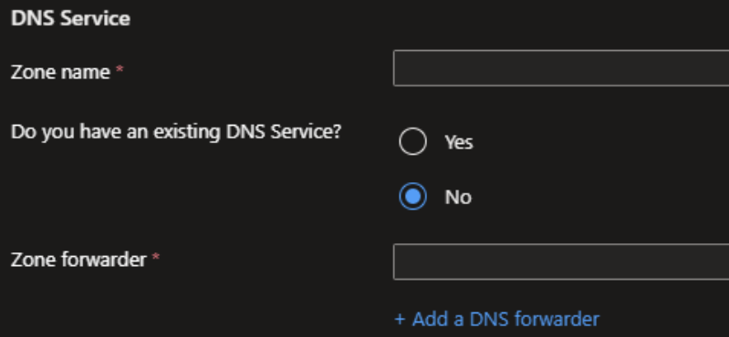
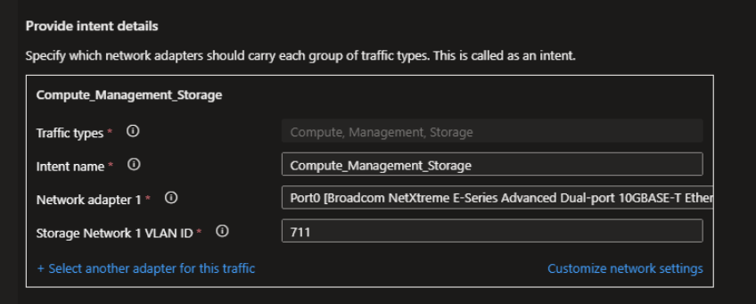
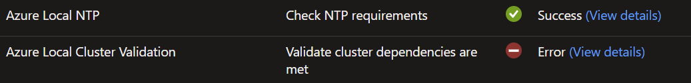

# Azure Local Deployment using Local Identity (with No External DNS)


<table border="1" cellpadding="6" cellspacing="0" style="border-collapse:collapse; margin-bottom:1em;">
  <tr>
    <th style="text-align:left; width: 180px;">Component</th>
    <td><strong>Azure Local</strong></td>
  </tr>
  <tr>
    <th style="text-align:left; width: 180px;">Topic</th>
    <td><strong>Azure Local Deployment using Local Identity</strong>: with No External DNS</td>
  </tr>
  <tr>
    <th style="text-align:left; width: 180px;">Applicable Scenarios</th>
    <td><strong>Azure Local Deployment using Local Identity</strong>: with No External DNS, with DNS Forwarder, with Internal DNS</td>
  </tr>
</table>

## Overview
Azure Local Deployment with Local Identity Supports deployment without Active Directory and No External DNS within the local network.

In the DNS Service configuration during Azure Local Deployment, there are 2 options:
- Yes - there is an existing DNS
- No - thjere is NO existing DNS



## What and Why
When there is **NO** existing DNS, the initial network validation will depends on mDNS service to resolve the hostname to IP address for the selected server nodes. The Zone Name intended for the Azure Local Deployment may be different from the existing DNS Suffix defaulted on the network interface. The DNS Suffix can be:

1) Empty - mDNS service will append ".LOCAL" to the hostname as the FQDN
2) Gateway/Router provided DNS Suffix - the local network will pick up the DNS Suffix from the internet facing gateway default. This DNS Suffix can be internet service provider specific and different from the intended Zone Name.
3) User Specific DNS Suffix - User can specify a DNS Suffix on the network interface, or if they can update the gateway/router default to the Zone name specified in the DNS Service configuration during Azure Local Deployment.

With (1) and (2), the Azure local deployment will fail on the deployment validation since the network DNS Suffix is different from the one entered in the DNS Service configuration.

User should prepare as in (3), setting up the local network gateway or the server node network interface with the intended DNS Suffix before proceeding with deployment.

## When to use this Guide
With Azure Local deployment using Local Identity with No External DNS, the server hosts need an to be able to have a valid DNS Suffix that match the Zone Name in the deployment configuration in the Azure Portal.

## DNS Suffix setup before deployment
The following setup should be done after the OS is setup and network is configured on each node.

For Gateway setting, refer to your gateway provider manual. Setting DNS Suffix or 
For Network interface setting (for **EACH** server host):

```
# Powershell
Get-DnsClient

# Set the network interface that will be used in deployment
Set-DnsClient -InterfaceIndex <specific-interace-index> -ConnectionSpecificSuffix "<Your Zone Name, example: store1.contoso.com>"
```
Note: the DNS Suffix should be set up on the network adapter select for the primary intent.


## Verification
Check the DNS Client and the DNS Suffix should be listed in the "Connection Specific Suffix" parameter for the specific network interface alias.
```
# Powershell
Get-DnsClient
```

## Deployment Failure Symptom - if DNS Suffix is not setup on the server hosts
During Deployment, there will be an validation Error on Azure Local Cluster Validation:


When opening the details, there will be error with error code and the error detail will have info about "WinRM client cannot process the request"

## Root Cause
The error is cause by not having the correct DNS Suffix on the server hosts.

## Resolution
See section "DNS Suffix setup before deployment" in this document.