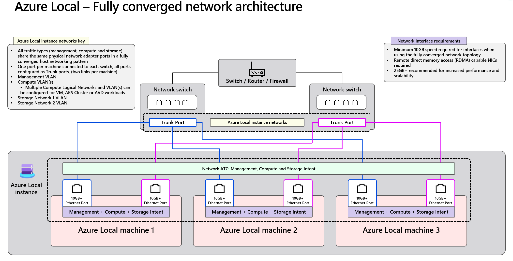

# Azure Local - Fully Converged Physical Network Design [Draft]

- [Azure Local - Fully Converged Physical Network Design](#azure-local---fully-converged-physical-network-design)
  - [Overview](#overview)
  - [Key Components](#key-components)
  - [Network Design Comparison: Fully Converged vs Switched vs Switchless](#network-design-comparison-fully-converged-vs-switched-vs-switchless)
  - [Three-Node Fully Converged Environment](#three-node-fully-converged-environment)
    - [Host Nodes](#host-nodes)
    - [Cable Map](#cable-map)
      - [Node 1](#node-1)
      - [Node 2](#node-2)
      - [Node 3](#node-3)
    - [VLAN Architecture](#vlan-architecture)
    - [ToR Switches](#tor-switches)
      - [Interface & VLAN Configuration](#interface--vlan-configuration)
  - [Reference Documents](#reference-documents)



## Overview

Azure Local's fully converged physical network architecture integrates **management**, **compute**, and **storage traffic** over the same physical Ethernet interfaces. This design minimizes hardware footprint while maximizing performance, scalability, and simplicity of deployment.

## Key Components

- **Top-of-Rack (ToR) Switches**: Physical switches that provide redundant L2/L3 connectivity. Each Azure Local machine connects to two separate ToR switches for high availability, with all switch ports configured as IEEE 802.1Q trunk ports to support multiple VLANs.

- **Azure Local Machine**: - **Azure Local Machine**: A physical host node running the Azure Local OS. In a fully converged design, each machine typically has **two high-speed physical NIC ports** (10Gbps or higher) that **support RDMA** (Remote Direct Memory Access). These interfaces are used to carry **management, compute, and storage traffic** over a unified logical fabric.

- **Network ATC**: Azure's intent-based networking framework used to define and deploy logical networking configurations (called "intents") on the host nodes. In the fully converged pattern, a single `Management + Compute + Storage` intent is used per interface.

- **SET (Switch Embedded Teaming)**: A Windows-native NIC teaming method that creates a single logical interface from multiple physical NICs. It operates in **switch-independent mode**, also SET is the **only** supported vmswitch technology on Azure Local.

## Network Design Comparison: Fully Converged vs Switched vs Switchless

| Design Type         | Host NIC Traffic                                                   | Switch Port VLAN                        | Typical Use Case                                          |
|---------------------|------------------------------------------------------------------------------|----------------------------------------------------------|-----------------------------------------------------------|
| **Fully Converged** | 2 NICs per host. All traffic (Mgmt + Compute + Storage) over both NICs       | Trunk ports with tagged VLANs: Mgmt, Compute, Storage     | Efficient design with minimal cabling and full RDMA support |
| **Switched**        | 4 NICs per host. 2 for Mgmt + Compute, 2 dedicated to Storage traffic        | Trunk for Mgmt/Compute; separate trunk for Storage | High-performance setups with physical traffic isolation     |
| **Switchless**      | 2 NICs per host to switch (Mgmt + Compute) + (N−1) direct host-to-host NICs for Storage | Only Trunk for Mgmt/Compute | Low-cost or remote site setup with no storage switches      |

## Three-Node Fully Converged Environment

This example illustrates a **three-node Azure Local deployment** using the **fully converged network design**. While this setup is based on three nodes, the same architecture scales easily to larger environments with minimal changes.

### Host Nodes

- **Total Nodes**: 3 Azure Local machines
- **Each Node**:
  - 2 high-speed RDMA-capable NICs (e.g., 25GbE)
  - Both NICs connect to redundant ToR switches
  - All traffic types (Management, Compute, Storage) share the same NICs using VLAN tagging


### Cable Map

This section shows the physical cabling between each host's NICs and the redundant Top-of-Rack (ToR) switches in the three-node fully converged setup.

#### Node 1

| Device    | Interface |      | Device | Interface   |
|-----------|-----------|------|--------|-------------|
| **Node1** | p-NIC A   | <==> | TOR1   | Ethernet1/1 |
| **Node1** | p-NIC B   | <==> | TOR2   | Ethernet1/1 |

#### Node 2

| Device    | Interface |      | Device | Interface   |
|-----------|-----------|------|--------|-------------|
| **Node2** | p-NIC A   | <==> | TOR1   | Ethernet1/2 |
| **Node2** | p-NIC B   | <==> | TOR2   | Ethernet1/2 |

#### Node 3

| Device    | Interface |      | Device | Interface   |
|-----------|-----------|------|--------|-------------|
| **Node3** | p-NIC A   | <==> | TOR1   | Ethernet1/3 |
| **Node3** | p-NIC B   | <==> | TOR2   | Ethernet1/3 |

### VLAN Architecture

| VLAN Type     | Purpose                             | VLAN ID |
|---------------|-------------------------------------|---------|
| Management    | Cluster and node management traffic | 7       |
| Compute       | VM / workload traffic               | 201     |
| Storage 1     | SMB over RDMA (path 1)              | 711     |
| Storage 2     | SMB over RDMA (path 2)              | 712     |

> Two storage VLANs are used to ensure **path-level redundancy** for RDMA traffic, enhancing **storage high availability**. Each VLAN can map to different physical NICs and ToR switches.

### ToR Switches

This design uses **two physical switches** as Top-of-Rack (ToR) devices to provide uplink connectivity for all Azure Local nodes.

- The ToR switches may be configured in **MLAG (Multi-Chassis Link Aggregation)** for redundancy, but it is **not strictly required**, as redundancy is already achieved through the host-side **SET (Switch Embedded Teaming)** configuration.
- The **core network layer** (e.g., data center routers or firewalls) is considered **out of scope** for this document.

#### Interface & VLAN Configuration

Using **Cisco Nexus 93180YC-FX3 (version 10.x)** as an example platform:

- **VLAN 7** – Management VLAN  
  - Routed in L3 (SVI configured)  
  - Set as the **native VLAN** on trunk ports  
- **VLAN 201** – Compute VLAN  
  - Routed in L3 (SVI configured)  
  - Tagged VLAN on trunk ports  
- **VLANs 711 and 712** – Storage VLANs  
  - Layer 2 only (no SVI)  
  - Both tagged on trunk ports for RDMA SMB traffic paths

##### Sample NX-OS Configuration (Simplified)

```console
vlan 7
  name Management_7
vlan 201
  name Compute_201
vlan 711
  name Storage_711
vlan 712
  name Storage_712

interface Vlan7
  description Management
  no shutdown
  mtu 9216
  ip address 10.101.176.2/24
  hsrp 7
    ip 100.101.176.1

interface Vlan201
  description Compute
  no shutdown
  mtu 9216
  ip address 10.101.177.2/24
  hsrp 201
    ip 100.101.177.1

interface Ethernet1/1-3
  description To_Azure_Local_Host
  switchport
  switchport mode trunk
  switchport trunk native vlan 7
  switchport trunk allowed vlan 7,201,711,712
  priority-flow-control mode on send-tlv
  spanning-tree port type edge trunk
  mtu 9216
  service-policy type qos input AZS_SERVICES
  no shutdown
```
> **Note**: QoS policies and routing design (e.g., uplinks, BGP/OSPF, default gateway) will be introduced in a separate document.

## Q&A
#### Q: In Fully Converged Network Design, can I configure TOR1 only allow only Storage VLAN 711, and TOR2 only allow Storage VLAN 712?

No, that configuration is not recommended in a fully converged design.

When using **SET (Switch Embedded Teaming)** on the host, both physical NICs are treated as a single logical interface. The operating system dynamically balances traffic — including storage — across both NICs. This means that **Storage VLAN 712 traffic could be sent through the NIC connected to TOR1**, and vice versa.

If the switch port on TOR1 only allows VLAN 711, it will **drop any traffic tagged with VLAN 712**, leading to packet loss and connectivity issues.

To ensure **redundancy, load balancing, and high availability**, all trunk ports on the ToR switches must be configured to **allow all required VLANs**, including Management (7), Compute (201), and both Storage VLANs (711 and 712).

#### Q: Management and Compute VLANs are allowed across the MLAG peer link. Do I also need to allow the Storage VLANs across the MLAG link between the two ToR switches?
No, it's not required — and in most cases, it's better not to.

Storage traffic in this design uses **RDMA**, which is extremely sensitive to latency and jitter. By design, **each storage VLAN (711, 712) stays local to its connected switch**, allowing hosts to communicate directly through the same ToR without needing to traverse the MLAG peer link.

Allowing storage VLANs across the MLAG link is technically possible, but doing so can introduce **unnecessary latency and complexity**. To preserve the **low-latency, deterministic behavior** of RDMA paths, it's best to keep storage traffic **isolated per switch** and rely on **host-side redundancy** via SET teaming and multiple storage VLANs.

> ✅ Allow: Management and Compute VLANs across MLAG  
> 🚫 Avoid: Storage VLANs across MLAG (keep local per switch)

## Reference Documents

- [Network considerations for cloud deployments of Azure Local](https://learn.microsoft.com/en-us/azure/azure-local/plan/cloud-deployment-network-considerations)
- [Physical network requirements for Azure Local](https://learn.microsoft.com/en-us/azure/azure-local/concepts/physical-network-requirements)
- [Teaming in Azure Stack HCI](https://techcommunity.microsoft.com/blog/networkingblog/teaming-in-azure-stack-hci/1070642)
