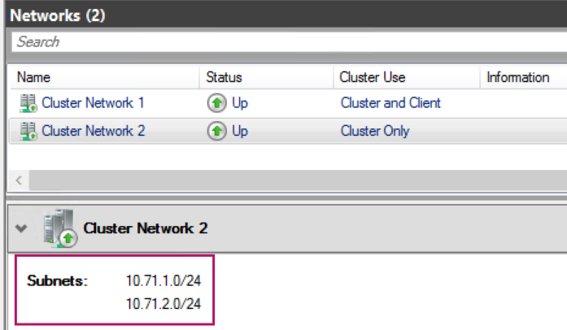

# Storage Cluster Networks merge causing Update Failure

<table border="1" cellpadding="6" cellspacing="0" style="border-collapse:collapse; margin-bottom:1em;">
  <tr>
    <th style="text-align:left; width: 180px;">Component</th>
    <td><strong>Cluster Networks</strong></td>
  </tr>
  <tr>
    <th style="text-align:left; width: 180px;">Severity</th>
    <td><strong>Medium</strong></td>
  </tr>
  <tr>
    <th style="text-align:left;">Applicable Scenarios</th>
    <td><strong>Update, Day to Day</strong></td>
  </tr>
  <tr>
    <th style="text-align:left;">Affected Versions</th>
    <td><strong>All Versions</strong></td>
  </tr>
</table>

## Overview

This issue only applies to Clusters with more than one Storage VLAN. In some cases the Storage Cluster Networks will be combined into one. This is an unexpected configuration and will block updates.

When the Storage Networks are combined the Cluster will see only one network available to it for Live Migration. Note that this does not reduce redundancy as there are still two VLANs available for migration. However, it may reduce the overall bandwidth available to migration since the two networks cannot be used in parallel.

## Symptoms

You may identify this issue in three ways:

**Update Failure:** Update will fail with the following error.

```powershell
CloudEngine.Actions.InterfaceInvocationFailedException: Type 'ValidateAndTuneNetworkATCAndClusterConfigurationPostUpdate' of Role 'HostNetwork' raised an exception:

Cluster storage network for storage network intent [ storage ] not ready after 10 minutes.
```


**CSS Tools Insight:** The `1.2605.5.1611` release of `CSSTools` adds a Host Network insight to detect and flag this issue.

**Manual Detection:** From a cluster node, run the following.

```powershell
[azlocal-node1]: PS C:\> Get-ClusterNetwork | Format-Table Name, Address, IPv4Addresses, AddressMask, State

Name              Address      Ipv4Addresses          AddressMask   State
----              -------      -------------          -----------   -----
Cluster Network 1 x.x.x.x      {x.x.x.x}              255.255.255.0    Up
Cluster Network 2 10.71.1.0    {10.71.1.0, 10.71.2.0} 255.255.255.0    Up
```

In this example output `Cluster Network 2` is configured with both Storage subnets `10.71.1.0/24` and `10.71.2.0/24`.

From the Network Intent, we can see that `10.71.1.0/24` is VLAN `711` and `10.71.2.0/24` is VLAN `712`. In the expected configuration, these should be in **TWO** Cluster Networks.

```powershell
[azlocal-node1]: PS C:\> Get-NetIntent | Select-Object IntentName, IsComputeIntentSet, IsStorageIntentSet, IsManagementIntentSet, StorageVLANs, NetAdapterNamesAsList


IntentName            : managementcomputestorage
IsComputeIntentSet    : True
IsStorageIntentSet    : True
IsManagementIntentSet : True
StorageVLANs          : {711, 712}
NetAdapterNamesAsList : {ethernet, ethernet 2}
```

> [!NOTE] In this example x.x.x.x is just the place holder for the management network IP address.

**Failover Cluster Manager**: From Failover Cluster manager, identify the storage Cluster Network. It should not have more than one subnet configured.



## Root Cause

When the Cluster detects that the adapters are on the same subnet it will merge them. If the Storage Adapter's IPs are configured to be all on the same subnet the Cluster Networks will merge.

If you have assigned Storage IPs manually, they must be a part of different subnets.

## Resolution

### Prerequisites

This mitigation will temporarily reduce Storage redundancy down to one VLAN so it is best ran during a maintenance window.

### Steps

1. **Identify the set adapters that need to be split**

In this example, the adapters that should be in the `10.71.2.0/24` subnet are in the Cluster Network 1 with address `10.71.1.0`. Therefore, the `10.71.2.0/24` adapters need to be split.

```powershell
Name              Address      Ipv4Addresses          AddressMask   State
----              -------      -------------          -----------   -----
Cluster Network 1 x.x.x.x      {x.x.x.x}              255.255.255.0    Up
Cluster Network 2 10.71.1.0    {10.71.1.0, 10.71.2.0} 255.255.255.0    Up
```

Looking at the Network Intent, `10.71.2.0/24` maps to VLAN `712`

```powershell
[azlocal-node1]: PS C:\> Get-NetIntent | Select-Object IntentName, IsComputeIntentSet, IsStorageIntentSet, IsManagementIntentSet, StorageVLANs, NetAdapterNamesAsList


IntentName            : managementcomputestorage
IsComputeIntentSet    : True
IsStorageIntentSet    : True
IsManagementIntentSet : True
StorageVLANs          : {711, 712}
NetAdapterNamesAsList : {ethernet, ethernet 2}
```

This means that the `vSMB(managementcomputestorage#ethernet 2)` on each node are the ones that have merged. The format of the Virtual Network Adapter Name is `vSMB(storage_intent_name#storage_adapter)`.

2. **Disable the split adapters on each node, at the same time**

From step 1, we have identified `vSMB(managementcomputestorage#ethernet 2)` as the adapters that have merged with `Cluster Network 2`.

On _all nodes, at the same time_ disable this Network Adapter.

> [!WARNING]
> At this time, Storage redundancy is temporarily reduced to one VLAN.

```powershell
$storageAdapter = Get-VMNetworkAdapter -Name "vSMB(managementcomputestorage#ethernet 2)" -ManagementOs
Disable-NetAdapter $storageAdapter.Name
```

3. **Re-enable the NetAdapters on each node**

Only proceed with this step after Step 2. The Storage adapter must have been disabled on **each node in the cluster**.

```powershell
$storageAdapter = Get-VMNetworkAdapter -Name "vSMB(managementcomputestorage#ethernet 2)" -ManagementOs
Enable-NetAdapter $storageAdapter.Name
```

4. **Confirm that the Networks have split**

In Failover Cluster Manager and CLI you should now see a new Cluster Network with the `10.71.2.0` address space.

```powershell
[azlocal-node01]: PS C:\> Get-ClusterNetwork | Format-Table Name, Address, AddressMask, State

Name              Address      AddressMask   State
----              -------      -----------   -----
Cluster Network 1 x.x.x.x      255.255.255.0    Up
Cluster Network 2 10.71.1.0    255.255.255.0    Up
Cluster Network 4 10.71.2.0    255.255.255.0    Up
```

---
