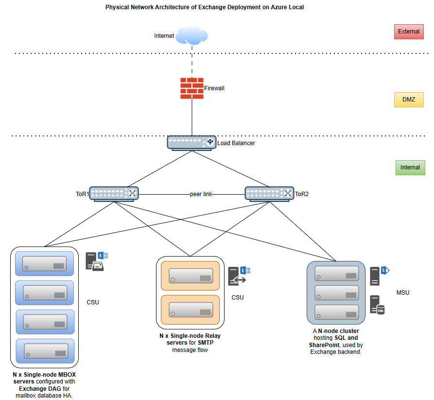
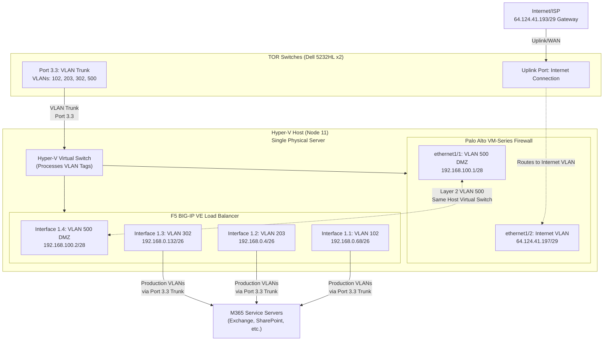
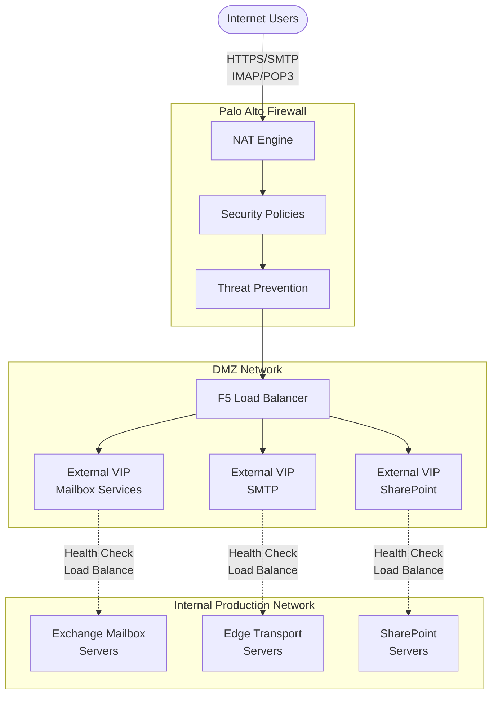
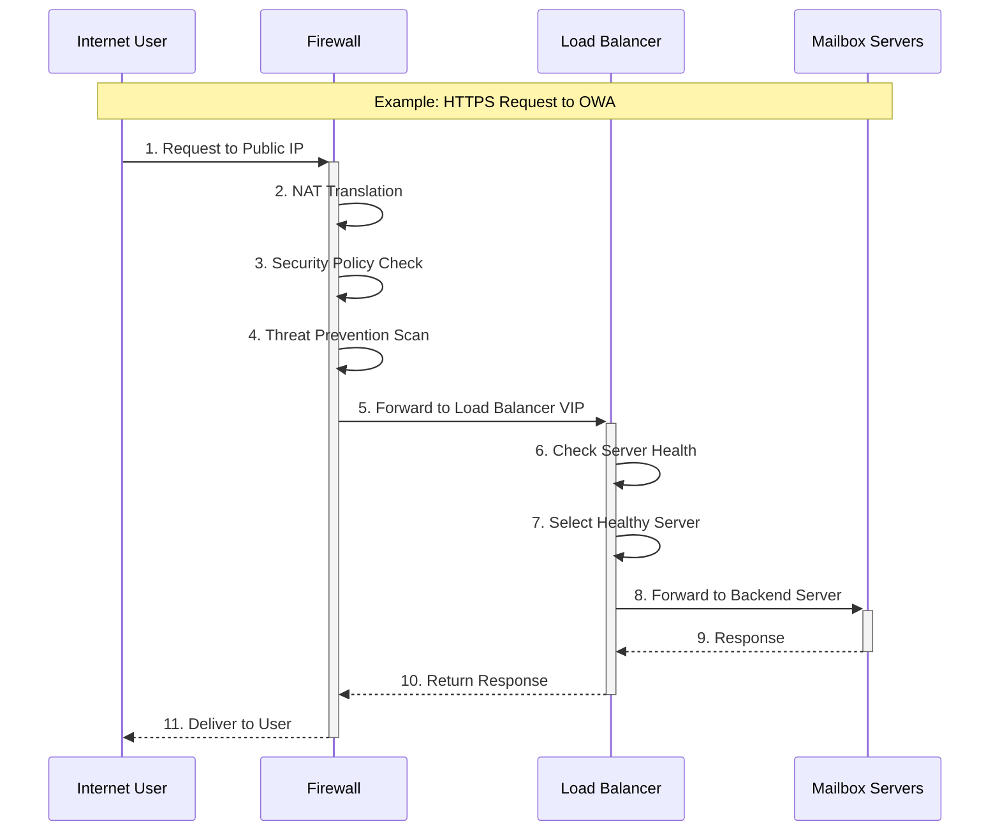
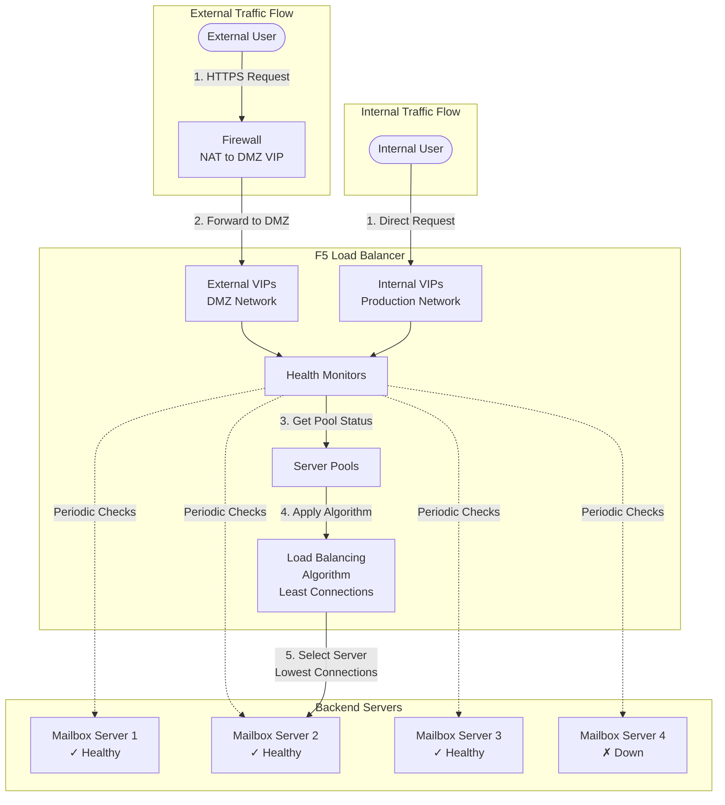

# M365 Azure Local Network Design - Implementation Guide

---

## Table of Contents
- **[1. Introduction](#1-introduction)**
  - [1.1. Overview](#11-overview)
  - [1.2. Implementation Phases](#12-implementation-phases)
  - [1.3. Key Terminology](#13-key-terminology)
- **[2. Infrastructure Preparation](#2-infrastructure-preparation)**
  - [2.1. Physical Components](#21-physical-components)
  - [2.2. Physical Connectivity](#22-physical-connectivity)
  - [2.3. Cable Map](#23-cable-map)
  - [2.4. VLAN and IP Planning](#24-vlan-and-ip-planning)
- **[3. Network Foundation](#3-network-foundation)**
  - [3.1. Interface Configuration](#31-interface-configuration)
  - [3.2. High Availability (MLAG & FHRP)](#32-high-availability-mlag--fhrp)
  - [3.3. Routing Design](#33-routing-design)
- **[4. Security and DMZ](#4-security-and-dmz)**
  - [4.1. Security Architecture Overview](#41-security-architecture-overview)
  - [4.2. Traffic Flow Architecture](#42-traffic-flow-architecture)
  - [4.3. NAT Configuration](#43-nat-configuration)
  - [4.4. NAT and Load Balancer Flow Diagram](#44-nat-and-load-balancer-flow-diagram)
  - [4.5. Security Policies](#45-security-policies)
  - [4.6. Routing Configuration](#46-routing-configuration)
- **[5. Load Balancer Configuration](#5-load-balancer-configuration)**
  - [5.1. Load Balancer Architecture](#51-load-balancer-architecture)
  - [5.2. Virtual Servers (VIPs) Overview](#52-virtual-servers-vips-overview)
  - [5.3. Backend Server Pools](#53-backend-server-pools)
  - [5.4. Health Monitoring](#54-health-monitoring)
  - [5.5. Load Balancer Configuration Summary](#55-load-balancer-configuration-summary)
- **[Appendix: Sample Configuration Files](#appendix-sample-configuration-files)**

---

## 1. Introduction

### 1.1. Overview
This document describes the network design for deploying Microsoft 365 (M365) services on Azure Local infrastructure. The deployment includes Exchange Mailbox servers, Edge Transport servers, and SharePoint services—all configured for high availability and security.

### 1.2. Implementation Phases
This deployment follows a structured approach with five phases, from infrastructure setup through final validation.

- [ ] **Phase 1: Infrastructure Preparation** (Rack, Cable, VLAN and IP Planning, Authentication)
- [ ] **Phase 2: Network Foundation** (VLANs, Interface Configuration, Switch/Gateway Redundancy, Routing)
- [ ] **Phase 3: Security and DMZ** (Firewall, NAT, Security Rules)
- [ ] **Phase 4: Load Balancer Setup** (Nodes, Monitors, Pools, Virtual Servers)
- [ ] **Phase 5: Validation and Testing** (Failover, Service Functionality, Performance, Penetration Testing)

### 1.3. Key Terminology
| Term | Definition |
|------|------------|
| **TOR** | Top-of-Rack switch that provides primary connectivity for servers. |
| **VRF** | Virtual Routing and Forwarding—a technology that creates isolated routing tables for network segmentation. |
| **BGP** | Border Gateway Protocol—a dynamic routing protocol for exchanging routes between switches. |
| **DMZ** | Demilitarized Zone—a buffer network that protects the internal LAN from untrusted internet traffic. |
| **MTU** | Maximum Transmission Unit—the largest packet size that can be transmitted in a single network transaction. |
| **OOB Management** | Out-of-Band Management—a dedicated, isolated network for hardware management (BMC/iDRAC) that operates independently from production networks. |
| **In-Band Management** | Management access that shares the production network infrastructure for operating system-level and application management. |
| **MSU (Management Scale Unit)** | A multi-node Azure Local cluster that runs core management services and M365 workloads, such as SharePoint and SQL Server. |
| **CSU (Exchange Mailbox)** | A single-node Azure Local cluster optimized for running Exchange Mailbox server virtual machines. |
| **CSU (Edge Transport)** | A single-node Azure Local cluster optimized for running Exchange Edge Transport server virtual machines that handle secure mail flow. |
| **VIP** | Virtual IP—an IP address used by a load balancer to represent a service, rather than a physical network interface. |

---

## 2. Infrastructure Preparation

### 2.1. Physical Components
The components listed below are based on the test lab configuration. Production deployments can use any hardware that meets the functional and performance requirements of the design.

| Component | Purpose | Use In Lab | Quantity | Deployment Model |
|-----------|---------|------------|----------|------------------|
| **BMC Switch** | Out-of-band management for hosts | Dell 3248 | 1 | Physical |
| **TOR Switches** | Top-of-Rack compute network switches | Dell 5232HL | 2 (HA pair) | Physical |
| **Load Balancer** | Virtual load balancer for M365 services | F5 BIG-IP VE | 1 | **Virtual (Hyper-V VM)** |
| **Firewall** | DMZ security boundary | Palo Alto VM-Series | 1 | **Virtual (Hyper-V VM)** |
| **Exchange Mailbox Servers** | Email storage and processing | Server Hosts | 4 nodes (DAG) | Virtual (Hyper-V VMs) |
| **Edge Transport Servers** | Email routing and external connectivity | Server Hosts | 2 nodes | Virtual (Hyper-V VMs) |
| **SharePoint Cluster** | SharePoint and Office Online services | Server Hosts | 3 nodes | Virtual (Hyper-V VMs) |

> [!IMPORTANT]
> **Virtual Infrastructure Deployment**: In this lab configuration, the F5 Load Balancer and Palo Alto Firewall are deployed as virtual machines on a **single Hyper-V host** (Node 11), **not as separate physical appliances**. They are connected to the TOR switches via a VLAN trunk port (3.3) on the host's network adapter, carrying **VLANs 102, 203, 302, and 500 (DMZ)**. The Palo Alto firewall's WAN interface connects directly to the Internet, not through the TOR switches. This eliminates the need for dedicated physical devices while maintaining the same logical network architecture.

### 2.2. Physical Connectivity
The diagram below shows the high-level physical cabling for the core components. Redundant TOR switches provide the primary network fabric, with dedicated connections for out-of-band management.

> [!NOTE]
> **Virtual Appliance Connectivity**: The F5 Load Balancer and Palo Alto Firewall shown in the diagram are virtual machines running on a single Hyper-V host (Node 11). They are not physically cabled as separate devices. Instead, they connect to the network through the host server's network adapter using VLAN trunking on port 3.3. The Hyper-V virtual switches pass tagged VLAN traffic (**VLANs 102, 203, 302, and DMZ VLAN 500**) to these virtual appliances. The Palo Alto firewall's Internet connection (ethernet1/2) connects directly to the WAN/Internet and is not routed through the TOR switches.

### 2.3. Cable Map
The tables below provide a simplified overview of the physical cabling based on the lab deployment.

#### Server to TOR Connectivity
All servers are dual-homed to both TOR switches for redundancy.

| Server Role | Node | Connection to TOR1 (Port) | Connection to TOR2 (Port) |
|-------------|------|---------------------------|---------------------------|
| **SharePoint** | Node1 | Port 1.1 | Port 1.1 |
| | Node2 | Port 1.2 | Port 1.2 |
| | Node3 | Port 1.3 | Port 1.3 |
| **Mailbox** | Node4 | Port 1.4 | Port 1.4 |
| | Node5 | Port 2.1 | Port 2.1 |
| | Node6 | Port 2.2 | Port 2.2 |
| | Node7 | Port 2.3 | Port 2.3 |
| **Edge Transport**| Node8 | Port 2.4 | Port 2.4 |
| | Node9 | Port 3.1 | Port 3.1 |
| **Infrastructure**| Node10 (AD) | Port 3.2 | Port 3.2 |
| | Node11 (Hyper-V Host for Firewall + Load Balancer VMs) | Port 3.3 | Port 3.3 |

> [!NOTE]
> **Virtual Infrastructure Host**: Node 11 is a Hyper-V host that runs **both** the Palo Alto Firewall VM and F5 Load Balancer VM on the same physical server. The physical server port (3.3) is configured as a VLAN trunk, passing **VLANs 102, 203, 302, and 500 (DMZ)** to the Hyper-V virtual switch, which then presents them to both virtual appliances. The Palo Alto firewall also has a separate Internet/WAN connection (ethernet1/2) that connects directly to the Internet router/ISP, bypassing the TOR switches entirely.

#### Network Backbone Connectivity
This table outlines the connections that form the network backbone, including inter-switch links and uplinks.

| Source Device | Source Port | Destination Device | Destination Port | Purpose |
|---------------|-------------|--------------------|------------------|---------|
| TOR1 | 25-28 | TOR2 | 25-28 | VLT Peer Link (4x QSFP) |
| TOR1 | 31 | Core Switch | - | Uplink |
| TOR2 | 31 | Core Switch | - | Uplink |
| TOR1 | 33 | BMC Switch | 51 | Management Link |
| TOR2 | 33 | BMC Switch | 52 | Management Link |

#### Out-of-Band Management Connectivity
The BMC switch provides out-of-band (OOB) management access to all servers and network devices via dedicated management ports (iDRAC/BMC).

| Source Device | Source Port Range | Destination Devices | Purpose |
|---------------|-------------------|---------------------|---------|
| BMC Switch | 1-12 | Server Nodes 1-12 | OOB Management (iDRAC/BMC) |

> [!NOTE]
> OOB management is completely isolated from production networks and operates independently, allowing hardware-level access even if the operating system or production network fails.

### 2.4 VLAN and IP Planning
This section outlines the IP allocation strategy, organized by network blocks (supernets). Adapt these ranges for your specific production needs.

> [!NOTE]
> **IP Planning Tools and References:**
> - **IP Subnet Planner Tool**: We have an open source IP planning tool available to help with network design and IP subnet allocation. Check the [M365-IPSubnetPlanner.md](./M365-IPSubnetPlanner.md) document for reference and usage details.
> - **Complete IP Assignment Reference**: For a comprehensive list of all IP addresses used in this deployment (including servers, network devices, VIPs, and infrastructure), see [M365-IPAssignment_Sample.json](./sample_config/M365-IPAssignment_Sample.json). This JSON file provides a structured, machine-readable format of all IP allocations across all VLANs and can be used as a reference template for your deployment.

#### VLAN Planning
Separate management and compute VLANs enable independent scaling and easier troubleshooting. BGP VLANs facilitate dynamic routing between redundant TOR switches.

| VLAN ID | Name | Purpose | Network | Gateway |
|---------|------|---------|---------|---------|
| **99** | NativeVlan | Native/untagged traffic | - | - |
| **102** | csu-exchange-compute | Exchange Mailbox compute network | 192.168.0.64/26 | 192.168.0.65 |
| **101** | csu-edge-transport-management | Edge Transport in-band management | 172.22.56.0/27 | 172.22.56.1 |
| **203** | csu-edge-transport-compute | Edge Transport compute network | 192.168.0.128/26 | 192.168.0.129 |
| **201** | msu-management | SharePoint/MSU in-band management | 172.22.56.32/27 | 172.22.56.33 |
| **302** | msu-compute | SharePoint compute network | 192.168.0.0/26 | 192.168.0.1 |
| **301** | csu-exchange-management | Exchange in-band management | 172.22.56.64/26 | 172.22.56.65 |
| **125** | BMC-Management | Server OOB management (BMC/iDRAC) | 10.60.48.128/26 | 10.60.48.129 |
| **402** | Infrastructure-Management | Infrastructure in-band management (AD, DNS, Jump) | 172.22.57.0/28 | 172.22.57.1 |
| **500** | DMZ-LoadBalancer-to-Firewall | DMZ security boundary | 192.168.100.0/28 | 192.168.100.1 |

#### Supernet: `192.168.0.0/24` — Production Compute
**Purpose**: This block is dedicated to all production server traffic for the M365 services. It is segmented into subnets for each service type.

| Subnet Name | VLAN | CIDR | Purpose | Key IPs |
|---|---|---|---|---|
| `msu-compute` | 302 | `/26` | SharePoint & MSU services | Gateway: `.1`, TOR Switches: `.2`-`.3`, SharePoint VIP: `.4`, SQL Listener: `.9` |
| `csu-exchange-compute` | 102 | `/26` | Exchange Mailbox services | Gateway: `.65`, TOR Switches: `.66`-`.67`, Load Balancer VIP: `.68` |
| `csu-edge-transport-compute` | 203 | `/26` | Edge Transport services | Gateway: `.129`, TOR Switches: `.130`-`.131`, Load Balancer VIP: `.132` |

#### Supernet: `172.22.56.0/24` — In-Band Management
**Purpose**: In-band management shares the production network infrastructure and provides operating system-level and application management access for service nodes (Exchange, SharePoint, etc.) and core infrastructure.

| Subnet Name | VLAN | CIDR | Purpose | Key IPs |
|---|---|---|---|---|
| `csu-edge-transport-management` | 101 | `/27` | Edge Transport node in-band management | Gateway: `.1`, TOR Switches: `.2`-`.3`, Nodes: `.4`-`.5` |
| `msu-management` | 201 | `/27` | SharePoint/MSU node in-band management | Gateway: `.33`, TOR Switches: `.34`-`.35`, Nodes: `.36`-`.38` |
| `csu-exchange-management` | 301 | `/26` | Exchange Mailbox node in-band management | Gateway: `.65`, TOR Switches: `.66`-`.67`, Nodes: `.68`-`.71` |
| `Infrastructure-Management` | 402 | `172.22.57.0/28` | Core services in-band management (AD, DNS, etc.) | Gateway: `172.22.57.1`, Nodes: `172.22.57.4`-`.5` |

#### Supernet: `192.168.100.0/27` — DMZ
**Purpose**: The Demilitarized Zone (DMZ) securely exposes services to the internet through the firewall and load balancer.

| Subnet Name | VLAN | CIDR | Purpose | Key IPs |
|---|---|---|---|---|
| `DMZ-LoadBalancer-to-Firewall` | 500 | `/28` | External-facing VIPs | Gateway: `.1`, TOR Switches: `.2`-`.3`, Mailbox VIP: `.5`, Edge Transport VIP: `.6`, SharePoint VIP: `.7` |

#### Supernet: `10.60.48.128/26` — Out-of-Band (OOB) Management
**Purpose**: This block provides completely isolated, out-of-band access to hardware management interfaces (BMC/iDRAC) of all physical hardware. OOB management operates independently from production networks and remains accessible even during operating system or network failures, providing hardware-level control for recovery and troubleshooting.

| Subnet Name | VLAN | CIDR | Purpose | Key IPs |
|---|---|---|---|---|
| `BMC-Management` | 125 | `/26` | OOB hardware management via BMC/iDRAC | Gateway: `.129`, BMC Switch: `.130`, TOR Switches: `.131`-`.132`, Node BMCs: `.133`+ |

> [!NOTE]
> For a complete and detailed list of all IP assignments, refer to the `M365-IPAssignment_Sample.json` file.

## 3. Network Foundation

### 3.1. Interface Configuration

- Create VLAN interfaces with gateway IP addresses
- Verify physical connections match the cable maps and configure switch ports accordingly
- Disable unused ports for security

> [!TIP]
> **Sample Configuration Available**: For a complete working example of TOR switch configuration including VLAN interfaces, VRRP, BGP, and static routes, refer to:
> - [TOR1_Sample.config](./sample_config/TOR1_Sample.config) - Primary TOR switch configuration
> - [TOR2_Sample.config](./sample_config/TOR2_Sample.config) - Secondary TOR switch configuration
> 
> These sample configurations are based on Dell OS10 switches and can be adapted to your specific hardware.

| Server Role | Node | Connection to TOR1 (Port) | Connection to TOR2 (Port) | Untagged VLAN | Tagged VLANs |
|-------------|------|---------------------------|---------------------------|---------------|--------------|
| **SharePoint** | Node1 | Port 1.1 | Port 1.1 | 201 (msu-management) | 102 (csu-exchange-compute), 302 (msu-compute) |
| | Node2 | Port 1.2 | Port 1.2 | 201 (msu-management) | 102 (csu-exchange-compute), 302 (msu-compute) |
| | Node3 | Port 1.3 | Port 1.3 | 201 (msu-management) | 102 (csu-exchange-compute), 302 (msu-compute) |
| **Mailbox** | Node4 | Port 1.4 | Port 1.4 | 301 (csu-exchange-management) | 102 (csu-exchange-compute), 201 (msu-management), 203 (csu-edge-transport-compute), 302 (msu-compute) |
| | Node5 | Port 2.1 | Port 2.1 | 301 (csu-exchange-management) | 102 (csu-exchange-compute), 201 (msu-management), 203 (csu-edge-transport-compute), 302 (msu-compute) |
| | Node6 | Port 2.2 | Port 2.2 | 301 (csu-exchange-management) | 102 (csu-exchange-compute), 201 (msu-management), 203 (csu-edge-transport-compute), 302 (msu-compute) |
| | Node7 | Port 2.3 | Port 2.3 | 301 (csu-exchange-management) | 102 (csu-exchange-compute), 201 (msu-management), 203 (csu-edge-transport-compute), 302 (msu-compute) |
| **Edge Transport**| Node8 | Port 2.4 | Port 2.4 | 101 (csu-edge-transport-management) | 102 (csu-exchange-compute), 201 (msu-management), 203 (csu-edge-transport-compute), 302 (msu-compute) |
| | Node9 | Port 3.1 | Port 3.1 | 101 (csu-edge-transport-management) | 102 (csu-exchange-compute), 201 (msu-management), 203 (csu-edge-transport-compute), 302 (msu-compute) |
| **Infrastructure**| Node10 (AD) | Port 3.2 | Port 3.2 | 201 (msu-management) | - |
| | Node11 (Hyper-V Host - Firewall + Load Balancer VMs) | Port 3.3 | Port 3.3 | N/A (Trunk Only) | **102, 203, 302, 500 (DMZ)** |

> [!IMPORTANT]
> **Virtual Appliance VLAN Trunking**: Node 11 is a Hyper-V host running **both** the Palo Alto Firewall VM and F5 Load Balancer VM on the same physical server. The TOR switch port (3.3) is configured as a **VLAN trunk port** that carries only the VLANs actually used by these appliances:
> 
> **Actual VLAN Configuration:**
> - **VLAN 102** (csu-exchange-compute): F5 Interface 1.1 - connects to Exchange servers
> - **VLAN 203** (csu-edge-transport-compute): F5 Interface 1.2 - connects to Edge Transport servers
> - **VLAN 302** (msu-compute): F5 Interface 1.3 - connects to SharePoint servers
> - **VLAN 500** (DMZ): F5 Interface 1.4 + Palo Alto ethernet1/1 - Layer 2 segment for firewall-to-load-balancer communication
> 
> **Virtual Appliance Interfaces:**
> - **Palo Alto Firewall**: Only has 2 interfaces:
>   - `ethernet1/2`: Internet/WAN (64.124.41.197/29) - Direct connection, not through TOR switches
>   - `ethernet1/1`: DMZ VLAN 500 (192.168.100.1/28) - Connects to F5
> - **F5 Load Balancer**: Has 4 VLAN interfaces (102, 203, 302, 500)
> 
> **How DMZ VLAN 500 Works:**
> - Both VMs run on the same Hyper-V host and communicate via VLAN 500 through the Hyper-V virtual switch
> - Traffic flow: `Internet → Palo Alto (eth1/2) → Palo Alto (eth1/1, VLAN 500) → F5 (Interface 1.4, VLAN 500) → F5 (Interfaces 1.1/1.2/1.3) → Production VLANs (102, 203, 302)`
> - The Palo Alto firewall does NOT have direct access to production VLANs—all internal traffic flows through F5

### 3.2. High Availability (MLAG & FHRP)

#### Switch Redundancy (MLAG)
The two TOR switches form a **Multi-Chassis Link Aggregation (MLAG)** domain for active-active link aggregation.
- Eliminates single points of failure with sub-second failover
- Doubles bandwidth and simplifies cabling

#### Gateway Redundancy (FHRP)
Each VLAN uses **First Hop Redundancy Protocol (FHRP)** to provide gateway failover between TOR switches.
- **TOR1**: Priority 150 (Primary)
- **TOR2**: Priority 100 (Standby)
- Servers use a single gateway IP address for simplified configuration

### 3.3. Routing Design

#### VRF (Optional)
**VRF (Virtual Routing and Forwarding)** creates isolated routing tables for enhanced security segmentation. This is optional—use only if your security requirements require strict network separation.

| VRF | Purpose | VLANs |
|-----|---------|-------|
| **default** | Management, infrastructure & production workloads | 101, 102, 201, 203, 301, 302 (In-Band Management & Compute) |
| **infra_bmc_mgmt** | Out-of-band management (BMC/iDRAC) | 125, 400 (OOB Management) |

#### BGP (Dynamic Routing)
BGP provides dynamic routing for management network connectivity with redundancy.

**iBGP (TOR-to-TOR):**
- Provides routing redundancy between TOR switches
- Enables automatic failover for management network routes
- Uses loopback interfaces for stable peering sessions

**eBGP (TOR-to-Border):**
- Exchanges routes with upstream border routers
- Provides connectivity to the broader enterprise network
- Advertises local subnets dynamically

> [!NOTE]
> All production and service VLANs use static routing (see below).

#### Static Routes
**Static routes** provide predictable paths for all service traffic, DMZ access, and internet connectivity.

**Why Use Static Routes:**
- Primary routing method for all production and management VLANs
- Ensures predictable traffic flow to the firewall and upstream networks
- Provides a default gateway for internet-bound traffic
- Simplifies the routing table and troubleshooting
- Avoids the complexity of dynamic routing for service networks

**Typical Static Routes:**
- Default route (0.0.0.0/0) → Firewall or Core Switch
- DMZ subnet (192.168.100.0/28) → Firewall
- Remote site subnets → Core/WAN router
- All service VLAN routes → Direct or via Firewall

---

## 4. Security and DMZ

### 4.1. Security Architecture Overview

The Palo Alto VM-Series firewall creates a security boundary between the internet and internal M365 services. It performs network segmentation, threat prevention, and controls access to published services.

> [!IMPORTANT]
> **Virtual Appliance Architecture**: In this lab deployment, both the **Palo Alto Firewall** and **F5 Load Balancer** are deployed as **virtual machines on Hyper-V hosts**, not as separate physical appliances. This architecture provides several advantages:
> 
> **Network Connectivity Model:**
> - Both VMs run on **the same Hyper-V host** (Node 11), connected to TOR switches via **VLAN trunk port 3.3**
> - Trunk carries **only VLANs 102, 203, 302, and 500 (DMZ)**
> - Virtual appliances have virtual NICs attached to specific VLANs via Hyper-V virtual switch
> - **DMZ VLAN 500** exists as a Layer 2 segment between both VMs on the same host (ultra-fast communication)
> - Palo Alto's Internet interface (ethernet1/2) connects **directly to WAN/Internet**, not through TOR switches
> 
> **Why DMZ Appears on Both Appliances:**
> - The firewall and load balancer both need interfaces on **DMZ VLAN 500** to communicate
> - There is **no physical cable** between them—they communicate via Hyper-V virtual switch on the same host
> - Traffic flow: `Internet → Palo Alto eth1/2 (WAN) → Palo Alto eth1/1 (VLAN 500) → F5 Int 1.4 (VLAN 500) → F5 Int 1.1/1.2/1.3 (VLANs 102/203/302) → Production Servers`
> - **Palo Alto has NO direct access to production VLANs**—all internal traffic flows through F5 first
> - This is functionally equivalent to having a physical DMZ switch, but even faster (same host virtual switch)
> 
> **Benefits of Virtual Deployment:**
> - Reduced hardware costs (no need for separate physical appliances)
> - Simplified cabling (single trunk port for both appliances + separate WAN connection)
> - Same-host deployment means DMZ VLAN 500 traffic never leaves the physical server
> - Easier resource allocation and scaling
> - Maintains full security segmentation and policy enforcement

#### Network Zones (Palo Alto Firewall)

| Zone | Interface | IP Address | VLAN | Purpose |
|------|-----------|------------|------|---------|
| **Internet** | ethernet1/2 | 64.124.41.197/29 | N/A (WAN) | External-facing interface for public internet connectivity |
| **DMZ** | ethernet1/1 | 192.168.100.1/28 | 500 | Internal-facing interface for load balancer connectivity via VLAN 500 |

> [!NOTE]
> **Firewall Configuration**: The Palo Alto firewall has **only 2 interfaces**. It does NOT have direct connections to production VLANs. All internal traffic flows through the F5 Load Balancer on DMZ VLAN 500.

#### F5 Load Balancer Interfaces

| Interface | VLAN | IP Address | Purpose |
|-----------|------|------------|---------|
| **1.4** | 500 | 192.168.100.2/28 | DMZ connectivity to firewall (VLAN 500) |
| **1.1** | 102 | 192.168.0.68/26 | Exchange compute (csu-exchange-compute) |
| **1.2** | 203 | 192.168.0.4/26 | Edge Transport compute (csu-edge-transport-compute) |
| **1.3** | 302 | 192.168.0.132/26 | SharePoint compute (msu-compute) |

#### Public IP Allocation

| Public IP | Service | Translated To (Load Balancer VIP) |
|-----------|---------|-----------------------------------|
| **Public Service IP** | OWA/Exchange/SharePoint Services | External VIP (Mailbox), External VIP (SMTP), External VIP (SharePoint) |

### 4.2. Traffic Flow Architecture

The diagram below illustrates the complete traffic flow from the internet through the firewall and load balancer to the backend servers.

### 4.3. NAT Configuration

The firewall performs both **inbound (destination) NAT** for published services and **outbound (source) NAT** for internet-bound traffic.

#### Inbound NAT Rules (Destination NAT)

Traffic from the internet to the public service IP is translated to internal load balancer VIPs:

| Rule Name | Service | Public Endpoint | Translated To | Load Balancer VIP |
|-----------|---------|-----------------|---------------|-------------------|
| **IN_NAT_OWA_443** | OWA/Outlook Web Access | Public IP:443 | External VIP - Mailbox:443 | Mailbox External VIP |
| **IN_NAT_SMTP_25** | SMTP Mail Delivery | Public IP:25 | External VIP - SMTP:25 | Edge Transport VIP |
| **IN_NAT_IMAP_993** | IMAP Secure | Public IP:993 | External VIP - Mailbox:993 | Mailbox External VIP |
| **IN_NAT_IMAP_143** | IMAP Standard | Public IP:143 | External VIP - Mailbox:143 | Mailbox External VIP |
| **IN_NAT_POP3** | POP3 Standard | Public IP:110 | External VIP - Mailbox:110 | Mailbox External VIP |
| **IN_NAT_POP3_995** | POP3 Secure | Public IP:995 | External VIP - Mailbox:995 | Mailbox External VIP |
| **IN_NAT_SharePoint_443** | SharePoint HTTPS | Public IP:444 | External VIP - SharePoint:443 | SharePoint External VIP |

#### Outbound NAT Rule (Source NAT)

| Rule Name | Source Zone | Destination Zone | Translation |
|-----------|-------------|------------------|-------------|
| **Out-NAT** | DMZ | Internet | Firewall Public IP |

> [!NOTE]
> Outbound NAT enables internal servers to initiate connections to the internet (e.g., for updates) using the firewall's public IP.

### 4.4. NAT and Load Balancer Flow Diagram

This diagram shows how NAT translation and load balancing work together:

### 4.5. Security Policies

The firewall enforces a layered security model with the following policy structure:

#### Inbound Security Policies (Internet → DMZ)

| Policy Name | Application/Service | Action | Security Profiles |
|-------------|---------------------|--------|-------------------|
| **Block_Geo_In** | Any (Source: Threat GEO Lists) | Drop | - |
| **Block_Dangerous_Traffic_IN** | Any (Source: Threat IP Lists) | Drop | - |
| **Allow_OWA_In** | HTTPS (443) | Allow | Virus: Default, Spyware: Strict, Vulnerability: Strict |
| **Allow_SMTP_In** | SMTP (25) | Allow | Virus: Default, Spyware: Strict, Vulnerability: Strict |
| **Allow_IMAP_In** | IMAP (993) | Allow | Virus: Default, Spyware: Strict, Vulnerability: Strict |
| **Allow_IMAP_TLS_In** | IMAP (143) | Allow | Virus: Default, Spyware: Strict, Vulnerability: Strict |
| **Allow_POP3_In** | POP3 (110) | Allow | Virus: Default, Spyware: Strict, Vulnerability: Strict |
| **Allow_POP3_995_In** | POP3S (995) | Allow | Virus: Default, Spyware: Strict, Vulnerability: Strict |
| **Allow_SharePoint_In** | HTTPS (444) | Allow | Virus: Default, Spyware: Strict, Vulnerability: Strict |
| **Drop_ALL_Log** | Any | Deny | - |

#### Outbound Security Policies (DMZ → Internet)

| Policy Name | Destination | Action | Purpose |
|-------------|-------------|--------|---------|
| **Block_Dangerous_Out** | Threat IP Lists | Drop | Block connections to known malicious IPs |
| **Allow OUT** | Any | Allow | Permit outbound connections (updates, external services) |

> [!IMPORTANT]
> All allowed traffic passes through strict threat prevention profiles including anti-virus, anti-spyware, and vulnerability protection.

### 4.6. Routing Configuration

The firewall uses static routes for predictable traffic flow:

| Route Name | Destination | Next Hop | Interface | Purpose |
|------------|-------------|----------|-----------|---------|
| **Default-Route** | 0.0.0.0/0 | ISP Gateway | ethernet1/2 | Default gateway to internet |
| **AL** | In-Band Management Network (172.22.56.0/24) | TOR Switch | ethernet1/1 | In-band management network via TOR switches |
| **AZ Compute** | Compute Network (192.168.0.0/24) | TOR Switch | ethernet1/1 | Production compute network via TOR switches |

> [!TIP]
> **Sample Configuration Available**: For a complete working example of Palo Alto firewall configuration including:
> - Network interface configuration (DMZ and Internet zones)
> - NAT rules (inbound destination NAT and outbound source NAT)
> - Security policies with threat prevention profiles
> - Static routing configuration
> - Security zones and address objects
> 
> Refer to: [PaloAlto_Sample.config](./sample_config/PaloAlto_Sample.config)
> 
> This sample configuration is based on Palo Alto VM-Series and includes all security policies, NAT translations, and routing needed for this deployment.

---

## 5. Load Balancer Configuration

### 5.1. Load Balancer Architecture

The F5 BIG-IP Virtual Edition (VE) provides application-level high availability, intelligent traffic distribution, and health monitoring for M365 services. It operates in both the DMZ and internal production networks, bridging external and internal traffic.

#### Load Balancer Traffic Flow Diagram
This diagram shows how the load balancer processes and distributes traffic to backend servers:

#### Virtual Server Design Concept

The load balancer uses a **dual VIP design** for each service:
- **External VIPs**: Receive traffic from the firewall in the DMZ
- **Internal VIPs**: Receive traffic from internal users in production networks

Both VIP types distribute traffic to the same backend server pools, ensuring consistent service delivery regardless of where the traffic originates.

### 5.2. Virtual Servers (VIPs) Overview

#### Exchange Mailbox VIPs

| VIP Type | IP Address | Port | Protocol | Backend Pool | Purpose |
|----------|------------|------|----------|--------------|---------|
| **External - OWA** | External VIP - Mailbox | 443 | HTTPS | Mailbox_OWA_443 | Internet-facing Outlook Web Access |
| **Internal - OWA** | Internal VIP - Mailbox | 443 | HTTPS | Mailbox_OWA_443 | Internal Outlook Web Access |
| **External - IMAP (993)** | External VIP - Mailbox | 993 | IMAPS | Mailbox_IMAP_993_HTTPS | Secure IMAP from internet |
| **Internal - IMAP (993)** | Internal VIP - Mailbox | 993 | IMAPS | Mailbox_IMAP_993_HTTPS | Secure IMAP from internal network |
| **External - IMAP (143)** | External VIP - Mailbox | 143 | IMAP | Mailbox_IMAP_143_PORT | Standard IMAP from internet |
| **Internal - IMAP (143)** | Internal VIP - Mailbox | 143 | IMAP | Mailbox_IMAP_143_PORT | Standard IMAP from internal network |
| **External - POP3 (110)** | External VIP - Mailbox | 110 | POP3 | Mailbox_POP_110 | POP3 from internet |
| **Internal - POP3 (110)** | Internal VIP - Mailbox | 110 | POP3 | Mailbox_POP_110 | POP3 from internal network |
| **External - POP3S (995)** | External VIP - Mailbox | 995 | POP3S | Mailbox_POP3_995_HTTPS | Secure POP3 from internet |
| **Internal - POP3S (995)** | Internal VIP - Mailbox | 995 | POP3S | Mailbox_POP3_995_HTTPS | Secure POP3 from internal network |

#### Edge Transport VIPs

| VIP Type | IP Address | Port | Protocol | Backend Pool | Purpose |
|----------|------------|------|----------|--------------|---------|
| **External - SMTP** | External VIP - SMTP | 25 | SMTP | EdgeTransport_25_SMTP_DOMAIN | Internet mail delivery |
| **Internal - SMTP** | Internal VIP - Mailbox | 25 | SMTP | EdgeTransport_25_SMTP_DOMAIN | Internal mail submission |

#### SharePoint VIPs

| VIP Type | IP Address | Port | Protocol | Backend Pool | Purpose |
|----------|------------|------|----------|--------------|---------|
| **External - SharePoint** | External VIP - SharePoint | 443 | HTTPS | SharePoint_443_HTTPS | Internet-facing SharePoint |
| **Internal - SharePoint** | Internal VIP - SharePoint | 443 | HTTPS | SharePoint_443_HTTPS | Internal SharePoint access |

### 5.3. Backend Server Pools

The load balancer distributes traffic across healthy backend servers using the **least-connections** algorithm:

#### Mailbox Server Pools

| Pool Name | Members | Health Monitor | Load Balancing Algorithm |
|-----------|---------|----------------|--------------------------|
| **Mailbox_OWA_443** | Mailbox Server 1-4 | 7 Exchange Health Checks* | Least Connections |
| **Mailbox_IMAP_993_HTTPS** | Mailbox Server 1-4 | IMAP_993_HTTPS | Least Connections |
| **Mailbox_IMAP_143_PORT** | Mailbox Server 1-4 | IMAP_143_TLS | Least Connections |
| **Mailbox_POP_110** | Mailbox Server 1-4 | POP3 | Least Connections |
| **Mailbox_POP3_995_HTTPS** | Mailbox Server 1-4 | POP3_995_HTTPS | Least Connections |

*OWA pool uses comprehensive health monitors for seven Exchange services: Autodiscover, EAS, ECP, EWS, MAPI, OAB, OWA

#### Edge Transport Server Pool

| Pool Name | Members | Health Monitor | Load Balancing Algorithm |
|-----------|---------|----------------|--------------------------|
| **EdgeTransport_25_SMTP_DOMAIN** | Edge Transport 1-2 | SMTP_587_DOMAIN | Least Connections |

#### SharePoint Server Pool

| Pool Name | Members | Health Monitor | Load Balancing Algorithm |
|-----------|---------|----------------|--------------------------|
| **SharePoint_443_HTTPS** | SharePoint FE 1-2 | HTTPS | Least Connections |

### 5.4. Health Monitoring

The load balancer performs intelligent, application-aware health checks to ensure traffic only reaches healthy servers:

#### Exchange Mailbox Health Monitors

| Monitor Name | Type | Check | Interval | Timeout |
|--------------|------|-------|----------|---------|
| **MailboxExchange_OWA_Health_HTTPS** | HTTPS | GET /owa/healthcheck.htm | 5s | 16s |
| **MailboxExchange_EWS_Health_HTTPS** | HTTPS | GET /ews/healthcheck.htm | 5s | 16s |
| **MailboxExchange_MAPI_Health_HTTPS** | HTTPS | GET /mapi/healthcheck.htm | 5s | 16s |
| **MailboxExchange_Autodiscover_Health_HTTPS** | HTTPS | GET /Autodiscover/healthcheck.htm | 5s | 16s |
| **MailboxExchange_EAS_Health_HTTPS** | HTTPS | GET /Microsoft-Server-ActiveSync/healthcheck.htm | 5s | 16s |
| **MailboxExchange_ECP_Health_HTTPS** | HTTPS | GET /ecp/healthcheck.htm | 5s | 16s |
| **MailboxExchange_OAB_Health_HTTPS** | HTTPS | GET /oab/healthcheck.htm | 5s | 16s |

#### Protocol-Specific Monitors

| Monitor Name | Protocol | Check Method | Purpose |
|--------------|----------|--------------|---------|
| **IMAP_993_HTTPS** | IMAPS | TCP connection + SSL handshake | Verify IMAP over SSL |
| **IMAP_143_TLS** | IMAP | TCP connection + STARTTLS | Verify IMAP with TLS |
| **POP3** | POP3 | TCP connection | Verify POP3 availability |
| **POP3_995_HTTPS** | POP3S | TCP connection + SSL handshake | Verify POP3 over SSL |
| **SMTP_587_DOMAIN** | SMTP | SMTP HELO/EHLO exchange | Verify SMTP functionality |
| **HTTPS** | HTTPS | TCP connection + SSL handshake | Verify HTTPS availability |

### 5.5. Load Balancer Configuration Summary

| Configuration Item | Value | Purpose |
|--------------------|-------|---------|
| **Load Balancing Mode** | Least Connections | Distributes traffic to server with fewest active connections |
| **Source Address Translation** | AutoMap | Enables direct server return path |
| **Persistence** | None (except SharePoint: dest_addr) | Session handled by application layer |
| **Health Check Failure Action** | Remove from pool | Automatic failover to healthy servers |
| **Health Check Recovery** | Automatic | Server rejoins pool when health checks pass |

> [!TIP]
> **Sample Configuration Available**: For a complete working example of F5 BIG-IP load balancer configuration including:
> - Network interface and VLAN configuration
> - Self-IP addresses for each VLAN
> - Backend server pool definitions (nodes and pools)
> - Health monitor configurations for all services
> - Virtual server (VIP) definitions for Exchange, SharePoint, and Edge Transport
> - Load balancing algorithms and persistence settings
> 
> Refer to: [F5_Sample.config](./sample_config/F5_Sample.config)
> 
> This sample configuration is based on F5 BIG-IP VE and includes all the monitors, pools, and virtual servers needed for this deployment. The configuration is organized into sections with detailed comments for easy understanding and adaptation.

---

## Appendix: Sample Configuration Files

This document references sample configuration files that provide working examples for implementation. All files are located in the `sample_config/` folder:

- **[TOR1_Sample.config](./sample_config/TOR1_Sample.config)** - Primary TOR switch configuration (Dell OS10)
- **[TOR2_Sample.config](./sample_config/TOR2_Sample.config)** - Secondary TOR switch configuration (Dell OS10)
- **[PaloAlto_Sample.config](./sample_config/PaloAlto_Sample.config)** - Firewall configuration with NAT and security policies
- **[F5_Sample.config](./sample_config/F5_Sample.config)** - Load balancer configuration with VIPs, pools, and health monitors
- **[M365-IPAssignment_Sample.json](./sample_config/M365-IPAssignment_Sample.json)** - Complete IP address allocation reference

> [!NOTE]
> Sample configurations are based on lab deployment and should be adapted for your production environment. Review inline documentation within each config file for implementation guidance.

---
