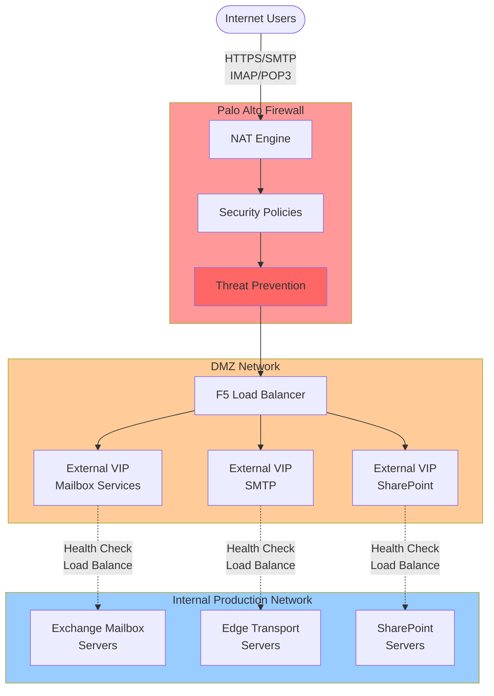
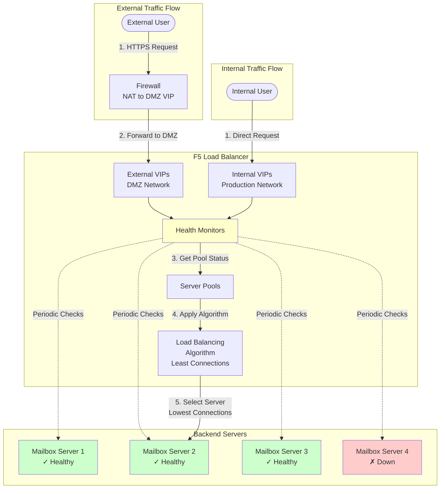

# M365 Azure Local Network Design - Implementation Guide

---

## Table of Contents
- **[1. Introduction](#1-introduction)**
  - [1.1. Overview](#11-overview)
  - [1.2. Implementation Phases](#12-implementation-phases)
  - [1.3. Key Terminology](#13-key-terminology)
- **[2. Infrastructure Preparation](#2-infrastructure-preparation)**
  - [2.1. Physical Components](#21-physical-components)
  - [2.2. Physical Connectivity](#22-physical-connectivity)
  - [2.3. Cable Map](#23-cable-map)
  - [2.4. VLAN and IP Planning](#24-vlan-and-ip-planning)
- **[3. Network Foundation](#3-network-foundation)**
  - [3.1. Interface Configuration](#31-interface-configuration)
  - [3.2. High Availability (MLAG & FHRP)](#32-high-availability-mlag--fhrp)
  - [3.3. Routing Design](#33-routing-design)
- **[4. Security and DMZ](#4-security-and-dmz)**
  - [4.1. Security Architecture Overview](#41-security-architecture-overview)
  - [4.2. Traffic Flow Architecture](#42-traffic-flow-architecture)
  - [4.3. NAT Configuration](#43-nat-configuration)
  - [4.4. NAT and Load Balancer Flow Diagram](#44-nat-and-load-balancer-flow-diagram)
  - [4.5. Security Policies](#45-security-policies)
  - [4.6. Routing Configuration](#46-routing-configuration)
- **[5. Load Balancer Configuration](#5-load-balancer-configuration)**
  - [5.1. Load Balancer Architecture](#51-load-balancer-architecture)
  - [5.2. Virtual Servers (VIPs) Overview](#52-virtual-servers-vips-overview)
  - [5.3. Backend Server Pools](#53-backend-server-pools)
  - [5.4. Health Monitoring](#54-health-monitoring)
  - [5.5. Load Balancer Configuration Summary](#55-load-balancer-configuration-summary)

---

## 1. Introduction

### 1.1. Overview
This document describes the network design for deploying Microsoft 365 (M365) services on Azure Local infrastructure. The deployment includes Exchange Mailbox servers, Edge Transport servers, and SharePoint services—all configured for high availability and security.

### 1.2. Implementation Phases
This deployment follows a structured approach with five phases, from infrastructure setup through final validation.

- [ ] **Phase 1: Infrastructure Preparation** (Rack, Cable, VLAN and IP Planning, Authentication)
- [ ] **Phase 2: Network Foundation** (VLANs, Interface Configuration, Switch/Gateway Redundancy, Routing)
- [ ] **Phase 3: Security and DMZ** (Firewall, NAT, Security Rules)
- [ ] **Phase 4: Load Balancer Setup** (Nodes, Monitors, Pools, Virtual Servers)
- [ ] **Phase 5: Validation and Testing** (Failover, Service Functionality, Performance, Penetration Testing)

### 1.3. Key Terminology
| Term | Definition |
|------|------------|
| **TOR** | Top-of-Rack switch that provides primary connectivity for servers. |
| **VRF** | Virtual Routing and Forwarding—a technology that creates isolated routing tables for network segmentation. |
| **BGP** | Border Gateway Protocol—a dynamic routing protocol for exchanging routes between switches. |
| **DMZ** | Demilitarized Zone—a buffer network that protects the internal LAN from untrusted internet traffic. |
| **MTU** | Maximum Transmission Unit—the largest packet size that can be transmitted in a single network transaction. |
| **OOB Management** | Out-of-Band Management—a dedicated, isolated network for hardware management (BMC/iDRAC) that operates independently from production networks. |
| **In-Band Management** | Management access that shares the production network infrastructure for operating system-level and application management. |
| **MSU (Management Scale Unit)** | A multi-node Azure Local cluster that runs core management services and M365 workloads, such as SharePoint and SQL Server. |
| **CSU (Exchange Mailbox)** | A single-node Azure Local cluster optimized for running Exchange Mailbox server virtual machines. |
| **CSU (Edge Transport)** | A single-node Azure Local cluster optimized for running Exchange Edge Transport server virtual machines that handle secure mail flow. |
| **VIP** | Virtual IP—an IP address used by a load balancer to represent a service, rather than a physical network interface. |

---

## 2. Infrastructure Preparation

### 2.1. Physical Components
The components listed below are based on the test lab configuration. Production deployments can use any hardware that meets the functional and performance requirements of the design.

| Component | Purpose | Use In Lab | Quantity |
|-----------|---------|------------|----------|
| **BMC Switch** | Out-of-band management for hosts | Dell 3248 | 1 |
| **TOR Switches** | Top-of-Rack compute network switches | Dell 5232HL | 2 (HA pair) |
| **Load Balancer** | Virtual load balancer for M365 services | F5 BIG-IP VE | 1 (Virtual) |
| **Firewall** | DMZ security boundary | Palo Alto VM-Series | 1 (Virtual) |
| **Exchange Mailbox Servers** | Email storage and processing | Server Hosts | 4 nodes (DAG) |
| **Edge Transport Servers** | Email routing and external connectivity | Server Hosts | 2 nodes |
| **SharePoint Cluster** | SharePoint and Office Online services | Server Hosts | 3 nodes |

### 2.2. Physical Connectivity
The diagram below shows the high-level physical cabling for the core components. Redundant TOR switches provide the primary network fabric, with dedicated connections for out-of-band management.

### 2.3. Cable Map
The tables below provide a simplified overview of the physical cabling based on the lab deployment.

#### Server to TOR Connectivity
All servers are dual-homed to both TOR switches for redundancy.

| Server Role | Node | Connection to TOR1 (Port) | Connection to TOR2 (Port) |
|-------------|------|---------------------------|---------------------------|
| **SharePoint** | Node1 | Port 1.1 | Port 1.1 |
| | Node2 | Port 1.2 | Port 1.2 |
| | Node3 | Port 1.3 | Port 1.3 |
| **Mailbox** | Node4 | Port 1.4 | Port 1.4 |
| | Node5 | Port 2.1 | Port 2.1 |
| | Node6 | Port 2.2 | Port 2.2 |
| | Node7 | Port 2.3 | Port 2.3 |
| **Edge Transport**| Node8 | Port 2.4 | Port 2.4 |
| | Node9 | Port 3.1 | Port 3.1 |
| **Infrastructure**| Node10 (AD) | Port 3.2 | Port 3.2 |
| | Node11 (Palo Alto) | Port 3.3 | Port 3.3 |
| | Node12 (F5) | Port 3.4 | Port 3.4 |

#### Network Backbone Connectivity
This table outlines the connections that form the network backbone, including inter-switch links and uplinks.

| Source Device | Source Port | Destination Device | Destination Port | Purpose |
|---------------|-------------|--------------------|------------------|---------|
| TOR1 | 25-28 | TOR2 | 25-28 | VLT Peer Link (4x QSFP) |
| TOR1 | 31 | Core Switch | - | Uplink |
| TOR2 | 31 | Core Switch | - | Uplink |
| TOR1 | 33 | BMC Switch | 51 | Management Link |
| TOR2 | 33 | BMC Switch | 52 | Management Link |

#### Out-of-Band Management Connectivity
The BMC switch provides out-of-band (OOB) management access to all servers and network devices via dedicated management ports (iDRAC/BMC).

| Source Device | Source Port Range | Destination Devices | Purpose |
|---------------|-------------------|---------------------|---------|
| BMC Switch | 1-12 | Server Nodes 1-12 | OOB Management (iDRAC/BMC) |

> [!NOTE]
> OOB management is completely isolated from production networks and operates independently, allowing hardware-level access even if the operating system or production network fails.

### 2.4 VLAN and IP Planning
This section outlines the IP allocation strategy, organized by network blocks (supernets). Adapt these ranges for your specific production needs.

> [!NOTE]
> We have an open source IP planning tool available to help with network design and IP subnet allocation. Please check the [M365-IPSubnetPlanner.md](./M365-IPSubnetPlanner.md) document in the same folder for reference and usage details.

#### VLAN Planning
Separate management and compute VLANs enable independent scaling and easier troubleshooting. BGP VLANs facilitate dynamic routing between redundant TOR switches.

| VLAN ID | Name | Purpose | Network | Gateway |
|---------|------|---------|---------|---------|
| **99** | NativeVlan | Native/untagged traffic | - | - |
| **102** | csu-exchange-compute | Exchange Mailbox compute network | 192.168.0.64/26 | 192.168.0.65 |
| **101** | csu-edge-transport-management | Edge Transport in-band management | 172.22.56.0/27 | 172.22.56.1 |
| **203** | csu-edge-transport-compute | Edge Transport compute network | 192.168.0.128/26 | 192.168.0.129 |
| **201** | msu-management | SharePoint/MSU in-band management | 172.22.56.32/27 | 172.22.56.33 |
| **302** | msu-compute | SharePoint compute network | 192.168.0.0/26 | 192.168.0.1 |
| **301** | csu-exchange-management | Exchange in-band management | 172.22.56.64/26 | 172.22.56.65 |
| **125** | BMC-Management | Server OOB management (BMC/iDRAC) | 10.60.48.128/26 | 10.60.48.129 |
| **402** | Infrastructure-Management | Infrastructure in-band management (AD, DNS, Jump) | 172.22.57.0/28 | 172.22.57.1 |
| **500** | DMZ-LoadBalancer-to-Firewall | DMZ security boundary | 192.168.100.0/28 | 192.168.100.1 |
| **400** | iBGP_Point_to_Point_Compute | BGP peering between TORs (Compute) | 192.168.0.192/30 | - |
| **401** | iBGP_Point_to_Point_Default | BGP peering between TORs (Default) | 172.22.56.192/30 | - |

#### Supernet: `192.168.0.0/24` — Production Compute
**Purpose**: This block is dedicated to all production server traffic for the M365 services. It is segmented into subnets for each service type.

| Subnet Name | VLAN | CIDR | Purpose | Key IPs |
|---|---|---|---|---|
| `msu-compute` | 302 | `/26` | SharePoint & MSU services | Gateway: `.1`, TOR Switches: `.2`-`.3`, SharePoint VIP: `.4`, SQL Listener: `.9` |
| `csu-exchange-compute` | 102 | `/26` | Exchange Mailbox services | Gateway: `.65`, TOR Switches: `.66`-`.67`, Load Balancer VIP: `.68` |
| `csu-edge-transport-compute` | 203 | `/26` | Edge Transport services | Gateway: `.129`, TOR Switches: `.130`-`.131`, Load Balancer VIP: `.132` |

#### Supernet: `172.22.56.0/24` — In-Band Management
**Purpose**: In-band management shares the production network infrastructure and provides operating system-level and application management access for service nodes (Exchange, SharePoint, etc.) and core infrastructure.

| Subnet Name | VLAN | CIDR | Purpose | Key IPs |
|---|---|---|---|---|
| `csu-edge-transport-management` | 101 | `/27` | Edge Transport node in-band management | Gateway: `.1`, TOR Switches: `.2`-`.3`, Nodes: `.4`-`.5` |
| `msu-management` | 201 | `/27` | SharePoint/MSU node in-band management | Gateway: `.33`, TOR Switches: `.34`-`.35`, Nodes: `.36`-`.38` |
| `csu-exchange-management` | 301 | `/26` | Exchange Mailbox node in-band management | Gateway: `.65`, TOR Switches: `.66`-`.67`, Nodes: `.68`-`.71` |
| `Infrastructure-Management` | 402 | `172.22.57.0/28` | Core services in-band management (AD, DNS, etc.) | Gateway: `172.22.57.1`, Nodes: `172.22.57.4`-`.5` |

#### Supernet: `192.168.100.0/27` — DMZ
**Purpose**: The Demilitarized Zone (DMZ) securely exposes services to the internet through the firewall and load balancer.

| Subnet Name | VLAN | CIDR | Purpose | Key IPs |
|---|---|---|---|---|
| `DMZ-LoadBalancer-to-Firewall` | 500 | `/28` | External-facing VIPs | Gateway: `.1`, TOR Switches: `.2`-`.3`, Mailbox VIP: `.5`, Edge Transport VIP: `.6`, SharePoint VIP: `.7` |

#### Supernet: `10.60.48.128/26` — Out-of-Band (OOB) Management
**Purpose**: This block provides completely isolated, out-of-band access to hardware management interfaces (BMC/iDRAC) of all physical hardware. OOB management operates independently from production networks and remains accessible even during operating system or network failures, providing hardware-level control for recovery and troubleshooting.

| Subnet Name | VLAN | CIDR | Purpose | Key IPs |
|---|---|---|---|---|
| `BMC-Management` | 125 | `/26` | OOB hardware management via BMC/iDRAC | Gateway: `.129`, BMC Switch: `.130`, TOR Switches: `.131`-`.132`, Node BMCs: `.133`+ |

> [!NOTE]
> For a complete and detailed list of all IP assignments, refer to the `M365-IPAssignment_Sample.json` file.

## 3. Network Foundation

### 3.1. Interface Configuration

- Create VLAN interfaces with gateway IP addresses
- Verify physical connections match the cable maps and configure switch ports accordingly
- Disable unused ports for security

| Server Role | Node | Connection to TOR1 (Port) | Connection to TOR2 (Port) | Untagged VLAN | Tagged VLANs |
|-------------|------|---------------------------|---------------------------|---------------|--------------|
| **SharePoint** | Node1 | Port 1.1 | Port 1.1 | 201 (msu-management) | 102 (csu-exchange-compute), 302 (msu-compute) |
| | Node2 | Port 1.2 | Port 1.2 | 201 (msu-management) | 102 (csu-exchange-compute), 302 (msu-compute) |
| | Node3 | Port 1.3 | Port 1.3 | 201 (msu-management) | 102 (csu-exchange-compute), 302 (msu-compute) |
| **Mailbox** | Node4 | Port 1.4 | Port 1.4 | 301 (csu-exchange-management) | 102 (csu-exchange-compute), 201 (msu-management), 203 (csu-edge-transport-compute), 302 (msu-compute) |
| | Node5 | Port 2.1 | Port 2.1 | 301 (csu-exchange-management) | 102 (csu-exchange-compute), 201 (msu-management), 203 (csu-edge-transport-compute), 302 (msu-compute) |
| | Node6 | Port 2.2 | Port 2.2 | 301 (csu-exchange-management) | 102 (csu-exchange-compute), 201 (msu-management), 203 (csu-edge-transport-compute), 302 (msu-compute) |
| | Node7 | Port 2.3 | Port 2.3 | 301 (csu-exchange-management) | 102 (csu-exchange-compute), 201 (msu-management), 203 (csu-edge-transport-compute), 302 (msu-compute) |
| **Edge Transport**| Node8 | Port 2.4 | Port 2.4 | 101 (csu-edge-transport-management) | 102 (csu-exchange-compute), 201 (msu-management), 203 (csu-edge-transport-compute), 302 (msu-compute) |
| | Node9 | Port 3.1 | Port 3.1 | 101 (csu-edge-transport-management) | 102 (csu-exchange-compute), 201 (msu-management), 203 (csu-edge-transport-compute), 302 (msu-compute) |
| **Infrastructure**| Node10 (AD) | Port 3.2 | Port 3.2 | 201 (msu-management) | - |
| | Node11 (Palo Alto) | Port 3.3 | Port 3.3 | 402 (Infrastructure-Management) | 102 (csu-exchange-compute), 201 (msu-management), 203 (csu-edge-transport-compute), 302 (msu-compute), 500 (DMZ-LoadBalancer-to-Firewall), 2999 (Internet_Circuit) |
| | Node12 (F5) | Port 3.4 | Port 3.4 | 402 (Infrastructure-Management) | 101-102, 125 (BMC-Management), 201, 203, 301-302, 400-401 (iBGP), 500 (DMZ-LoadBalancer-to-Firewall) |

### 3.2. High Availability (MLAG & FHRP)

#### Switch Redundancy (MLAG)
The two TOR switches form a **Multi-Chassis Link Aggregation (MLAG)** domain for active-active link aggregation.
- Eliminates single points of failure with sub-second failover
- Doubles bandwidth and simplifies cabling

#### Gateway Redundancy (FHRP)
Each VLAN uses **First Hop Redundancy Protocol (FHRP)** to provide gateway failover between TOR switches.
- **TOR1**: Priority 150 (Primary)
- **TOR2**: Priority 100 (Standby)
- Servers use a single gateway IP address for simplified configuration

### 3.3. Routing Design

#### VRF (Optional)
**VRF (Virtual Routing and Forwarding)** creates isolated routing tables for enhanced security segmentation. This is optional—use only if your security requirements require strict network separation.

| VRF | Purpose | VLANs |
|-----|---------|-------|
| **default** | Management, infrastructure & production workloads | 101, 102, 201, 203, 301, 302 (In-Band Management & Compute) |
| **infra_bmc_mgmt** | Out-of-band management (BMC/iDRAC) | 125, 400 (OOB Management) |

#### BGP (Dynamic Routing)
BGP provides dynamic routing for management network connectivity with redundancy.

**iBGP (TOR-to-TOR):**
- Provides routing redundancy between TOR switches
- Enables automatic failover for management network routes
- Uses loopback interfaces for stable peering sessions

**eBGP (TOR-to-Border):**
- Exchanges routes with upstream border routers
- Provides connectivity to the broader enterprise network
- Advertises local subnets dynamically

> [!NOTE]
> All production and service VLANs use static routing (see below).

#### Static Routes
**Static routes** provide predictable paths for all service traffic, DMZ access, and internet connectivity.

**Why Use Static Routes:**
- Primary routing method for all production and management VLANs
- Ensures predictable traffic flow to the firewall and upstream networks
- Provides a default gateway for internet-bound traffic
- Simplifies the routing table and troubleshooting
- Avoids the complexity of dynamic routing for service networks

**Typical Static Routes:**
- Default route (0.0.0.0/0) → Firewall or Core Switch
- DMZ subnet (192.168.100.0/28) → Firewall
- Remote site subnets → Core/WAN router
- All service VLAN routes → Direct or via Firewall

---

## 4. Security and DMZ

### 4.1. Security Architecture Overview

The Palo Alto VM-Series firewall creates a security boundary between the internet and internal M365 services. It performs network segmentation, threat prevention, and controls access to published services.

#### Network Zones

| Zone | Interface | IP Address | Purpose |
|------|-----------|------------|---------|
| **Internet** | ethernet1/2 | Public IP Block (/29) | External-facing interface for public internet connectivity |
| **DMZ** | ethernet1/1 | DMZ Network (192.168.100.1/28) | Internal-facing interface for load balancer connectivity |

#### Public IP Allocation

| Public IP | Service | Translated To (Load Balancer VIP) |
|-----------|---------|-----------------------------------|
| **Public Service IP** | OWA/Exchange/SharePoint Services | External VIP (Mailbox), External VIP (SMTP), External VIP (SharePoint) |

### 4.2. Traffic Flow Architecture

The diagram below illustrates the complete traffic flow from the internet through the firewall and load balancer to the backend servers.

### 4.3. NAT Configuration

The firewall performs both **inbound (destination) NAT** for published services and **outbound (source) NAT** for internet-bound traffic.

#### Inbound NAT Rules (Destination NAT)

Traffic from the internet to the public service IP is translated to internal load balancer VIPs:

| Rule Name | Service | Public Endpoint | Translated To | Load Balancer VIP |
|-----------|---------|-----------------|---------------|-------------------|
| **IN_NAT_OWA_443** | OWA/Outlook Web Access | Public IP:443 | External VIP - Mailbox:443 | Mailbox External VIP |
| **IN_NAT_SMTP_25** | SMTP Mail Delivery | Public IP:25 | External VIP - SMTP:25 | Edge Transport VIP |
| **IN_NAT_IMAP_993** | IMAP Secure | Public IP:993 | External VIP - Mailbox:993 | Mailbox External VIP |
| **IN_NAT_IMAP_143** | IMAP Standard | Public IP:143 | External VIP - Mailbox:143 | Mailbox External VIP |
| **IN_NAT_POP3** | POP3 Standard | Public IP:110 | External VIP - Mailbox:110 | Mailbox External VIP |
| **IN_NAT_POP3_995** | POP3 Secure | Public IP:995 | External VIP - Mailbox:995 | Mailbox External VIP |
| **IN_NAT_SharePoint_443** | SharePoint HTTPS | Public IP:444 | External VIP - SharePoint:443 | SharePoint External VIP |

#### Outbound NAT Rule (Source NAT)

| Rule Name | Source Zone | Destination Zone | Translation |
|-----------|-------------|------------------|-------------|
| **Out-NAT** | DMZ | Internet | Firewall Public IP |

> [!NOTE]
> Outbound NAT enables internal servers to initiate connections to the internet (e.g., for updates) using the firewall's public IP.

### 4.4. NAT and Load Balancer Flow Diagram

This diagram shows how NAT translation and load balancing work together:

### 4.5. Security Policies

The firewall enforces a layered security model with the following policy structure:

#### Inbound Security Policies (Internet → DMZ)

| Policy Name | Application/Service | Action | Security Profiles |
|-------------|---------------------|--------|-------------------|
| **Block_Geo_In** | Any (Source: Threat GEO Lists) | Drop | - |
| **Block_Dangerous_Traffic_IN** | Any (Source: Threat IP Lists) | Drop | - |
| **Allow_OWA_In** | HTTPS (443) | Allow | Virus: Default, Spyware: Strict, Vulnerability: Strict |
| **Allow_SMTP_In** | SMTP (25) | Allow | Virus: Default, Spyware: Strict, Vulnerability: Strict |
| **Allow_IMAP_In** | IMAP (993) | Allow | Virus: Default, Spyware: Strict, Vulnerability: Strict |
| **Allow_IMAP_TLS_In** | IMAP (143) | Allow | Virus: Default, Spyware: Strict, Vulnerability: Strict |
| **Allow_POP3_In** | POP3 (110) | Allow | Virus: Default, Spyware: Strict, Vulnerability: Strict |
| **Allow_POP3_995_In** | POP3S (995) | Allow | Virus: Default, Spyware: Strict, Vulnerability: Strict |
| **Allow_SharePoint_In** | HTTPS (444) | Allow | Virus: Default, Spyware: Strict, Vulnerability: Strict |
| **Drop_ALL_Log** | Any | Deny | - |

#### Outbound Security Policies (DMZ → Internet)

| Policy Name | Destination | Action | Purpose |
|-------------|-------------|--------|---------|
| **Block_Dangerous_Out** | Threat IP Lists | Drop | Block connections to known malicious IPs |
| **Allow OUT** | Any | Allow | Permit outbound connections (updates, external services) |

> [!IMPORTANT]
> All allowed traffic passes through strict threat prevention profiles including anti-virus, anti-spyware, and vulnerability protection.

### 4.6. Routing Configuration

The firewall uses static routes for predictable traffic flow:

| Route Name | Destination | Next Hop | Interface | Purpose |
|------------|-------------|----------|-----------|---------|
| **Default-Route** | 0.0.0.0/0 | ISP Gateway | ethernet1/2 | Default gateway to internet |
| **AL** | In-Band Management Network (172.22.56.0/24) | TOR Switch | ethernet1/1 | In-band management network via TOR switches |
| **AZ Compute** | Compute Network (192.168.0.0/24) | TOR Switch | ethernet1/1 | Production compute network via TOR switches |

## 5. Load Balancer Configuration

### 5.1. Load Balancer Architecture

The F5 BIG-IP Virtual Edition (VE) provides application-level high availability, intelligent traffic distribution, and health monitoring for M365 services. It operates in both the DMZ and internal production networks, bridging external and internal traffic.

#### Load Balancer Traffic Flow Diagram
This diagram shows how the load balancer processes and distributes traffic to backend servers:

#### Virtual Server Design Concept

The load balancer uses a **dual VIP design** for each service:
- **External VIPs**: Receive traffic from the firewall in the DMZ
- **Internal VIPs**: Receive traffic from internal users in production networks

Both VIP types distribute traffic to the same backend server pools, ensuring consistent service delivery regardless of where the traffic originates.

### 5.2. Virtual Servers (VIPs) Overview

#### Exchange Mailbox VIPs

| VIP Type | IP Address | Port | Protocol | Backend Pool | Purpose |
|----------|------------|------|----------|--------------|---------|
| **External - OWA** | External VIP - Mailbox | 443 | HTTPS | Mailbox_OWA_443 | Internet-facing Outlook Web Access |
| **Internal - OWA** | Internal VIP - Mailbox | 443 | HTTPS | Mailbox_OWA_443 | Internal Outlook Web Access |
| **External - IMAP (993)** | External VIP - Mailbox | 993 | IMAPS | Mailbox_IMAP_993_HTTPS | Secure IMAP from internet |
| **Internal - IMAP (993)** | Internal VIP - Mailbox | 993 | IMAPS | Mailbox_IMAP_993_HTTPS | Secure IMAP from internal network |
| **External - IMAP (143)** | External VIP - Mailbox | 143 | IMAP | Mailbox_IMAP_143_PORT | Standard IMAP from internet |
| **Internal - IMAP (143)** | Internal VIP - Mailbox | 143 | IMAP | Mailbox_IMAP_143_PORT | Standard IMAP from internal network |
| **External - POP3 (110)** | External VIP - Mailbox | 110 | POP3 | Mailbox_POP_110 | POP3 from internet |
| **Internal - POP3 (110)** | Internal VIP - Mailbox | 110 | POP3 | Mailbox_POP_110 | POP3 from internal network |
| **External - POP3S (995)** | External VIP - Mailbox | 995 | POP3S | Mailbox_POP3_995_HTTPS | Secure POP3 from internet |
| **Internal - POP3S (995)** | Internal VIP - Mailbox | 995 | POP3S | Mailbox_POP3_995_HTTPS | Secure POP3 from internal network |

#### Edge Transport VIPs

| VIP Type | IP Address | Port | Protocol | Backend Pool | Purpose |
|----------|------------|------|----------|--------------|---------|
| **External - SMTP** | External VIP - SMTP | 25 | SMTP | EdgeTransport_25_SMTP_DOMAIN | Internet mail delivery |
| **Internal - SMTP** | Internal VIP - Mailbox | 25 | SMTP | EdgeTransport_25_SMTP_DOMAIN | Internal mail submission |

#### SharePoint VIPs

| VIP Type | IP Address | Port | Protocol | Backend Pool | Purpose |
|----------|------------|------|----------|--------------|---------|
| **External - SharePoint** | External VIP - SharePoint | 443 | HTTPS | SharePoint_443_HTTPS | Internet-facing SharePoint |
| **Internal - SharePoint** | Internal VIP - SharePoint | 443 | HTTPS | SharePoint_443_HTTPS | Internal SharePoint access |

### 5.3. Backend Server Pools

The load balancer distributes traffic across healthy backend servers using the **least-connections** algorithm:

#### Mailbox Server Pools

| Pool Name | Members | Health Monitor | Load Balancing Algorithm |
|-----------|---------|----------------|--------------------------|
| **Mailbox_OWA_443** | Mailbox Server 1-4 | 7 Exchange Health Checks* | Least Connections |
| **Mailbox_IMAP_993_HTTPS** | Mailbox Server 1-4 | IMAP_993_HTTPS | Least Connections |
| **Mailbox_IMAP_143_PORT** | Mailbox Server 1-4 | IMAP_143_TLS | Least Connections |
| **Mailbox_POP_110** | Mailbox Server 1-4 | POP3 | Least Connections |
| **Mailbox_POP3_995_HTTPS** | Mailbox Server 1-4 | POP3_995_HTTPS | Least Connections |

*OWA pool uses comprehensive health monitors for seven Exchange services: Autodiscover, EAS, ECP, EWS, MAPI, OAB, OWA

#### Edge Transport Server Pool

| Pool Name | Members | Health Monitor | Load Balancing Algorithm |
|-----------|---------|----------------|--------------------------|
| **EdgeTransport_25_SMTP_DOMAIN** | Edge Transport 1-2 | SMTP_587_DOMAIN | Least Connections |

#### SharePoint Server Pool

| Pool Name | Members | Health Monitor | Load Balancing Algorithm |
|-----------|---------|----------------|--------------------------|
| **SharePoint_443_HTTPS** | SharePoint FE 1-2 | HTTPS | Least Connections |

### 5.4. Health Monitoring

The load balancer performs intelligent, application-aware health checks to ensure traffic only reaches healthy servers:

#### Exchange Mailbox Health Monitors

| Monitor Name | Type | Check | Interval | Timeout |
|--------------|------|-------|----------|---------|
| **MailboxExchange_OWA_Health_HTTPS** | HTTPS | GET /owa/healthcheck.htm | 5s | 16s |
| **MailboxExchange_EWS_Health_HTTPS** | HTTPS | GET /ews/healthcheck.htm | 5s | 16s |
| **MailboxExchange_MAPI_Health_HTTPS** | HTTPS | GET /mapi/healthcheck.htm | 5s | 16s |
| **MailboxExchange_Autodiscover_Health_HTTPS** | HTTPS | GET /Autodiscover/healthcheck.htm | 5s | 16s |
| **MailboxExchange_EAS_Health_HTTPS** | HTTPS | GET /Microsoft-Server-ActiveSync/healthcheck.htm | 5s | 16s |
| **MailboxExchange_ECP_Health_HTTPS** | HTTPS | GET /ecp/healthcheck.htm | 5s | 16s |
| **MailboxExchange_OAB_Health_HTTPS** | HTTPS | GET /oab/healthcheck.htm | 5s | 16s |

#### Protocol-Specific Monitors

| Monitor Name | Protocol | Check Method | Purpose |
|--------------|----------|--------------|---------|
| **IMAP_993_HTTPS** | IMAPS | TCP connection + SSL handshake | Verify IMAP over SSL |
| **IMAP_143_TLS** | IMAP | TCP connection + STARTTLS | Verify IMAP with TLS |
| **POP3** | POP3 | TCP connection | Verify POP3 availability |
| **POP3_995_HTTPS** | POP3S | TCP connection + SSL handshake | Verify POP3 over SSL |
| **SMTP_587_DOMAIN** | SMTP | SMTP HELO/EHLO exchange | Verify SMTP functionality |
| **HTTPS** | HTTPS | TCP connection + SSL handshake | Verify HTTPS availability |

### 5.5. Load Balancer Configuration Summary

| Configuration Item | Value | Purpose |
|--------------------|-------|---------|
| **Load Balancing Mode** | Least Connections | Distributes traffic to server with fewest active connections |
| **Source Address Translation** | AutoMap | Enables direct server return path |
| **Persistence** | None (except SharePoint: dest_addr) | Session handled by application layer |
| **Health Check Failure Action** | Remove from pool | Automatic failover to healthy servers |
| **Health Check Recovery** | Automatic | Server rejoins pool when health checks pass |

---
