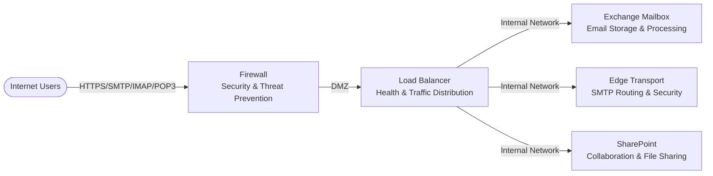

# M365 Azure Local Network Design - Overview

## Overview
This document provides a high-level overview of the Microsoft 365 (M365) deployment on Azure Local infrastructure, designed for secure, highly available email and collaboration services.

## 🎯 Business Objectives
- **High Availability**: Enterprise-grade uptime with automatic failover capabilities
- **Security First**: Multi-layered protection with firewall and DMZ isolation
- **Scalability**: Modular design supports growth and additional services
- **Compliance Ready**: Segmented networks support compliance requirements

## 🏗️ Architecture Overview

### Core Components
| Component | Purpose | Comments |
|-----------|---------|----------|
| **Exchange Mailbox** | Email storage & processing | Database Availability Group (DAG) for high availability |
| **Edge Transport** | SMTP routing & security | Active-active configuration for redundancy |
| **SharePoint** | Collaboration & file sharing | Farm deployment with SQL cluster backend |
| **Load Balancer** | Traffic distribution & health monitoring | Application-aware health monitoring with automatic failover |
| **Firewall** | Security boundary & threat protection | Geo-blocking and threat prevention capabilities |

> [!NOTE]
> The specific vendors mentioned (F5 BIG-IP, Palo Alto VM-Series) are examples from our lab environment. Customers can use any load balancer and firewall solutions that meet the functional and performance requirements of this design.

## 📋 Prerequisites & Requirements

### Infrastructure Requirements
- **Physical Hardware**: Multiple server nodes + redundant TOR switches + BMC switch for Out-of-Band management (if needed)
- **Network Uplinks**: Dual redundant connections to core network
- **Public IPs**: Public IP block for external services (size depends on service requirements)
- **Power**: Dual power feeds for all critical components

> [!NOTE]
> For reference examples of hardware specifications, node counts, and IP allocations, see the [M365_Network_Design_Implementation_Guide.md](./M365_Network_Design_Implementation_Guide.md) document. This is provided as a lab example - customers could adapt these specifications to meet their specific requirements and constraints.

### Network Planning
| Planning Area | Details |
|---------------|---------|
| **IP Address Planning** | Network address allocation for Production, In-Band Management, DMZ, and Out-of-Band Management traffic |
| **VLAN Planning** | Network segmentation strategy for service isolation and traffic management |
| **Routing Planning** | Network routing strategy to ensure proper traffic flow between Out-of-Band Management, In-Band Management, and service networks |
| **Security Zone Planning** | DMZ, Internal, and Out-of-Band Management zone isolation and traffic flow design |
| **Load Balancing Planning** | Service distribution strategy and health monitoring configuration for optimal performance |

> [!NOTE]
> We have an open source IP planning tool available to help with network design and IP subnet allocation. Please check the [M365-IPSubnetPlanner.md](./M365-IPSubnetPlanner.md) document in the same folder for reference and usage details.

### Operational Prerequisites
- **DNS**: Internal DNS servers for name resolution
- **Active Directory**: Domain services for authentication
- **Certificates**: SSL/TLS certificates for all public services
- **Monitoring**: Network and application monitoring tools
- **Backup Strategy**: Configuration and data backup procedures

## 🚀 Implementation Planning Areas

> [!NOTE]
> The following areas represent key implementation activities that may be planned and executed in parallel or different sequences based on your organization's requirements, resources, and dependencies.

### Infrastructure Planning
- Physical rack, stack, and cable equipment
- Configure Out-of-Band management network
- Validate hardware functionality

### Network Foundation Planning
- Configure VLANs and IP addressing
- Implement switch redundancy
- Establish routing and gateway redundancy

### Security Planning
- Deploy and configure firewall
- Implement DMZ and security policies
- Configure NAT and threat protection

### Load Balancing Planning
- Install and configure load balancer
- Set up health monitors and server pools
- Configure virtual servers for all services

### Service Deployment Planning
- Deploy Exchange, SharePoint, and supporting services
- Configure high availability and clustering
- Implement monitoring and alerting

### Testing & Validation Planning
- Functional testing of all services
- Failover testing and disaster recovery
- Performance validation and optimization

