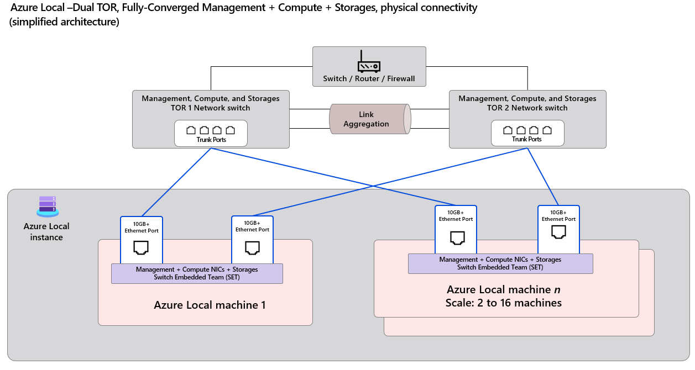

# Azure Local - Fully Converged Physical Network Design [Draft]

- [Overview](#overview)
- [Key Components](#key-components)
- [Three-Node Fully Converged Environment](#three-node-fully-converged-environment)
  - [Host Nodes](#host-nodes)
  - [Cable Map](#cable-map)
    - [Node 1](#node-1)
    - [Node 2](#node-2)
    - [Node 3](#node-3)
  - [VLAN Architecture](#vlan-architecture)
  - [ToR Switches](#tor-switches)
    - [Interface & VLAN Configuration](#interface--vlan-configuration)
- [Q&A](#qa)
- [Reference Documents](#reference-documents)


## Overview

Azure Local's fully converged physical network architecture integrates **management**, **compute**, and **storage** traffic over the same physical Ethernet interfaces. This design minimizes hardware footprint while maximizing performance, scalability, and simplicity of deployment.

## Key Components

- **Top-of-Rack (ToR) Switches**: Physical switches that provide redundant L2/L3 connectivity. Each Azure Local machine connects to two separate ToR switches for high availability, with all switch ports configured as IEEE 802.1Q trunk ports to support multiple VLANs.

- **Azure Local Machine**: A physical host running the Azure Local OS. In a fully converged design, each machine typically has **two high-speed physical NICs** (10Gbps or higher) that **support RDMA** (Remote Direct Memory Access). These interfaces are used to carry **management, compute, and storage** traffic over a unified logical fabric.

- **Network ATC**: Azure Local intent-based networking framework used to define and deploy logical networking configurations (called "intents") on the hosts. In the fully converged pattern, a single `Management + Compute + Storage` intent is cross the NICs.

- **SET (Switch Embedded Teaming)**: A Windows-native NIC teaming method that creates a single logical interface from multiple physical NICs. It operates in **switch-independent mode**, also SET is the **only** supported vmswitch technology on Azure Local.


## Fully Converged Network Design – Physical Topology

This example illustrates a **fully converged Azure Local environment**, where **Management**, **Compute**, and **Storage** traffic all share the same NICs using **VLAN tagging**. While the diagram shows a dual-node-to-ToR cabling structure, the same design easily scales from **2 to 16 nodes** with minimal changes.

> ✅ Fully converged: All traffic types (Mgmt, Compute, Storage) run over the same physical links  
> ✅ Redundant ToR: Each node connects to both TOR1 and TOR2  
> ✅ SET (Switch Embedded Team): Used on the host to bond NICs for fault tolerance

### Topology Diagram



---

### Example: Three-Host Cabling Map

The following table shows physical connections between NICs and the Top-of-Rack switches in a **3-Host setup**. Each Host has two Ethernet ports, and each port connects to a different ToR switch to ensure redundancy.

#### Host 1

| Device    | Interface |      | Device | Interface   |
|-----------|-----------|------|--------|-------------|
| **Host1** | NIC A     | <==> | TOR1   | Ethernet1/1 |
| **Host1** | NIC B     | <==> | TOR2   | Ethernet1/1 |

#### Host 2

| Device    | Interface |      | Device | Interface   |
|-----------|-----------|------|--------|-------------|
| **Host2** | NIC A     | <==> | TOR1   | Ethernet1/2 |
| **Host2** | NIC B     | <==> | TOR2   | Ethernet1/2 |

#### Host 3

| Device    | Interface |      | Device | Interface   |
|-----------|-----------|------|--------|-------------|
| **Host3** | NIC A     | <==> | TOR1   | Ethernet1/3 |
| **Host3** | NIC B     | <==> | TOR2   | Ethernet1/3 |


### VLAN Architecture

| VLAN Type     | Purpose                             | VLAN ID |
|---------------|-------------------------------------|---------|
| Management    | Cluster and Host management traffic | 7       |
| Compute       | VM / workload traffic               | 201     |
| Storage 1     | SMB over RDMA (path 1)              | 711     |
| Storage 2     | SMB over RDMA (path 2)              | 712     |

> Two storage VLANs are used to ensure **path-level redundancy** for RDMA traffic, enhancing **storage high availability**. Each VLAN can map to different physical NICs and ToR switches.

### ToR Switches

This design uses **two physical switches** as Top-of-Rack (ToR) devices to provide uplink connectivity for all Azure Local nodes.

- The ToR switches may be configured in **MLAG (Multi-Chassis Link Aggregation)** for redundancy, but it is **not strictly required**, as redundancy is already achieved through the host-side **SET (Switch Embedded Teaming)** configuration.
- The **core network layer** (e.g., data center routers or firewalls) is considered **out of scope** for this document.

#### Interface & VLAN Configuration

Using **Cisco Nexus 93180YC-FX3 (version 10.x)** as an example platform:

- **VLAN 7** – Management VLAN  
  - Routed in L3 (SVI configured)  
  - Set as the **native VLAN** on trunk ports  
- **VLAN 201** – Compute VLAN  
  - Routed in L3 (SVI configured)  
  - Tagged VLAN on trunk ports  
- **VLANs 711 and 712** – Storage VLANs  
  - Layer 2 only (no SVI)  
  - Both tagged on trunk ports for RDMA SMB traffic paths

##### Sample NX-OS Configuration (Simplified)

```console
vlan 7
  name Management_7
vlan 201
  name Compute_201
vlan 711
  name Storage_711
vlan 712
  name Storage_712

interface Vlan7
  description Management
  no shutdown
  mtu 9216
  ip address 10.101.176.2/24
  hsrp 7
    ip 100.101.176.1

interface Vlan201
  description Compute
  no shutdown
  mtu 9216
  ip address 10.101.177.2/24
  hsrp 201
    ip 100.101.177.1

interface Ethernet1/1-3
  description To_Azure_Local_Host_FullyConverged
  switchport
  switchport mode trunk
  switchport trunk native vlan 7
  switchport trunk allowed vlan 7,201,711,712
  priority-flow-control mode on send-tlv
  spanning-tree port type edge trunk
  mtu 9216
  service-policy type qos input AZS_SERVICES
  no shutdown
```

> **Note**: QoS policies and routing design (e.g., uplinks, BGP/OSPF, default gateway) will be introduced in a separate document.


#### Validation in Lab Environment

##### On Azure Local Host
- Verify the host's MAC address and VLAN configuration.
- For virtual adapters, run `Get-VMNetworkAdapterIsolation` to view VLAN isolation settings.


```powershell
[Host3]: PS C:\Users\Administrator\Documents> Get-NetAdapter | ft InterfaceAlias, VlanID, MacAddress

InterfaceAlias                     VlanID MacAddress       
--------------                     ------ ----------       
ethernet                                0 0C-42-A1-F9-69-4A
vSMB(managementcompute#ethernet 2)        00-15-5D-C8-20-07
ethernet 2                              0 0C-42-A1-F9-69-4B
vManagement(managementcompute)            0C-42-A1-F9-69-4A
vSMB(managementcompute#ethernet)          00-15-5D-C8-20-06

[Host3]: PS C:\Users\Administrator\Documents> Get-VMNetworkAdapterIsolation -ManagementOS | ft ParentAdapter, IsolationMode, DefaultIsolationID

ParentAdapter                                                         IsolationMode DefaultIsolationID
-------------                                                         ------------- ------------------
VMInternalNetworkAdapter, Name = 'vSMB(managementcompute#ethernet)'            Vlan                711
VMInternalNetworkAdapter, Name = 'vManagement(managementcompute)'              Vlan                  0
VMInternalNetworkAdapter, Name = 'vSMB(managementcompute#ethernet 2)'          Vlan                712

```

##### On ToR Switches

- Verify the MAC address table for each ToR switch to ensure the host's MAC addresses are learned correctly.

```console
# On ToR1
TOR1# show mac address-table interface ethernet 1/3
Legend:
        * - primary entry, G - Gateway MAC, (R) - Routed MAC, O - Overlay MAC
        age - seconds since last seen,+ - primary entry using vPC Peer-Link,
        (T) - True, (F) - False, C - ControlPlane MAC, ~ - vsan
   VLAN     MAC Address      Type      age     Secure NTFY Ports
---------+-----------------+--------+---------+------+----+------------------
*    7     0c42.a1f9.694a   dynamic  0         F      F    Eth1/3
*  711     0015.5dc8.2006   dynamic  0         F      F    Eth1/3

# On ToR2
TOR2# show mac address-table interface ethernet 1/3
Legend:
        * - primary entry, G - Gateway MAC, (R) - Routed MAC, O - Overlay MAC
        age - seconds since last seen,+ - primary entry using vPC Peer-Link,
        (T) - True, (F) - False, C - ControlPlane MAC, ~ - vsan
   VLAN     MAC Address      Type      age     Secure NTFY Ports
---------+-----------------+--------+---------+------+----+------------------
*  712     0015.5dc8.2007   dynamic  0         F      F    Eth1/3

```


## Q&A
### Q: In Fully Converged Network Design, can I configure TOR1 only allow only Storage VLAN 711, and TOR2 only allow Storage VLAN 712?

**A:** 
No, this configuration is not supported and will lead to connectivity issues.

When using **SET (Switch Embedded Teaming)** on the host, both physical NICs are treated as a single logical interface. The operating system dynamically balances traffic — including storage — across both NICs. This means that **Storage VLAN 712 traffic could be sent through the NIC connected to TOR1**, and vice versa.

If the switch port on TOR1 only allows VLAN 711, it will **drop any traffic tagged with VLAN 712**, leading to packet loss and connectivity issues.

To ensure **redundancy, load balancing, and high availability**, all trunk ports on the ToR switches must be configured to **allow all required VLANs**, including Management (7), Compute (201), and both Storage VLANs (711 and 712).

### Q: Management and Compute VLANs are allowed across the ToRs peer link. Do I also need to allow the Storage VLANs across the peer link between the two ToR switches?


**A:** 
In a **Switched** deployment, allowing Storage VLANs across the ToRs peer link is **not required** because each storage VLAN is pinned to a specific ToR.

However, in a **Fully Converged** deployment, **Storage VLANs must be allowed across the ToRs peer link**. This is not for regular storage traffic, but to support failover scenarios.

For example:  
If Host1 has NIC1 connected to ToR1 and NIC2 connected to ToR2, and it uses Storage VLAN 711—under normal conditions, traffic flows through ToR1. If NIC1 fails, Host1 will send storage traffic through NIC2 and ToR2. Without VLAN 711 allowed across the ToRs peer link, that traffic cannot reach its destination and will be dropped.


## Reference Documents

- [Network considerations for cloud deployments of Azure Local](https://learn.microsoft.com/en-us/azure/azure-local/plan/cloud-deployment-network-considerations)
- [Physical network requirements for Azure Local](https://learn.microsoft.com/en-us/azure/azure-local/concepts/physical-network-requirements)
- [Teaming in Azure Stack HCI](https://techcommunity.microsoft.com/blog/networkingblog/teaming-in-azure-stack-hci/1070642)
