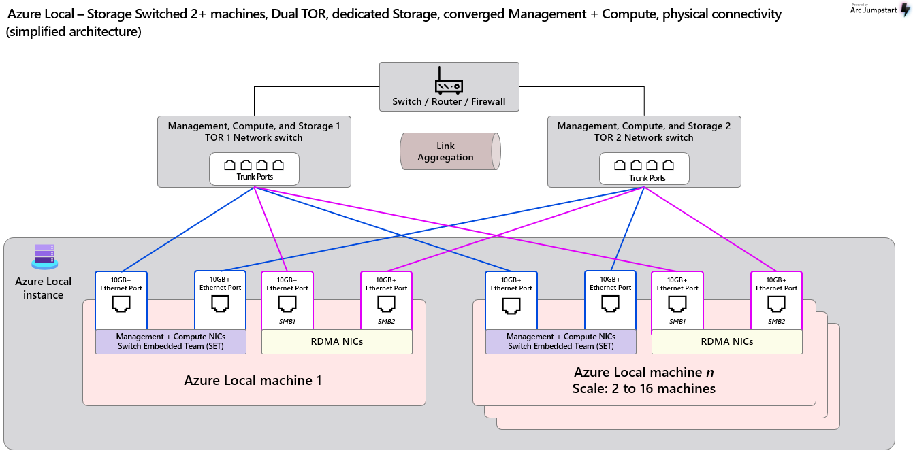
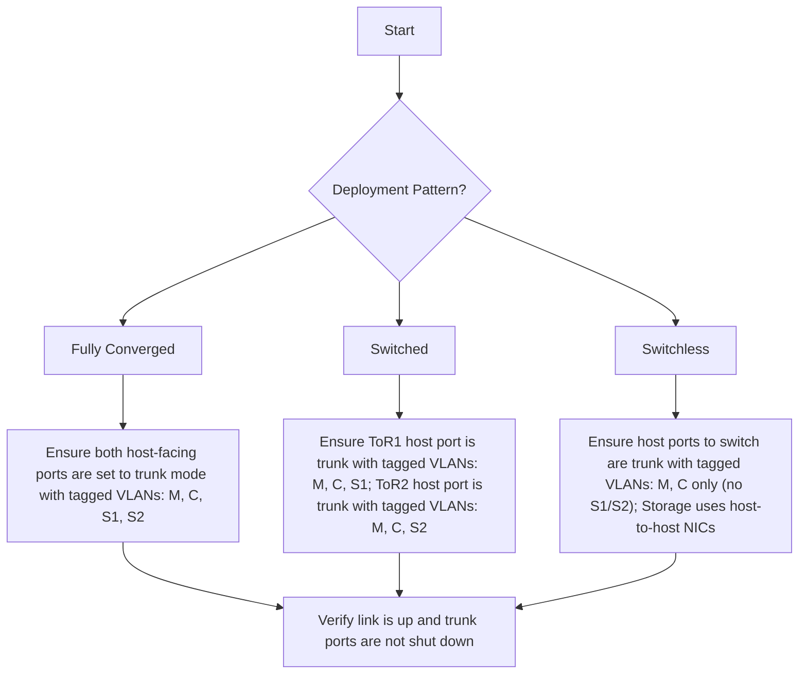
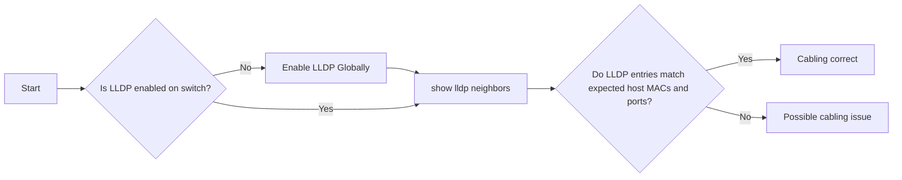
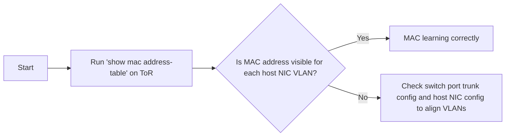

# Azure Local – Physical Network Overview & Troubleshooting Guidance

_A foundational guide covering Azure Local physical network deployment patterns, key configuration requirements, log collection practices, and troubleshooting workflows._

---

## Table of Contents

- [1. Introduction](#1-introduction)
- [2. Deployment Patterns Overview](#2-deployment-patterns-overview)
- [3. Physical Network Hardware & Configuration Requirements](#3-physical-network-hardware--configuration-requirements)
- [4. Initial Troubleshooting for Physical Network Issues](#4-initial-troubleshooting-for-physical-network-issues)
  - [4.1 Identify Deployment Pattern & Interface Configuration](#41-identify-deployment-pattern--interface-configuration)
  - [4.2 Verify Physical Connections Between Hosts and ToR Switches](#42-verify-physical-connections-between-hosts-and-tor-switches)
  - [4.3 Verify Azure Local Host MAC Learning on the Switch](#43-verify-azure-local-host-mac-learning-on-the-switch)
  - [4.4 Advanced Troubleshooting](#44-advanced-troubleshooting)
- [5. Q&A](#5-qa)
- [6. Appendix](#6-appendix)

---

## 1. Introduction

This document provides a high-level introduction to **Azure Local physical networking**, including common deployment patterns, key configuration requirements, and typical troubleshooting scenarios. It also covers frequently asked questions (FAQ) to clarify design choices and operational considerations.

Whether you're already familiar with these topics or exploring them for the first time, this guide can serve as a helpful **knowledge refresher** and reference. It complements the official Azure documentation and aims to provide practical guidance for real-world deployments.

This content will continue to evolve over time. **Feedback, suggestions, and contributions are welcome** to help improve accuracy and usability for everyone working with Azure Local.


### Terms and Acronyms

- **ToR**: Top-of-Rack switch — the physical switch directly connected to Azure Local hosts.
- **M**: Management VLAN — carries management traffic.
- **C**: Compute VLAN — carries tenant or compute traffic.
- **S1**: Storage 1 VLAN traffic.
- **S2**: Storage 2 VLAN traffic.
- **SET**: Switch Embedded Teaming — a Windows-native NIC teaming technology that provides redundancy and load balancing without requiring switch-based aggregation (like LACP).
- **RDMA**: Remote Direct Memory Access — enables high-throughput, low-latency communication directly between memory across hosts, used for storage traffic.
- **LLDP**: Link Layer Discovery Protocol — used to discover directly connected neighbors and interface mapping between hosts and switches.
- **PFC**: Priority Flow Control — an IEEE 802.1Qbb standard that enables lossless Ethernet by pausing traffic per priority class (commonly used for RDMA).
- **ETS**: Enhanced Transmission Selection — an IEEE 802.1Qaz standard that enables bandwidth allocation among traffic classes, often used with PFC to manage RDMA and non-RDMA coexistence.
- **DCB**: Data Center Bridging — a suite of IEEE standards (including PFC and ETS) that enhances Ethernet for data center use by enabling lossless and traffic-class-aware transport over Ethernet.


---

## 2. Deployment Patterns Overview
There are three primary physical network deployment patterns for Azure Local, depends on the use case and scale of the environment, and the mainly difference is how the storage traffic is handled:

- **Fully-Converged**: All traffic types (M, C, S) share the same physical NICs. This design minimizes hardware footprint while maximizing performance and scalability.


- **Switched**: Separate NICs for M/C and S traffic, providing physical isolation. This pattern is suitable for high-performance setups where storage traffic needs dedicated bandwidth.


- **Switchless**: A cost-effective design where storage traffic is handled directly between hosts without a dedicated switch. This is typically used in smaller or remote deployments where simplicity and cost are prioritized.


### Comparison Summary: Fully-Converged vs Switched vs Switchless

## Network Design Comparison

| Design Type         | Host NIC Traffic                                                   |  VLAN on ToRs                       | Typical Use Case                                      |
|---------------------|---------------------------------------------------------------------|--------------------------------------------------------|--------------------------------------------------------|
| **Fully Converged** | 2 NICs per host. All traffic (M + C + S) over both NICs | Host-facing ports are configured as trunks carrying M, C, and S VLANs — all VLANs must be allowed on both ToRs | Simple, scalable design with RDMA and minimal cabling |
| **Switched**        | 4 NICs per host. 2 for M + C, 2 for S                | Host-facing ports are configured as trunks: M and C VLANs are present on both ToRs; S1 VLAN is only on ToR1, and S2 VLAN is only on ToR2 | For dedicated storage performance and traffic separation |
| **Switchless**      | 2 NICs per host to switch (M + C) + (N−1) direct host-to-host NICs for S | Trunk to host with M, C VLANs only; no S VLANs on ToRs | Low-cost, small-site or edge deployments without storage switches |


> [!IMPORTANT]  
> Storage VLANs are preferably configured as **Layer 2 (L2) VLANs without IP subnets** to simplify the overall network design. Since storage traffic is **tagged by Azure Local hosts**, make sure these VLANs are always configured as **tagged VLANs (trunk ports)** on the **ToR (Top of Rack)** switches.


---

## 3. Physical Network Hardware & Configuration Requirements

### Network Switch Requirements

Azure Local requires specific capabilities from physical network switches to ensure performance, compatibility, and integration with RDMA, SET, and VLAN-based traffic separation.

You can find the official list of switch requirements here:  
🔗 [Azure Local – Physical Network Switch Requirements](https://learn.microsoft.com/en-us/azure/azure-local/concepts/physical-network-requirements?view=azloc-2506&tabs=overview%2C24H2reqs#network-switch-requirements)

If you're an **OEM** and wish to qualify your switches for Azure Local deployments, Microsoft provides an open-source validation tool:  
🛠️ [AzureLocal-Network-Switch-Validation](https://github.com/microsoft/AzureLocal-Network-Switch-Validation)


### Network Configuration Requirements

The physical network must be configured in alignment with Azure Local’s host networking requirements, and details and official configuration guidance are available here:  
🔗 [Azure Local – Host Network Requirements](https://learn.microsoft.com/en-us/azure/azure-local/concepts/host-network-requirements?view=azloc-2506)


| Requirement           | Notes                                                                 |
|------------------------|-----------------------------------------------------------------------|
| **VLAN**              | Support separate VLANs for M, C, and S networks.                    |
| **Jumbo Frames**      | MTU must support 1514–9174 bytes to enable SDN encapsulation.          |
| **DCB (PFC + ETS)**   | Required for lossless RDMA; must support IEEE 802.1Qbb and 802.1Qaz.  |
| **LLDP with TLVs**    | Switches must support LLDP with VLAN, ETS, and PFC TLVs, which will be used for network discovery and monitoring.              |
| **BGP Support**       | Required for SDN compute overlays.                                    |

> [!NOTE]
>  These are high-level requirements. Please refer to the official documentation to ensure full alignment with your specific deployment needs.

This tool is designed to automate the generation of Azure Local switch configurations based on input JSON files. In addition to automation, it includes sample configuration files that can be used as reference. The tool is actively maintained and will continue to evolve in alignment with Azure Local's latest requirements.
🔗 [AzureStack_Network_Switch_Config_Generator](https://github.com/microsoft/AzureStack_Network_Switch_Config_Generator)


---

## 4. Initial Troubleshooting for Physical Network Issues

This section provides clear, step-by-step guidance to help identify and troubleshoot common physical network issues in Azure Local environments.

### 4.1 Identify Deployment Pattern & Interface Configuration

#### Troubleshooting Flowchart


#### Log Collection & Analysis

> [!NOTE]
> The following examples use Cisco NX-OS for reference. Please adjust the commands based on your switch vendor's CLI.

##### Interface Configuration Verification
- `show run interface <interface_name>`  
  - Verify the interface is configured in **trunk mode**
  - Confirm that required VLANs (M, C, S1, S2) are **allowed** based on the deployment pattern
  - Ensure the interface is **not shutdown** (`no shutdown`)


In this example, the Azure Local is deployed with **Switched** pattern, **7 is M, 201 is C, 711 is S1, and 712 is S2**. So the ToR1 and ToR2 Hosts-Facing ports should be configured as follows:

###### TOR1
``` console
TOR1# show run int ethernet 1/1

interface Ethernet1/1
  description Switched-Compute
  no cdp enable
  switchport
  switchport mode trunk
  switchport trunk native vlan 7
  switchport trunk allowed vlan 7,201
  spanning-tree port type edge trunk
  mtu 9216
  no logging event port link-status
  no shutdown

TOR1# show run int ethernet 1/21

interface Ethernet1/21
  description Switched-Storage
  no cdp enable
  switchport
  switchport mode trunk
  switchport trunk native vlan 99
  switchport trunk allowed vlan 711
  priority-flow-control mode on
  spanning-tree port type edge trunk
  mtu 9216
  no logging event port link-status
  service-policy type qos input AZS_SERVICES no-stats
  no shutdown

```
###### TOR2
``` console
TOR2# show run int ethernet 1/1

interface Ethernet1/1
  description Switched-Compute
  no cdp enable
  switchport
  switchport mode trunk
  switchport trunk native vlan 7
  switchport trunk allowed vlan 7,201
  spanning-tree port type edge trunk
  mtu 9216
  no logging event port link-status
  no shutdown

TOR2# show run int ethernet 1/21

interface Ethernet1/21
  description Switched-Storage
  no cdp enable
  switchport
  switchport mode trunk
  switchport trunk native vlan 99
  switchport trunk allowed vlan 712
  priority-flow-control mode on
  spanning-tree port type edge trunk
  mtu 9216
  no logging event port link-status
  service-policy type qos input AZS_SERVICES no-stats
  no shutdown
```

##### Interface Status Verification

- `show interface <interface_name>`  
  - Confirm the interface is **up and operational**
  - Check for absence of **errors**, or **drops**, especially **CRC errors**.


``` console
TOR1# show int ethernet 1/1
Ethernet1/1 is up
admin state is up, Dedicated Interface
  Hardware: 10000/25000/40000/50000/100000 Ethernet, address: 4874
.1039.e2e8 (bia 4874.1039.e2e8)
  Description: Switched-Compute
  MTU 9216 bytes, BW 100000000 Kbit , DLY 10 usec
  reliability 255/255, txload 1/255, rxload 1/255
  Encapsulation ARPA, medium is broadcast
  Port mode is trunk
  full-duplex, 100 Gb/s, media type is 100G
  Beacon is turned off
  Auto-Negotiation is turned on  FEC mode is Auto
  Input flow-control is off, output flow-control is off
  Auto-mdix is turned off
  Rate mode is dedicated
  Switchport monitor is off
  EtherType is 0x8100
  EEE (efficient-ethernet) : n/a
    admin fec state is auto, oper fec state is Rs-fec
  Last link flapped 1week(s) 1day(s)
  Last clearing of "show interface" counters never
  402 interface resets
  Load-Interval #1: 30 seconds
    30 seconds input rate 58976 bits/sec, 24 packets/sec
    30 seconds output rate 89304 bits/sec, 42 packets/sec
    input rate 58.98 Kbps, 24 pps; output rate 89.30 Kbps, 42 pps
  Load-Interval #2: 5 minute (300 seconds)
    300 seconds input rate 60440 bits/sec, 13 packets/sec
    300 seconds output rate 83152 bits/sec, 27 packets/sec
    input rate 60.44 Kbps, 13 pps; output rate 83.15 Kbps, 27 pps
  RX
    1803016069 unicast packets  1930412 multicast packets  84859 b
roadcast packets
    1805031341 input packets  1886271661338 bytes
    83702 jumbo packets  0 storm suppression bytes
    0 runts  0 giants  0 CRC  0 no buffer
    0 input error  0 short frame  0 overrun   0 underrun  0 ignore
d
    0 watchdog  0 bad etype drop  0 bad proto drop  0 if down drop
    0 input with dribble  0 input discard
    0 Rx pause
    0 Stomped CRC
  TX
    2459465706 unicast packets  389073841 multicast packets  65260
69 broadcast packets
    2855065616 output packets  3119994074289 bytes
    72934 jumbo packets
    0 output error  0 collision  0 deferred  0 late collision
    0 lost carrier  0 no carrier  0 babble  0 output discard
    0 Tx pause

```

### 4.2 Verify Physical connections between Hosts and ToR Switches

#### Troubleshooting Flowchart


##### Log Collection & Analysis
- `show lldp neighbors`  
  - Verify LLDP entries match expected host MAC addresses and ports
  - Check for any discrepancies in neighbor information

###### On Azure Local Host
``` console
[Host1]: PS C:\Users\Administrator\Documents> Get-NetAdapter | select Name,MacAddress,Status

Name                                 MacAddress        Status
----                                 ----------        ------
ethernet 2                           C8-4B-D6-90-C7-E6 Up
ethernet 4                           C8-4B-D6-90-C7-E8 Up
ethernet                             C8-4B-D6-90-C7-E5 Up
ethernet 3                           C8-4B-D6-90-C7-E7 Up

```

###### On ToR Switch

``` console
# on TOR1
TOR1# show lldp neighbors
Capability codes:
  (R) Router, (B) Bridge, (T) Telephone, (C) DOCSIS Cable Device
  (W) WLAN Access Point, (P) Repeater, (S) Station, (O) Other
Device ID            Local Intf      Hold-time  Capability  Port ID
c84b.d690.c7e5       Eth1/1          30                     c84b.d690.c7e5
...
c84b.d690.c7e7       Eth1/21         30                     c84b.d690.c7e7
...

# on TOR2
TOR2# show lldp neighbors
Capability codes:
  (R) Router, (B) Bridge, (T) Telephone, (C) DOCSIS Cable Device
  (W) WLAN Access Point, (P) Repeater, (S) Station, (O) Other
Device ID            Local Intf      Hold-time  Capability  Port ID
c84b.d690.c7e6       Eth1/1          30                     c84b.d690.c7e6
...
c84b.d690.c7e8       Eth1/21         30                     c84b.d690.c7e8
...
```

So the cable mapping based on the lldp neighbors output is as follows:

| Host Name | NIC Name     | MAC Address           | Connected ToR | ToR Interface     |
|-----------|--------------|------------------------|---------------|-------------------|
| Host1     | Ethernet     | C8-4B-D6-90-C7-E5      | ToR1          | Ethernet1/1     |
| Host1     | Ethernet 2   | C8-4B-D6-90-C7-E6      | ToR2          | Ethernet1/1   |
| Host1     | Ethernet 3   | C8-4B-D6-90-C7-E7      | ToR1          | Ethernet1/21    |
| Host1     | Ethernet 4   | C8-4B-D6-90-C7-E8      | ToR2          | Ethernet1/21   |


---

### 4.3 Verify Azure Local Host MAC Learning on the Switch

Switches learn which MAC addresses are connected to which ports and VLANs. If a switch doesn’t learn the correct MAC for a host’s NICs, traffic won’t reach the intended host. This step ensures each host is properly connected and the network knows where to send traffic.

#### Troubleshooting Flowchart



##### Log Collection & Analysis
- `show mac address-table`  
  - Verify that the MAC addresses of each host NIC are learned on the expected VLANs
  - Check for any missing or incorrect entries

###### On Azure Local Host
``` Powershell
[Host1]: PS C:\Users\Administrator\Documents> Get-NetAdapter | ft InterfaceAlias, VlanID, MacAddress
 
InterfaceAlias VlanID MacAddress
-------------- ------ ----------
ethernet 4        712 C8-4B-D6-90-C7-E8
ethernet 3        711 C8-4B-D6-90-C7-E7
ethernet 2        0   C8-4B-D6-90-C7-E6
ethernet          0   C8-4B-D6-90-C7-E5

```

###### On ToR Switch
``` console
# On TOR1
TOR1# show mac address-table interface ethernet 1/1
Legend:
        * - primary entry, G - Gateway MAC, (R) - Routed MAC, O - Overlay MAC
        age - seconds since last seen,+ - primary entry using vPC Peer-Link,
        (T) - True, (F) - False, C - ControlPlane MAC, ~ - vsan
   VLAN     MAC Address      Type      age     Secure NTFY Ports
---------+-----------------+--------+---------+------+----+------------------
*    7     cb4b.d690.c7e5   dynamic  0         F      F    Eth1/1

TOR1# show mac address-table interface ethernet 1/21
Legend:
        * - primary entry, G - Gateway MAC, (R) - Routed MAC, O - Overlay MAC
        age - seconds since last seen,+ - primary entry using vPC Peer-Link,
        (T) - True, (F) - False, C - ControlPlane MAC, ~ - vsan
   VLAN     MAC Address      Type      age     Secure NTFY Ports
---------+-----------------+--------+---------+------+----+------------------
*  711     cb4b.d690.c7e7   dynamic  0         F      F    Eth1/21


# On TOR2
TOR2# show mac address-table interface ethernet 1/1
Legend:
        * - primary entry, G - Gateway MAC, (R) - Routed MAC, O - Overlay MAC
        age - seconds since last seen,+ - primary entry using vPC Peer-Link,
        (T) - True, (F) - False, C - ControlPlane MAC, ~ - vsan
   VLAN     MAC Address      Type      age     Secure NTFY Ports
---------+-----------------+--------+---------+------+----+------------------
*    7     cb4b.d690.c7e6   dynamic  0         F      F    Eth1/1

TOR2# show mac address-table interface ethernet 1/21
Legend:
        * - primary entry, G - Gateway MAC, (R) - Routed MAC, O - Overlay MAC
        age - seconds since last seen,+ - primary entry using vPC Peer-Link,
        (T) - True, (F) - False, C - ControlPlane MAC, ~ - vsan
   VLAN     MAC Address      Type      age     Secure NTFY Ports
---------+-----------------+--------+---------+------+----+------------------
*  712     cb4b.d690.c7e8   dynamic  0         F      F    Eth1/21
```

### 4.4 Advanced Troubleshooting
This TSG just covers the basic physical network troubleshooting steps. For more advanced topics like RDMA, latency tuning, SDN setup, BGP, MLAG, and Spanning Tree, please refer to the dedicated documents in the Azure Local documentation set.

## 5. Q&A

### Q: Why does Azure Local use two storage networks in the design? Can I use just one?

**A:**  
Azure Local uses **two separate storage VLANs** (e.g., VLAN 711 and VLAN 712) to provide **high availability and fault tolerance** for storage traffic.

It’s true that **Windows SET (Switch Embedded Teaming)** provides NIC-level fault tolerance. However,  **RDMA (Remote Direct Memory Access)** traffic is **bound to a specific NIC** and switch. If only **one storage VLAN** is used, RDMA traffic can be forced to cross the **peer link** between ToR switches — which we want to avoid in performance-sensitive environments.

For example, in a **switched scenario**:
- If **Host1** uses **NIC1 → ToR1**
- And **Host2** uses **NIC2 → ToR2**
- Then all RDMA storage traffic between them must **cross the peer link**

```txt
          +--------+            +--------+
          |  ToR1  | <--------> |  ToR2  |
          +--------+  peer link +--------+
             |  |                  |  |
             |  |                  |  |
         +---+--+--+           +---+--+--+
         | NIC1   |           | NIC2   |
     Host1       Host2     Host1       Host2
     VLAN711     VLAN711   VLAN711     VLAN711

```

This introduces **unnecessary latency and jitter**, which can degrade RDMA performance.

By using **two storage VLANs** (e.g., 711 and 712), each mapped to separate NICs and switches, the design allows RDMA traffic to **stay local** to the switch as much as possible. Traffic only crosses the peer link **when a failover occurs**, not during normal operation.

```txt
          +--------+            +--------+
          |  ToR1  | <--------> |  ToR2  |
          +--------+  peer link +--------+
             |  |                  |  |
             |  |                  |  |
         +---+--+--+           +---+--+--+
         | NIC1   |           | NIC2   |
     Host1       Host2     Host1       Host2
     VLAN711     VLAN711   VLAN712     VLAN712

```

#### Summary:
- ✅ SET provides link-level redundancy
- ✅ Two storage VLANs ensure **RDMA-level failover** and **ToR-local communication**
- 🚫 One VLAN risks **cross-ToR RDMA**, which reduces performance

### Q: Management and Compute VLANs are allowed across the ToRs peer link. Do I also need to allow the Storage VLANs across the peer link between the two ToR switches?

**A:** 
- In a **Switched** deployment, **Storage VLANs do not need to be allowed** across the ToR peer link. Each host uses a dedicated Storage VLAN that maps to a specific ToR switch. This keeps storage traffic local, avoiding cross-ToR paths.

- In a **Fully Converged** deployment, **Storage VLANs must be allowed** on the ToR peer link. While regular storage traffic doesn’t cross ToRs, **failover scenarios** make the peer link critical.

#### Fully Converged Deployment

- Host1  
  → NIC1 → ToR1 (normal path)  
  → NIC2 → ToR2 (failover path)  
- Uses Storage VLAN 711  
- If NIC1 fails, Host1 switches to NIC2  
- **If VLAN 711 is not allowed on the peer link**, ToR2 cannot forward traffic to the storage network — **traffic is dropped**.

#### Switched Deployment

- Host1 → NIC1 → Storage VLAN 711 → ToR1  
- Host1 → NIC2 → Storage VLAN 712 → ToR2  
- Each ToR handles its own storage traffic  
- No cross-ToR forwarding needed  
- **No need to allow Storage VLANs across the peer link**


### Q: Are **DCB (Data Center Bridging)** features like **PFC** and **ETS** needed for RDMA in Azure Local, including both **RoCEv2** and **iWARP**?

**A:**  
While **DCB features** such as **Priority Flow Control (PFC)** and **Enhanced Transmission Selection (ETS)** are not strictly required, they are **highly recommended** for both **RoCEv2** and **iWARP** to optimize RDMA performance in Azure Local environments.

Overall Comparison:

- **RoCEv2** uses **UDP**, which is fast but **cannot tolerate packet loss**.  
  → It **needs PFC** to prevent packet drops, and DCB is **required** for optimal performance.

- **iWARP** uses **TCP**, which can handle **packet loss** but is **slower**.  
  → It **doesn’t require PFC**, but enabling **DCB** can still help reduce latency.

> [!NOTE]
>  Even though **iWARP** uses reliable TCP transport and does **not mandate DCB**, enabling **PFC and ETS** can still help minimize congestion and latency, especially in mixed RDMA environments.  
> Enabling DCB across the fabric ensures **consistent, predictable low-latency** behavior for RDMA workloads.

### Q: Why can't I see the storage IP in the ARP table, while the Compute and Management IPs are visible?

**A:**
This is expected behavior in Azure Local deployments.

In the reference design, the **Storage VLAN is configured as a Layer 2 (L2) network without an IP subnet**. Storage traffic is **VLAN-tagged and handled entirely at Layer 2**, so it doesn't involve IP-based communication or ARP resolution. In contrast, **Management and Compute VLANs are Layer 3 networks** with IP addresses, which is why their entries appear in the ARP table.


## 6. Appendix

- [Physical network requirements for Azure Local](https://learn.microsoft.com/en-us/azure/azure-local/concepts/physical-network-requirements?view=azloc-2506&tabs=overview%2C24H2reqs)
- [Host network requirements for Azure Local](https://learn.microsoft.com/en-us/azure/azure-local/concepts/host-network-requirements?view=azloc-2506)
- [Software Defined Networking (SDN) in Azure Local](https://learn.microsoft.com/en-us/azure/azure-local/concepts/software-defined-networking-23h2?view=azloc-2506)