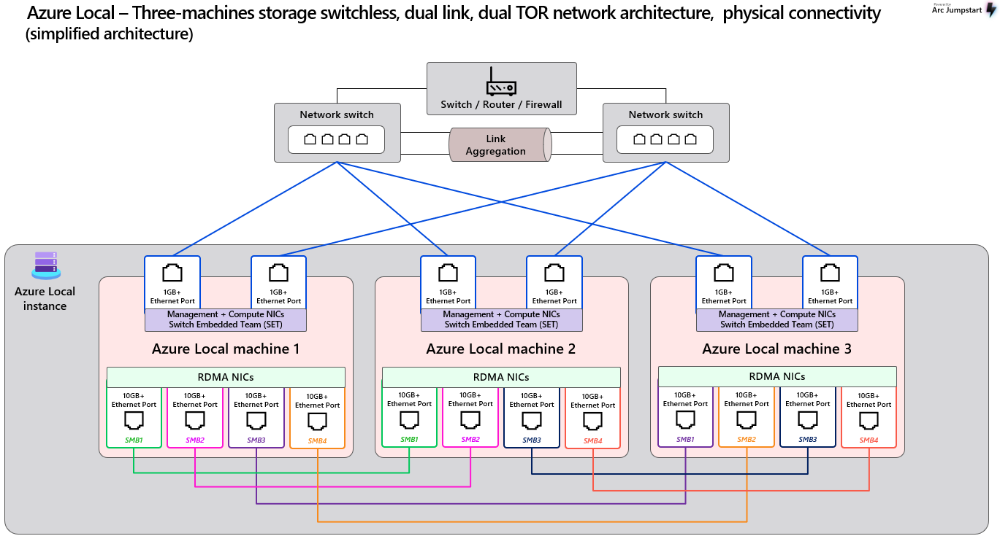

# Azure Local – Physical Network Deployment Patterns Reference

_A comprehensive design reference covering Azure Local physical network deployment patterns, configuration requirements, and hardware specifications for enterprise deployments._

> [!IMPORTANT]
> **Document Purpose**: This document provides guidance and best practices for Azure Local physical network design. Always refer to the latest official Microsoft documentation for the most current requirements and supported configurations.

---

## Table of Contents

- [1. Introduction](#1-introduction)
- [2. Deployment Patterns Overview](#2-deployment-patterns-overview)
- [3. Physical Network Hardware & Configuration Requirements](#3-physical-network-hardware--configuration-requirements)
- [4. Frequently Asked Questions](#4-frequently-asked-questions)
- [5. Additional Resources](#5-additional-resources)

---

## 1. Introduction

This document provides comprehensive guidance for **Azure Local physical networking**, covering deployment patterns and configuration requirements to support enterprise deployments. It serves as a design reference for IT professionals, network architects, and system integrators planning Azure Local infrastructure.

This guide complements the official Azure Local documentation and provides practical implementation guidance with focus on:
- Physical network deployment pattern selection
- Hardware requirements and specifications  
- Configuration best practices and design considerations
- Frequently asked questions about deployment patterns

> [!NOTE]
> This document focuses specifically on physical network infrastructure design patterns. For troubleshooting procedures and diagnostic guidance, refer to the companion document: **Azure Local – Physical Network Connection Troubleshooting Guide**.

> [!TIP]  
> For logical networking, SDN configuration, and advanced operational topics, please refer to the dedicated Azure Local documentation resources listed in the Additional Resources section.

### Key Terminology

This section defines essential terms and acronyms used throughout this document:

| Term | Definition |
|------|------------|
| **ToR (Top-of-Rack Switch)** | Physical network switch directly connected to Azure Local nodes, providing Layer 2/3 connectivity |
| **Management VLAN (M)** | Network segment dedicated to cluster management and administrative traffic |
| **Compute VLAN (C)** | Network segment for virtual machine workloads and tenant traffic |
| **Storage VLAN 1 (S1)** | Storage network segment for SMB1 over RDMA traffic |
| **Storage VLAN 2 (S2)** | Storage network segment for SMB2 over RDMA traffic |
| **SET (Switch Embedded Teaming)** | Windows-native NIC aggregation technology providing redundancy without switch-based LACP |
| **RDMA (Remote Direct Memory Access)** | High-performance networking technology enabling direct memory-to-memory communication |
| **LLDP (Link Layer Discovery Protocol)** | IEEE 802.1AB standard for network topology discovery and cable verification |
| **PFC (Priority Flow Control)** | IEEE 802.1Qbb standard enabling lossless Ethernet for RDMA traffic |
| **ETS (Enhanced Transmission Selection)** | IEEE 802.1Qaz standard for bandwidth allocation and traffic class management |
| **DCB (Data Center Bridging)** | IEEE standards suite (PFC, ETS) enhancing Ethernet for data center environments |

---

## 2. Deployment Patterns Overview

Azure Local supports three primary physical network deployment patterns, each optimized for different use cases, scale requirements, and operational considerations. The fundamental difference between these patterns lies in how storage traffic is handled and isolated:

### Deployment Pattern Descriptions

**Switchless Deployment**
A cost-effective design optimized for smaller deployments where storage traffic flows directly between nodes without dedicated switching infrastructure. This pattern minimizes hardware requirements and is ideal for edge locations and remote sites where simplicity and cost optimization are priorities.

**Switched Deployment**  
A high-performance design utilizing dedicated NICs for management/compute and storage traffic, providing storage physical isolation. This pattern is recommended for enterprise deployments requiring maximum storage performance and dedicated bandwidth allocation for storage workloads.

**Fully Converged Deployment**
A balanced design where all traffic types (management, compute, storage) share the same physical NICs through VLAN segmentation. This pattern minimizes hardware footprint while maintaining high scalability. **Design Consistency**: Follows the same storage VLAN pattern as Switched deployment with "One Storage VLAN per TOR" as the baseline configuration to ensure RDMA traffic utilization and prevent storage traffic cross the ToR peer links.

### Deployment Pattern Comparison

| Deployment Pattern  | Host NIC Configuration | ToR Switch VLAN Configuration | Primary Use Cases |
|---------------------|------------------------|-------------------------------|-------------------|
| **Switchless** | 2 NICs to switches (M+C traffic) + (N−1) direct inter-node NICs (S traffic) | Trunk ports with M, C VLANs only; no storage VLANs on ToRs | Edge deployments, remote sites, cost-sensitive environments |
| **Switched** | 4 NICs per host: 2 for M+C traffic, 2 dedicated for storage | M and C VLANs on both ToRs; S1 VLAN exclusive to ToR1, S2 VLAN exclusive to ToR2 | Enterprise deployments requiring dedicated storage performance and traffic isolation |
| **Fully Converged** | 2 NICs per host carrying all traffic types (M+C+S) via VLAN segmentation | **Baseline**: One Storage VLAN per TOR (S1→ToR1, S2→ToR2). **Optional**: Both storage VLANs on both ToRs for enhanced resilience | General-purpose deployments balancing performance, simplicity, and hardware efficiency |

> [!NOTE]
> **Storage VLAN Configuration**: Customers can configure Storage VLANs as either **Layer 3 (L3) networks with IP subnets** or **Layer 2 (L2) networks without IP subnets**, but **we prefer L2 configuration**. With L2, it's just VLAN tagging, which makes it easy for Azure Local hosts to use any IP addresses without hardcoding subnet configurations on the switch or requiring predefined IP ranges. Since Azure Local nodes handle storage traffic tagging, ensure these VLANs are configured as **tagged VLANs on trunk ports** across all ToR switches.

---

## 3. Physical Network Hardware & Configuration Requirements

### Network Switch Requirements

Azure Local requires specific capabilities from physical network switches to ensure performance, compatibility, and integration with RDMA, SET, and VLAN-based traffic separation.

You can find the official list of switch requirements here:  
🔗 [Azure Local – Physical Network Switch Requirements](https://learn.microsoft.com/en-us/azure/azure-local/concepts/physical-network-requirements?view=azloc-2506&tabs=overview%2C24H2reqs#network-switch-requirements)

If you're an **OEM** and wish to qualify your switches for Azure Local deployments, Microsoft provides an open-source validation tool:  
🛠️ [AzureLocal-Network-Switch-Validation](https://github.com/microsoft/AzureLocal-Network-Switch-Validation)

### Network Configuration Requirements

The physical network must be configured in alignment with Azure Local's host networking requirements, and details and official configuration guidance are available here:  
🔗 [Azure Local – Host Network Requirements](https://learn.microsoft.com/en-us/azure/azure-local/concepts/host-network-requirements)

| Requirement           | Notes                                                                 |
|------------------------|-----------------------------------------------------------------------|
| **VLAN**              | Support separate VLANs for M, C, and S networks.                    |
| **Jumbo Frames**      | MTU must support 1514–9174 bytes to enable SDN encapsulation.          |
| **DCB (PFC + ETS)**   | Required for lossless RDMA; must support IEEE 802.1Qbb and 802.1Qaz.  |
| **LLDP with TLVs**    | Switches must support LLDP with VLAN, ETS, and PFC TLVs, which will be used for network discovery and monitoring.              |
| **BGP Support**       | Required for SDN compute overlays.                                    |

> [!NOTE]
>  These are high-level requirements. Please refer to the official documentation to ensure full alignment with your specific deployment needs.

This tool is designed to automate the generation of Azure Local switch configurations based on input JSON files. In addition to automation, it includes sample configuration files that can be used as reference. The tool is actively maintained and will continue to evolve in alignment with Azure Local's latest requirements.
🔗 [AzureStack_Network_Switch_Config_Generator](https://github.com/microsoft/AzureStack_Network_Switch_Config_Generator)

---

## 4. Frequently Asked Questions

### Q: Why does Azure Local utilize two storage networks in the design architecture, and do Storage VLANs need to be configured across the ToR peer link?

**A:**  
Azure Local implements **dual storage VLANs** (typically VLAN 711 and VLAN 712) to ensure **high availability and fault tolerance** for storage traffic. The core design principle follows **"One Storage VLAN per ToR"** architecture for consistency across all deployment patterns.

**Storage VLANs and Peer Link Configuration:**
**No, Storage VLANs should not be configured across the ToR peer link** in any deployment pattern. While Management and Compute VLANs are allowed across ToR peer links, Storage VLANs follow a different architecture.

**Key Design Principles:**
- **ToR Switch Level**: Each ToR switch handles **only one storage VLAN** - no storage traffic crosses the ToR peer link
- **Host Level**: **Windows SET (Switch Embedded Teaming)** in Fully Converged deployments uses vNIC to pNIC mapping based on adapter order to ensure storage traffic reaches the correct ToR switch
- **Resilience**: Two storage VLANs provide **host-side resilience** while ToR switches optimize **RDMA performance** to the right destination

**Architecture Overview:**

In **both Switched and Fully Converged** deployments:
- **ToR1**: Handles Storage VLAN 711 exclusively  
- **ToR2**: Handles Storage VLAN 712 exclusively  
- **No storage traffic crosses the ToR peer link**

**Deployment Pattern Implementation:**

#### Switched Deployment
- Uses **dedicated storage NICs** (no SET)
- Host1 → dedicated NIC1 → Storage VLAN 711 → ToR1  
- Host1 → dedicated NIC2 → Storage VLAN 712 → ToR2  
- **Direct NIC-to-ToR mapping** without teaming
- **No storage VLANs required on the peer link**

#### Fully Converged Deployment
- Uses **SET (Switch Embedded Teaming)** for all traffic types
- SET performs **vNIC to pNIC mapping** based on adapter order
- Host1 → SET maps Storage VLAN 711 → pNIC1 → ToR1  
- Host1 → SET maps Storage VLAN 712 → pNIC2 → ToR2  
- **SET ensures correct vNIC to pNIC mapping** based on adapter order
- **No storage VLANs required on the peer link**

**Why this design works:**
- **Host-side resilience**: SET (in Fully Converged) or dedicated NICs (in Switched) provide redundancy
- **ToR-side optimization**: Each ToR switch optimizes RDMA performance for its assigned storage VLAN
- **Clean separation**: Management and Compute VLANs handle inter-ToR communication needs

#### Summary:
- ✅ **One Storage VLAN per ToR** - no storage traffic crosses ToR peer links
- ✅ **SET provides host-side resilience** and correct traffic routing in Fully Converged deployments  
- ✅ **Dual storage VLANs ensure failover capabilities** while maintaining RDMA performance optimization
- ✅ **Storage VLANs are not configured on ToR peer links** - unlike Management and Compute VLANs

### Q: Are **DCB (Data Center Bridging)** features like **PFC** and **ETS** required for RDMA in Azure Local deployments?

**A:**  
While **DCB features** such as **Priority Flow Control (PFC)** and **Enhanced Transmission Selection (ETS)** are not strictly mandatory, they are **highly recommended** for both **RoCEv2** and **iWARP** to optimize RDMA performance in Azure Local environments.

**Protocol Comparison:**

- **RoCEv2** uses **UDP**, which is fast but **cannot tolerate packet loss**.  
  → **PFC is essential** to prevent packet drops, and DCB is **required** for optimal performance.

- **iWARP** uses **TCP**, which can handle **packet loss** but may introduce additional latency.  
  → **PFC is not mandatory**, but enabling **DCB** can still help reduce latency and improve consistency.

> [!IMPORTANT]
> Even though **iWARP** uses reliable TCP transport and does **not mandate DCB**, enabling **PFC and ETS** can help minimize congestion and latency, especially in mixed RDMA environments. Enabling DCB across the fabric ensures **consistent, predictable low-latency** behavior for RDMA workloads.

### Q: Can Storage VLANs be configured as Layer 3 networks instead of Layer 2?

**A:**
Yes, Storage VLANs can be configured as either **Layer 2 (L2) networks without IP subnets** or **Layer 3 (L3) networks with IP subnets**. However, **Layer 2 configuration is the recommended approach** for the following reasons:

**Layer 2 Benefits (Recommended):**
- Simplified VLAN tagging approach
- No need to pre-configure IP subnets on switches
- Azure Local hosts can use any IP addresses dynamically
- Reduced switch configuration complexity
- Better alignment with Azure Local's network intent configuration

**Layer 3 Configuration:**
- Requires predefined IP subnet configuration on switches
- More complex to manage and troubleshoot
- May require additional routing considerations

> [!NOTE]
> Regardless of the approach chosen, ensure Storage VLANs are configured as **tagged VLANs on trunk ports** across all ToR switches since Azure Local nodes handle storage traffic tagging.

## 5. Additional Resources

For comprehensive Azure Local networking guidance, refer to these official Microsoft documentation resources:

### Official Documentation
- **[Physical network requirements for Azure Local](https://learn.microsoft.com/en-us/azure/azure-local/concepts/physical-network-requirements)**  
  Complete hardware and configuration requirements for Azure Local network infrastructure

- **[Host network requirements for Azure Local](https://learn.microsoft.com/en-us/azure/azure-local/concepts/host-network-requirements)**  
  Detailed guidance for host-level networking configuration and requirements

- **[Software Defined Networking (SDN) in Azure Local](https://learn.microsoft.com/en-us/azure/azure-local/concepts/software-defined-networking-23h2)**  
  Comprehensive guide to SDN implementation and configuration in Azure Local environments
