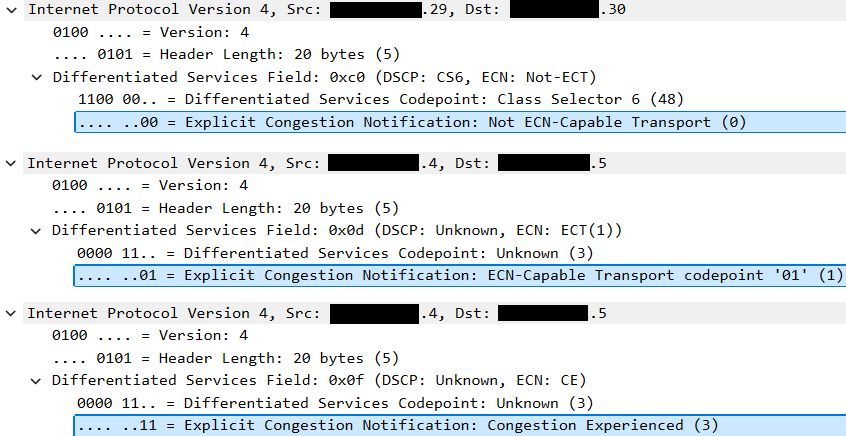

<!-- tsg-metadata
{
	"schema": "azure-local-supportability/tsg-metadata/v1",
	"document_type": "reference",
	"products": ["Azure Local"],
	"detector": {
		"type": "none",
		"signal": null
	},
	"validation": {
		"fidelity_level": "L0",
		"technical_grade": null,
		"reproduction_substrate": "none",
		"automation_status": "not-assessed",
		"last_validated": "2026-09-09",
		"spec_ref": ""
	}
}
-->

# Azure Local - Explicit Congestion Notification

Explicit Congestion Notification (ECN) enables a congested switch or router to mark eligible IP packets instead of relying only on packet drops as a congestion signal. In Azure Local switched-storage designs, ECN provides congestion feedback for storage traffic while Priority Flow Control (PFC) provides hop-by-hop loss prevention.

This reference explains the ECN mechanism and its validation boundaries. For the complete Azure Local RDMA QoS design, traffic classes, PFC, Enhanced Transmission Selection (ETS), MTU, and Cisco NX-OS configuration, see [Azure Local QoS Policy](./Reference-TOR-QOS-Policy-Configuration.md).

## Contents

- [How ECN Works](#how-ecn-works)
- [ECN Codepoints](#ecn-codepoints)
- [Transport Feedback](#transport-feedback)
- [Validation](#validation)
- [Related Guidance](#related-guidance)
- [References](#references)

## How ECN Works

When an ECN-capable transport sends a packet, it sets the two-bit ECN field in the IPv4 Differentiated Services field or IPv6 Traffic Class field to ECT(0) or ECT(1). When a configured queue crosses its congestion threshold, the network device can change that field to Congestion Experienced (CE). The receiver then returns transport-specific feedback, and the sender reduces its transmission rate.

ECN and PFC solve different problems:

- ECN signals persistent queue pressure so the endpoint can reduce its sending rate.
- PFC pauses a congested priority hop by hop to prevent loss while congestion feedback takes effect.
- ETS reserves minimum bandwidth among traffic classes.

ECN does not by itself make a path lossless, and a PFC-enabled queue does not prove that ECN marking works.

## ECN Codepoints

| ECN bits | Codepoint | Meaning |
| -------- | --------- | ------- |
| `00` | Not-ECT | The transport does not permit ECN marking. |
| `10` | ECT(0) | ECN-capable transport. |
| `01` | ECT(1) | ECN-capable transport. |
| `11` | CE | Congestion Experienced. |

> [!NOTE]
> ECT(0) and ECT(1) both indicate ECN participation, but transports can define how they use the two ECT codepoints. Do not rewrite one ECT codepoint to the other in transit.

Packet capture showing the ECN field:

## Transport Feedback

| Transport | Receiver feedback | Sender response |
| --------- | ----------------- | --------------- |
| RoCEv2 | The receiving NIC observes CE and returns a Congestion Notification Packet (CNP). | The sending NIC applies supported congestion control, commonly Data Center Quantized Congestion Notification (DCQCN), to reduce its rate. |
| iWARP | TCP reports congestion through its negotiated ECN feedback. | TCP congestion control reduces the sending rate. |

Switch CE marking without receiver feedback and sender rate reduction does not close the congestion-control loop.

## Validation

Validate ECN under controlled load in both directions and across every active and failover path.

| Surface | Expected evidence |
| ------- | ----------------- |
| Sender packets | Storage packets enter the network as ECT(0) or ECT(1). |
| Congesting egress queue | The intended storage queue increments CE-mark counters when its configured threshold is crossed. |
| Packet capture | Packets leaving the congested hop contain CE without an unrelated change to the Differentiated Services Code Point (DSCP). |
| RoCEv2 receiver | CNP activity correlates with received CE-marked packets. |
| RoCEv2 sender | Sender rate reduction correlates with CNP feedback. |
| iWARP endpoints | TCP ECN feedback and sender rate reduction correlate with CE marking. |
| Loss counters | Non-ECT, WRED, tail-drop, and MTU discards are zero or explicitly explained. |

> [!IMPORTANT]
> Configured state alone is not proof. Stop and investigate if CE marks occur without endpoint feedback, endpoint congestion-control counters change without switch CE marks, or unexplained packet drops accompany the test.

## Related Guidance

- [Azure Local QoS Policy](./Reference-TOR-QOS-Policy-Configuration.md) defines the end-to-end RDMA QoS requirements and Cisco NX-OS implementation.
- [Troubleshoot LLDP, DCBX, and PFC for RoCEv2](./Troubleshoot-TOR-LLDP-DCBX-PFC-RoCEv2.md) addresses a validated Mellanox ConnectX and Cisco NX-OS PFC failure. That case is separate from ECN marking and feedback validation.

## References

- [RFC 3168 - The Addition of Explicit Congestion Notification (ECN) to IP][rfc3168]
- [Azure Local QoS Policy][QOS]

[rfc3168]: https://www.rfc-editor.org/rfc/rfc3168 "We begin by describing TCP's use of packet drops as an indication of congestion.  Next we explain that with the addition of active queue management (e.g., RED) to the Internet infrastructure, where routers detect congestion before the queue overflows, routers are no longer limited to packet drops as an indication of congestion.  Routers can instead set the Congestion Experienced (CE) codepoint in the IP header of packets from ECN-capable transports.  We describe when the CE codepoint is to be set in routers, and describe modifications needed to TCP to make it ECN-capable.  Modifications to other transport protocols (e.g., unreliable unicast or multicast, reliable multicast, other reliable unicast transport protocols) could be considered as those protocols are developed and advance through the standards process.  We also describe in this document the issues involving the use of ECN within IP tunnels, and within IPsec tunnels in particular."
[QOS]: ./Reference-TOR-QOS-Policy-Configuration.md