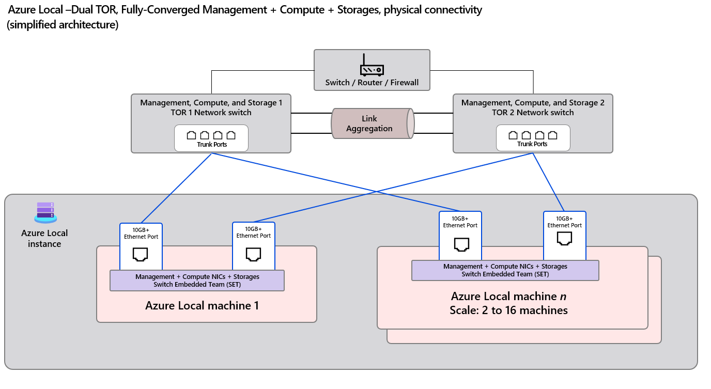

# Azure Local - Fully Converged Physical Network Design Reference

This document provides a comprehensive reference for implementing a fully converged physical network design for Azure Local deployments. It includes configuration examples, validation procedures, and best practices for customers and partners deploying Azure Local in production environments.

- [Azure Local - Fully Converged Physical Network Design Reference](#azure-local---fully-converged-physical-network-design-reference)
  - [Executive Summary](#executive-summary)
  - [Design Overview](#design-overview)
  - [Architecture Components](#architecture-components)
    - [Top-of-Rack (ToR) Switches](#top-of-rack-tor-switches)
    - [Azure Local Nodes](#azure-local-nodes)
    - [Network ATC (Automatic Network Configuration)](#network-atc-automatic-network-configuration)
    - [Switch Embedded Teaming (SET)](#switch-embedded-teaming-set)
  - [Physical Network Topology](#physical-network-topology)
    - [Design Characteristics](#design-characteristics)
    - [Topology Diagram](#topology-diagram)
    - [Cabling Configuration Example](#cabling-configuration-example)
      - [Host 1](#host-1)
      - [Host 2](#host-2)
      - [Host 3](#host-3)
    - [VLAN Architecture](#vlan-architecture)
    - [Top-of-Rack Switch Configuration](#top-of-rack-switch-configuration)
      - [Interface \& VLAN Configuration](#interface--vlan-configuration)
        - [Sample NX-OS Configuration](#sample-nx-os-configuration)
      - [Configuration Validation](#configuration-validation)
        - [Azure Local Host Validation](#azure-local-host-validation)
        - [Switch Validation](#switch-validation)
  - [Quality of Service (QoS)](#quality-of-service-qos)
  - [BGP Routing](#bgp-routing)
  - [Frequently Asked Questions](#frequently-asked-questions)
    - [Q: Why must both Storage VLANs be on both ToR switches in Fully Converged?](#q-why-must-both-storage-vlans-be-on-both-tor-switches-in-fully-converged)
  - [Additional Resources](#additional-resources)
    - [Official Documentation](#official-documentation)
    - [Technical Deep Dives](#technical-deep-dives)

## Executive Summary

Azure Local's fully converged network design provides a unified approach to handling management, compute, and storage traffic over the same physical infrastructure. This design pattern offers:

- **Simplified Infrastructure**: Reduced hardware footprint and cabling complexity
- **Cost Optimization**: Efficient use of network resources and equipment
- **Scalability**: Support for 2 to 16 nodes with consistent configuration patterns

## Design Overview

The fully converged physical network architecture integrates **management**, **compute**, and **storage** traffic over the same physical Ethernet interfaces. This design minimizes hardware footprint while maximizing scalability and deployment simplicity.

**Key Design Principle**: In Fully Converged deployments, **both storage VLANs must be configured on both ToR switches**. This is because each host has only 2 NICs (shared for all traffic), and SET (Switch Embedded Teaming) may route either storage VLAN through either physical NIC based on its load balancing algorithm.

## Architecture Components

This section describes the essential components required for implementing a fully converged Azure Local network design.

### Top-of-Rack (ToR) Switches
Physical switches that provide redundant Layer 2/Layer 3 connectivity for the Azure Local cluster. Key characteristics:
- Each Azure Local node connects to **two separate ToR switches** for high availability
- All switch ports must be configured as **IEEE 802.1Q trunk ports** to support multiple VLANs
- Supports standard data center switch features including MLAG, BGP routing, and QoS policies

### Azure Local Nodes
Physical hosts running the Azure Local operating system. In a fully converged design:
- Each node requires **minimum two high-speed physical NICs** (10Gbps or higher)
- NICs must **support RDMA** (Remote Direct Memory Access) for optimal storage performance
- All traffic types (management, compute, and storage) flow over the same physical interfaces using VLAN segmentation

### Network ATC (Automatic Network Configuration)
Azure Local's intent-based networking framework that simplifies network deployment:
- Defines and deploys logical networking configurations through "intents"
- In fully converged deployments, uses a single `Management + Compute + Storage` intent
- Automatically configures VLANs, IP addressing, and adapter settings across the cluster

### Switch Embedded Teaming (SET)
Windows-native NIC teaming technology that provides link-level redundancy:
- Creates a single logical interface from multiple physical NICs
- Operates in **switch-independent mode** for maximum compatibility
- **Only supported virtual switch technology** on Azure Local
- Provides load balancing and failover capabilities


## Physical Network Topology

This section demonstrates a **fully converged Azure Local deployment** where management, compute, and storage traffic all share the same NICs using VLAN segmentation. The design scales seamlessly from **2 to 16 nodes** with consistent configuration patterns.

### Design Characteristics
- **Fully Converged**: All traffic types (Management, Compute, Storage) utilize the same physical links
- **Redundant Infrastructure**: Each node connects to both ToR1 and ToR2 for high availability
- **Switch Embedded Teaming**: Host-level NIC bonding provides fault tolerance and load balancing
- **VLAN Segmentation**: Traffic isolation using IEEE 802.1Q VLAN tagging

### Topology Diagram



### Cabling Configuration Example

The following tables demonstrate physical connectivity between Azure Local nodes and Top-of-Rack switches in a **three-node cluster**. This pattern scales consistently for larger deployments.

**Cabling Requirements:**
- Each node requires **two network connections** (NIC A and NIC B)
- Each NIC connects to a **different ToR switch** to ensure redundancy
- Use **identical cable types and speeds** for consistent performance

#### Host 1

| Azure Local Node | Interface | ToR Switch | Interface   |
|------------------|-----------|------------|-------------|
| **Host1**        | NIC A     | ToR1       | Ethernet1/1 |
| **Host1**        | NIC B     | ToR2       | Ethernet1/1 |

#### Host 2

| Azure Local Node | Interface | ToR Switch | Interface   |
|------------------|-----------|------------|-------------|
| **Host2**        | NIC A     | ToR1       | Ethernet1/2 |
| **Host2**        | NIC B     | ToR2       | Ethernet1/2 |

#### Host 3

| Azure Local Node | Interface | ToR Switch | Interface   |
|------------------|-----------|------------|-------------|
| **Host3**        | NIC A     | ToR1       | Ethernet1/3 |
| **Host3**        | NIC B     | ToR2       | Ethernet1/3 |


### VLAN Architecture

The fully converged design uses VLAN segmentation to isolate different traffic types while sharing the same physical infrastructure.

| Traffic Type  | Purpose                             | VLAN ID | Configuration Notes                    |
|---------------|-------------------------------------|---------|----------------------------------------|
| Management    | Cluster and host management traffic | 7       | Native VLAN, L3 routed (SVI)          |
| Compute       | Virtual machine workload traffic    | 201     | Tagged VLAN, L3 routed (SVI)          |
| Storage 1     | SMB storage over RDMA (first path)  | 711     | Tagged VLAN, L2 only (no SVI)         |
| Storage 2     | SMB storage over RDMA (second path) | 712     | Tagged VLAN, L2 only (no SVI)         |

> [!IMPORTANT]
> **Storage VLAN Design Pattern for Fully Converged**: In Fully Converged deployments, **both storage VLANs (711 and 712) must be configured on both ToR switches**. This is because:
>
> - Each host has only **2 NICs** connecting to both ToRs (no dedicated storage NICs)
> - **SET (Switch Embedded Teaming)** handles vNIC-to-pNIC mapping at the host level
> - SET may route either storage VLAN through either physical NIC based on its load balancing algorithm
>
> This differs from **Switched** deployments where dedicated storage NICs connect to specific ToRs, allowing one storage VLAN per ToR.

### Top-of-Rack Switch Configuration

This design utilizes **two physical switches** as Top-of-Rack (ToR) devices to provide redundant uplink connectivity for all Azure Local nodes.

**Switch Requirements:**
- Support for IEEE 802.1Q VLAN tagging and trunking
- Layer 3 routing capabilities (SVI interfaces)
- RDMA/RoCE support with Data Center Bridging (DCB)
- Quality of Service (QoS) policy enforcement
- Optional: Multi-Chassis Link Aggregation (MLAG) support

**Redundancy Design:**
- ToR switches may be configured with **MLAG (Multi-Chassis Link Aggregation)** for enhanced redundancy
- MLAG configuration is **optional**, as redundancy is primarily achieved through host-side **SET (Switch Embedded Teaming)**
- Core network layer connectivity (routers, firewalls) is considered out of scope for this document

#### Interface & VLAN Configuration

This section provides configuration guidance using **Cisco Nexus 93180YC-FX3 (NX-OS 10.x)** as the reference platform. The principles apply to other vendor switches with appropriate syntax modifications.

**VLAN Configuration Summary:**
- **VLAN 7 (Management)**: Layer 3 routed VLAN, configured as native VLAN on trunk ports
- **VLAN 201 (Compute)**: Layer 3 routed VLAN, tagged on trunk ports
- **VLAN 711 (Storage 1)**: Layer 2 only VLAN (no SVI), tagged on trunk ports for RDMA traffic
- **VLAN 712 (Storage 2)**: Layer 2 only VLAN (no SVI), tagged on trunk ports for RDMA traffic

> [!NOTE]
> In Fully Converged deployments, **both storage VLANs must be configured on both ToR switches** because SET handles vNIC-to-pNIC mapping at the host level and may route either storage VLAN through either physical NIC.

**Key Configuration Requirements:**
- Enable Priority Flow Control (PFC) for RDMA support
- Configure jumbo frames (MTU 9216) for optimal performance
- Apply QoS service policies for traffic prioritization
- Set appropriate spanning-tree settings for edge ports

##### Sample NX-OS Configuration

**ToR1 Configuration:**
```console
vlan 7
  name Management_7
vlan 201
  name Compute_201
vlan 711
  name Storage_711
vlan 712
  name Storage_712

interface Vlan7
  description Management
  no shutdown
  mtu 9216
  ip address 10.101.176.2/24
  hsrp 7
    ip 100.101.176.1

interface Vlan201
  description Compute
  no shutdown
  mtu 9216
  ip address 10.101.177.2/24
  hsrp 201
    ip 100.101.177.1

interface Ethernet1/1-3
  description To_Azure_Local_Host_FullyConverged
  switchport
  switchport mode trunk
  switchport trunk native vlan 7
  switchport trunk allowed vlan 7,201,711,712
  priority-flow-control mode on send-tlv
  spanning-tree port type edge trunk
  mtu 9216
  service-policy type qos input AZS_SERVICES
  no shutdown
```

**ToR2 Configuration:**
```console
vlan 7
  name Management_7
vlan 201
  name Compute_201
vlan 711
  name Storage_711
vlan 712
  name Storage_712

interface Vlan7
  description Management
  no shutdown
  mtu 9216
  ip address 10.101.176.3/24
  hsrp 7
    ip 100.101.176.1

interface Vlan201
  description Compute
  no shutdown
  mtu 9216
  ip address 10.101.177.3/24
  hsrp 201
    ip 100.101.177.1

interface Ethernet1/1-3
  description To_Azure_Local_Host_FullyConverged
  switchport
  switchport mode trunk
  switchport trunk native vlan 7
  switchport trunk allowed vlan 7,201,711,712
  priority-flow-control mode on send-tlv
  spanning-tree port type edge trunk
  mtu 9216
  service-policy type qos input AZS_SERVICES
  no shutdown
```

> [!NOTE]
> - Both ToR switches have **identical VLAN configurations** (7, 201, 711, 712) in Fully Converged deployments
> - SET at the host level handles vNIC-to-pNIC mapping to optimize storage traffic paths
> - QoS policies and routing design (e.g., uplinks, BGP/OSPF, default gateway) will be introduced in a separate document


#### Configuration Validation

This section provides comprehensive validation procedures to verify the network configuration is functioning correctly in **already deployed Azure Local environments**. These validation commands are intended for troubleshooting and verifying existing production deployments, not for fresh installations.

##### Azure Local Host Validation

Use these PowerShell commands on **deployed Azure Local nodes** to validate network adapter configuration and RDMA connectivity:

**1. Verify Network Adapter Configuration**
```powershell
# Display network adapters and VLAN assignments
Get-NetAdapter | Format-Table InterfaceAlias, VlanID, MacAddress -AutoSize

# Check VLAN isolation settings for virtual adapters
Get-VMNetworkAdapterIsolation -ManagementOS | Format-Table ParentAdapter, IsolationMode, DefaultIsolationID -AutoSize
```

**2. Validate SMB Multichannel and RDMA Connectivity**

```powershell
[Host3]: PS C:\Users\Administrator\Documents> Get-NetAdapter | ft InterfaceAlias, VlanID, MacAddress

InterfaceAlias                     VlanID MacAddress       
--------------                     ------ ----------       
ethernet                                0 0C-42-A1-F9-69-4A
vSMB(managementcompute#ethernet 2)        00-15-5D-C8-20-07
ethernet 2                              0 0C-42-A1-F9-69-4B
vManagement(managementcompute)            0C-42-A1-F9-69-4A
vSMB(managementcompute#ethernet)          00-15-5D-C8-20-06

[Host3]: PS C:\Users\Administrator\Documents> Get-VMNetworkAdapterIsolation -ManagementOS | ft ParentAdapter, IsolationMode, DefaultIsolationID

ParentAdapter                                                         IsolationMode DefaultIsolationID
-------------                                                         ------------- ------------------
VMInternalNetworkAdapter, Name = 'vSMB(managementcompute#ethernet)'            Vlan                711
VMInternalNetworkAdapter, Name = 'vManagement(managementcompute)'              Vlan                  0
VMInternalNetworkAdapter, Name = 'vSMB(managementcompute#ethernet 2)'          Vlan                712


# Verify SMB Multichannel connections and RDMA usage
[Host3]: PS C:\Users\Administrator\Documents> Get-SmbMultichannelConnection | Format-Table ClientInterfaceFriendlyName, ClientIpAddress, ServerIpAddress, ClientRdmaCapable, RdmaConnectionCount, TcpConnectionCount -AutoSize

ClientInterfaceFriendlyName         ClientIpAddress ServerIpAddress ClientRdmaCapable RdmaConnectionCount TcpConnectionCount
---------------------------         --------------- --------------- ----------------- ------------------- ------------------
vSMB(managementcompute#ethernet 2)  10.71.2.10      10.71.2.34      True              2                   0
vSMB(managementcompute#ethernet)    10.71.1.249     10.71.1.214     True              2                   0

# Verify SMB connections
[Host3]: PS C:\Users\Administrator\Documents> Get-SmbConnection

ServerName ShareName UserName      Credential    Dialect NumOpens
---------- --------- --------      ----------    ------- --------
Host4      c$        Administrator Administrator 3.1.1   2

```

> [!NOTE]
> **SMB Multichannel Validation Key Points:**
> - Both storage VLANs (711 and 712) are operational with RDMA enabled
> - `RdmaConnectionCount = 2` confirms RDMA is being used for storage traffic
> - `TcpConnectionCount = 0` shows no fallback to regular TCP
> - SMB 3.1.1 dialect is being used for optimal performance
> - This validates that storage traffic is using RDMA as intended

##### Switch Validation

Verify Top-of-Rack switch configuration and MAC address learning to ensure proper connectivity.

> [!NOTE]
> With Switch Embedded Teaming (SET), storage VLAN traffic load balancing is dynamic. MAC addresses for VLANs 711 and 712 may appear on different ToR switches or ports depending on active traffic patterns and SET's load distribution. You may need to generate storage traffic to observe MAC learning.

**Step 1: Verify VLAN Configuration**

Confirm that storage VLANs 711 and 712 are allowed on the trunk to the host:

```console
# Verify VLANs are allowed on the interface trunk
ToR1# show interface ethernet 1/3 trunk

Port          Native  Status        Port
              Vlan                  Channel
---------------------------------------------------------------------------
Eth1/3        1       trunking      --

Port          Vlans Allowed on Trunk
---------------------------------------------------------------------------
Eth1/3        1,7,711-712

```

**Step 2: Verify MAC Address Learning**

Check MAC address table entries for storage VLANs. The example below shows one possible state - actual results will vary based on active traffic and SET load balancing decisions:

```console
# Check per-VLAN MAC table entries across the ToR
ToR1# show mac address-table vlan 711
Legend:
        * - primary entry, G - Gateway MAC, (R) - Routed MAC, O - Overlay MAC
        age - seconds since last seen,+ - primary entry using vPC Peer-Link,
        (T) - True, (F) - False, C - ControlPlane MAC, ~ - vsan
   VLAN     MAC Address      Type      age     Secure NTFY Ports
---------+-----------------+--------+---------+------+----+------------------
*  711     0015.5dc8.2006   dynamic  0         F      F    Eth1/3

ToR1# show mac address-table vlan 712
Legend:
        * - primary entry, G - Gateway MAC, (R) - Routed MAC, O - Overlay MAC
        age - seconds since last seen,+ - primary entry using vPC Peer-Link,
        (T) - True, (F) - False, C - ControlPlane MAC, ~ - vsan
   VLAN     MAC Address      Type      age     Secure NTFY Ports
---------+-----------------+--------+---------+------+----+------------------
*  712     0015.5dc8.2007   dynamic  0         F      F    Eth1/3

```

**Expected Results:**
- VLANs 711 and 712 must be allowed on the trunk interface
- MAC addresses for storage VLANs should be learned on the ToR switches when storage traffic is active
- Due to SET load balancing, MAC addresses may appear on either ToR switch and on different ports depending on traffic distribution
- If no MACs are visible for a VLAN, generate storage traffic (e.g., copy files between cluster nodes) and recheck

## Quality of Service (QoS)

Quality of Service configuration is essential for optimal Azure Local performance. For detailed QoS policy configuration:

**Reference**: [Quality of Service (QoS) Policy](Reference-TOR-QOS-Policy-Configuration.md)

## BGP Routing

For BGP routing configuration and best practices in Azure Local deployments:

**Reference**: [Azure Local BGP Routing](Reference-TOR-BGP.md)


## Frequently Asked Questions

### Q: Why must both Storage VLANs be on both ToR switches in Fully Converged?

**A:** 
In Fully Converged deployments, **both storage VLANs (711 and 712) must be configured on both ToR switches**. This is required because:

1. **Only 2 NICs per host**: Each host connects one NIC to ToR1 and one to ToR2
2. **SET handles traffic routing**: Switch Embedded Teaming maps storage vNICs to physical NICs at the host level
3. **Either VLAN through either NIC**: SET's load balancing may route Storage VLAN 711 or 712 through either physical NIC

**How it differs from Switched deployment:**

| Deployment Pattern | Storage NICs | ToR VLAN Config | Why |
|-------------------|--------------|-----------------|-----|
| **Fully Converged** | Shared (2 NICs total) | Both VLANs on both ToRs | SET may route either VLAN through either NIC |
| **Switched** | Dedicated (4 NICs total) | One VLAN per ToR | Each storage NIC connects to a specific ToR |

**Key Point:** The "one storage VLAN per ToR" optimization applies to **Switched** deployments where dedicated storage NICs connect to specific ToRs. In Fully Converged, SET's flexibility requires both VLANs on both switches.

> [!NOTE]
> SET uses vNIC-to-pNIC affinity mapping to optimize traffic paths, but the switches must still be configured to carry both storage VLANs to handle any mapping SET chooses.


## Additional Resources

For comprehensive Azure Local networking information, refer to these official Microsoft documentation resources:

### Official Documentation
- **[Network considerations for cloud deployments of Azure Local](https://learn.microsoft.com/en-us/azure/azure-local/plan/cloud-deployment-network-considerations)**  
  Planning guidance for Azure Local network deployments in cloud environments

- **[Physical network requirements for Azure Local](https://learn.microsoft.com/en-us/azure/azure-local/concepts/physical-network-requirements)**  
  Detailed hardware and connectivity requirements for Azure Local deployments

### Technical Deep Dives
- **[Teaming in Azure Stack HCI](https://techcommunity.microsoft.com/blog/networkingblog/teaming-in-azure-stack-hci/1070642)**  
  Technical blog covering NIC teaming concepts and implementation