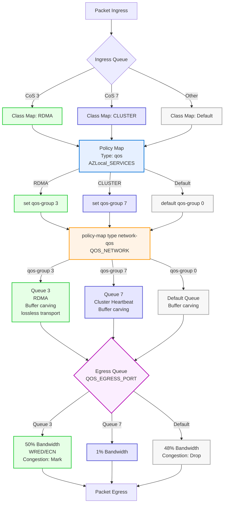

<!-- tsg-metadata
{
  "schema": "azure-local-supportability/tsg-metadata/v1",
  "document_type": "reference",
  "products": ["Azure Local"],
  "detector": {
    "type": "none",
    "signal": null
  },
  "validation": {
    "fidelity_level": "L0",
    "technical_grade": null,
    "reproduction_substrate": "none",
    "automation_status": "not-assessed",
    "last_validated": "2026-09-09",
    "spec_ref": ""
  }
}
-->

# Azure Local - QoS Policy

This reference defines the standards-based, end-to-end Quality of Service (QoS) outcomes required for Azure Local storage traffic and provides a Cisco NX-OS configuration example. The requirements are based on IEEE 802.1Qbb Priority Flow Control (PFC), IEEE 802.1Qaz Enhanced Transmission Selection (ETS), and IP Explicit Congestion Notification (ECN).

QoS is mandatory for Azure Local deployments that carry Storage intent workloads through network switches. A switch policy alone is not an end-to-end configuration. Network ATC, the host operating system, the RDMA adapters and drivers, and every active and failover switch path must implement compatible classification, MTU, bandwidth, loss-prevention, and congestion-response behavior.

## Contents

- [Requirements](#requirements)
- [Azure Local Defaults](#azure-local-defaults)
- [In Scope network patterns](#in-scope-network-patterns)
- [Out of Scope network patterns](#out-of-scope-network-patterns)
- [QOS Policy Overview](#qos-policy-overview)
- [ClassMap](#classmap)
- [Policy Map (QoS)](#policy-map-qos)
- [Policy Map (Network QoS)](#policy-map-network-qos)
- [Policy Map (Queuing)](#policy-map-queuing)
- [System QoS Application](#system-qos-application)
- [Interface Application of QOS](#interface-application-of-qos)
- [End-to-End Validation](#end-to-end-validation)
- [Terminology](#terminology)
- [Reference](#reference)

## Requirements

1. Support three CoS values will be utilized within the Azure Local environment, default values are as follows:
   - CoS 3: Storage, also referred to as RDMA.
   - CoS 7: Cluster Heartbeat
   - CoS 0: Default traffic
2. Protect Storage traffic with Priority Flow Control (802.1Qbb)
  - Establish Storage as the PFC-enabled traffic class on priority 3.
  - Assign Cluster heartbeat traffic to priority 7 with its dedicated bandwidth reservation.
   - Default traffic is the lowest priority, in the event of congestion.  Default will be dropped to protect Storage and Cluster.
3. Bandwidth Reservations utilizing ETS (802.1Qaz)
   - Storage assigned a minimum 50% of the interface bandwidth.
   - Cluster assigned a minimum 1 - 2% of the interface bandwidth.  The percentage is based on the Interface speed
     - 10G: 2%
     - 25G or Greater: 1%
4. Congestion Notification
   - Support Explicit Congestion Notification (ECN) on every switch egress queue that can congest Storage traffic.
   - Ensure the selected RDMA transport and NIC driver emit ECN-Capable Transport (ECT) packets and provide a supported sender response to Congestion Experienced (CE) marks.
5. End-to-end consistency
   - Preserve the Storage priority, compatible MTU, queue mapping, PFC, ETS, and ECN behavior across every active and failover path.
   - Do not treat a host-only or switch-only configuration as complete.

## Azure Local Defaults

### Network ATC Data Center Bridging (DCB) and VLAN Defaults

| Setting                | Default Value                                      | Description                                                                                                       |
| ---------------------- | -------------------------------------------------- | ----------------------------------------------------------------------------------------------------------------- |
| Priority Flow Control  | Enabled                                            | PFC (IEEE 802.1Qbb) is enabled for lossless transport on storage traffic.                                         |
| ETS (Bandwidth)        | Storage 50%<br>Cluster 1-2%<br>Default (Remainder) | Bandwidth reservations <br>Cluster Heartbeat:<br>2% if the adapter are <=10Gbps<br>1% if the adapter are >10 Gbps |
| ECN                    | Enabled                                            | Explicit Congestion Notification is enabled for RDMA/Storage traffic.                                             |
| VLAN                   | 711<br>712                                         | Default Storage Intent VLAN assignments. These values can be customized.                                          |
| CoS (Class of Service) | Storage: 3<br>Cluster: 7<br>Default: 0             | Default CoS values for traffic classification.  These values can be customized.                                   |
| Storage MTU            | End-to-end compatible jumbo MTU                    | Host, NIC, switch ports, and every routed or switched hop must carry the selected Storage MTU without fragmentation or discard. |
| Endpoint response      | Transport-specific                                 | RoCEv2 requires supported NIC congestion control such as DCQCN. iWARP uses TCP congestion control and can use TCP ECN. |

> [!IMPORTANT]
> Azure Local does not configure DCBX. The host has no DCBX settings and does not send DCB TLVs back to the switch. DCB (PFC, ETS) is configured statically on both the host and the switch.
>
> Dynamic changes to host-level DCB settings would disrupt RDMA traffic and impact the storage layer. This requirement has been in place since Storage Spaces Direct originally launched.

> [!NOTE]
> These defaults can be overridden using [Network ATC][NetworkAtc] custom settings. For more details, see [Manage Network ATC][NetworkAtcOverride].

### RDMA Transport and Endpoint Congestion Control

ECN closes a feedback loop between a congested network device and the sending endpoint. The switch detects queue pressure and marks eligible IP packets with CE. The endpoint must interpret that signal and reduce its sending rate.

| Transport | Data path | ECN feedback and sender response | Loss behavior |
| --------- | --------- | -------------------------------- | ------------- |
| RoCEv2 | RDMA over UDP/IP | The sender emits ECT packets. A congested switch marks CE, the receiving NIC returns a Congestion Notification Packet (CNP), and the sending NIC uses a supported congestion-control algorithm such as Data Center Quantized Congestion Notification (DCQCN) to reduce its rate. | Relies on a correctly engineered lossless path; PFC is the hop-by-hop loss-prevention backstop. |
| iWARP | RDMA over TCP/IP | When endpoint ECN is enabled, the sender emits ECT packets, the switch marks CE, and TCP ECN feedback causes the sending TCP/iWARP endpoint to reduce its rate. | TCP can also detect loss, reduce its rate, and retransmit, but loss recovery adds latency. |

DCQCN is a commonly implemented RoCEv2 endpoint congestion-control algorithm, not a switch feature. This reference describes the standards-based ECN, CE, CNP, PFC, and ETS behavior required to close the congestion-control loop; it does not prescribe endpoint-specific parameters, defaults, or configuration settings.

```text
                         ECT storage traffic, CoS 3
+-----------------------+       +-----------------------------+       +-------------------------+
| Sending host and      | ----> | Every active and failover   | ----> | Receiving host and      |
| RDMA NIC              |       | switch hop                  |  CE   | RDMA NIC                |
+-----------------------+       +-----------------------------+       +-------------------------+
          ^                              |
          |                              +-- PFC protects priority 3 hop by hop while feedback takes effect
          |
          +-- RoCEv2: CNP feedback; sender applies DCQCN or another supported rate reduction
          +-- iWARP: TCP ECN feedback; sender applies TCP rate reduction
```

> [!IMPORTANT]
> Partial configuration does not close the congestion-control loop. NIC-side DCQCN without switch ECN receives no CE/CNP signal. Switch ECN without endpoint ECT participation cannot mark those packets as CE. A missing MTU, CoS mapping, PFC, ETS, or ECN configuration on any switch hop can also break the intended Storage behavior.

## In Scope network patterns

This QoS policy is applicable to the following Azure Local deployment models:

- **Fully hyperconverged:** Compute, management, and storage traffic all share the same network interface.
- **Disaggregated:** Compute and management traffic are assigned to dedicated interfaces, while storage traffic is isolated on its own separate interface.
  - [Disaggregated Design](./Reference-TOR-Disaggregated-Switched-Storage.md)
- **Rack Aware Cluster:** Based on Disaggregated design with room to room to storage links.

## Out of Scope network patterns

Switchless configurations do not require a ToR switch QoS policy because Storage traffic travels directly between endpoints. They still require compatible endpoint, link, MTU, priority, and transport configuration; switchless does not mean that host and NIC QoS requirements disappear.

## QOS Policy Overview



> [!NOTE]
> The command blocks below are Cisco NX-OS configuration examples. They implement the standards-based QoS outcomes defined above by using Cisco NX-OS class maps, policy maps, queue names, buffer behavior, and interface commands.

## ClassMap

```console
class-map type qos match-all RDMA
  match cos 3
class-map type qos match-all CLUSTER
  match cos 7
```

ClassMap identification is performed by matching the packet's CoS (Class of Service) value. If the CoS value is 3 (for RDMA/Storage) or 7 (for Cluster Heartbeat), the traffic is classified into the corresponding class. All other traffic is automatically assigned to the implicit default class. Matching solely on CoS ensures accurate classification and prevents critical traffic from being misclassified as default. This approach simplifies policy management.

## Policy Map (QoS)

```console
policy-map type qos AZLocal_SERVICES
  class RDMA
    set qos-group 3
  class CLUSTER
    set qos-group 7
```

This policy map assigns classified traffic to internal QoS groups. All other traffic classes not represented are placed in an implicit default class (qos-group 0).

## Policy Map (Network QoS)

```console
policy-map type network-qos QOS_NETWORK
  class type network-qos c-8q-nq3
    mtu 9216
    pause pfc-cos 3
  class type network-qos c-8q-nq-default
    mtu 9216
  class type network-qos c-8q-nq7
    mtu 9216
```

In Cisco NX-OS, this policy map sets global Layer 2 properties for each traffic class by configuring the MTU and enabling PFC for storage traffic on CoS 3. The `pause pfc-cos 3` command activates PFC for the specified class; the `no-drop` keyword is optional and can be added for clarity. The `mtu 9216` command applies a consistent jumbo frame size to all classes and initiates ingress-queue buffer carving on supported Cisco Nexus platforms.

## Policy Map (Queuing)

```console
policy-map type queuing QOS_EGRESS_PORT
  class type queuing c-out-8q-q3
    bandwidth remaining percent 50
    random-detect minimum-threshold 300 kbytes maximum-threshold 300 kbytes drop-probability 100 weight 0 ecn
  class type queuing c-out-8q-q-default
    bandwidth remaining percent 48
  class type queuing c-out-8q-q7
    bandwidth percent 1
  class type queuing c-out-8q-q1
    bandwidth remaining percent 0
  class type queuing c-out-8q-q2
    bandwidth remaining percent 0
  class type queuing c-out-8q-q4
    bandwidth remaining percent 0
  class type queuing c-out-8q-q5
    bandwidth remaining percent 0
  class type queuing c-out-8q-q6
    bandwidth remaining percent 0
```

- Only queues 3, 7, and default are actively used in this policy. All other queues are configured with 0% bandwidth and remain unused.
- Bandwidth reservations are explicitly configured for queues 3 and 7. Queue 3 (RDMA) is guaranteed a minimum of 50% of the interface bandwidth and can use up to 98% if available. When congestion occurs, tail drop is performed and default traffic may be randomly dropped as needed. Queue 7 (Cluster Heartbeat) is reserved 1% of bandwidth for 25G interfaces and 2% for 10G interfaces. This ensures reliable delivery of critical heartbeat traffic.
- The `random-detect ... ecn` command enables [Explicit Congestion Notification (ECN)](./Reference-TOR-Explicit-Congestion-Notification.md) for queue 3. When congestion is detected, the switch can mark ECT packets with CE instead of dropping them. The receiving endpoint must return transport-appropriate feedback, and the sender must reduce its rate.
- The `random-detect minimum-threshold 300 kbytes maximum-threshold 300 kbytes drop-probability 100 weight 0` configuration sets the minimum and maximum WRED (Weighted Random Early Detection) thresholds. When queue depth reaches 300 kbytes, selected ECT packets are marked and selected Non-ECT packets can be dropped with a probability of 100%. The weight controls how quickly average queue size responds; a lower value makes the response immediate for short RDMA bursts.
- PFC is intended to prevent congestion loss for priority 3, but a PFC-enabled or no-drop class does not by itself prove zero discards. Verify ECN eligibility and queue-level mark, WRED-drop, tail-drop, and PFC counters on the deployed switch platform.

### Summary Table

| Traffic Type      | CoS | Bandwidth Guarantee | Features Enabled | MTU  | Notes                                  |
| ----------------- | --- | ------------------- | ---------------- | ---- | -------------------------------------- |
| RDMA (Storage)    | 3   | minimum 50%         | PFC, ECN/WRED    | 9216 | Lossless, congestion-aware             |
| Cluster Heartbeat | 7   | 1% (or 2% for 10G)  | Dedicated Queue  | 9216 | Strict minimum for reliability         |
| Default/Other     | -   | Remaining (48%)     | -                | 9216 | Shared among all other traffic classes |

This policy ensures that storage and cluster heartbeat traffic are always prioritized, minimizing latency and packet loss, while still allowing efficient use of available bandwidth for other traffic types.

```console
policy-map type network-qos QOS_NETWORK
  class type network-qos c-8q-nq3
    mtu 9216
    pause pfc-cos 3
  class type network-qos c-8q-nq-default
    mtu 9216
  class type network-qos c-8q-nq7
    mtu 9216
!
class-map type qos match-all RDMA
  match cos 3
class-map type qos match-all CLUSTER
  match cos 7
!
policy-map type qos AZLocal_SERVICES
  class RDMA
    set qos-group 3
  class CLUSTER
    set qos-group 7
!
policy-map type queuing QOS_EGRESS_PORT
  class type queuing c-out-8q-q3
    bandwidth remaining percent 50
    random-detect minimum-threshold 300 kbytes maximum-threshold 300 kbytes drop-probability 100 weight 0 ecn
  class type queuing c-out-8q-q-default
    bandwidth remaining percent 48
  class type queuing c-out-8q-q7
    bandwidth percent 1
  class type queuing c-out-8q-q1
    bandwidth remaining percent 0
  class type queuing c-out-8q-q2
    bandwidth remaining percent 0
  class type queuing c-out-8q-q4
    bandwidth remaining percent 0
  class type queuing c-out-8q-q5
    bandwidth remaining percent 0
  class type queuing c-out-8q-q6
    bandwidth remaining percent 0
```

## System QoS Application

```console
system qos
  service-policy type queuing output QOS_EGRESS_PORT
  service-policy type network-qos QOS_NETWORK
```

This applies the defined queuing and network QoS policies globally to all interfaces.

## Interface Application of QOS

Example of a Cisco NX-OS storage interface supporting a disaggregated Azure Local environment.

```console
interface Ethernet1/17
  description Storage Intent
  switchport
  switchport mode trunk
  switchport trunk native vlan 99
  switchport trunk allowed vlan 711
  priority-flow-control mode on send-tlv
  spanning-tree port type edge trunk
  mtu 9216
  no logging event port link-status
  service-policy type qos input AZLocal_SERVICES
  no shutdown
```

In this example, the key points are the use of `priority-flow-control` and `service-policy`.

- `priority-flow-control mode on send-tlv`: Enables PFC (IEEE 802.1Qbb) on the interface and advertises the PFC TLV over LLDP. On Cisco NX-OS, `send-tlv` typically requires DCBX to be enabled on the switch. If DCBX is enabled, **willing mode must be False** because Azure Local uses the advertised TLVs for telemetry and does not participate in DCBX negotiation. See [Azure Local Network Requirements][AzureLocalPhysicalNetworkRequirements].
- `service-policy type qos input AZLocal_SERVICES`: Applies a QoS policy, which maps storage and cluster traffic to a specific CoS value that PFC will act upon.

The example above configures one Cisco NX-OS switch interface. Apply the same outcomes to every interface and switching hop in each active and failover Storage path, then validate the corresponding host and NIC state. Configuring one interface alone does not complete RDMA QoS.

## End-to-End Validation

Administrative configuration on one host or switch is not proof that RDMA QoS works end to end. Validate both directions and every active and failover path.

| Layer | Validate | Expected evidence |
| ----- | -------- | ----------------- |
| Network ATC and host | Selected RDMA transport, Storage VLAN and priority, ETS, PFC, and effective intent status | Desired policy is successfully realized on every node and intended Storage adapter. |
| NIC and driver | RDMA enabled, supported firmware/driver, selected transport, endpoint ECN behavior | Adapter uses the intended RoCEv2 or iWARP mode and emits ECT packets when ECN participation is enabled. |
| MTU | Host, NIC, switch ports, inter-switch links, and routed hops | The selected Storage frame size traverses every path without fragmentation or MTU discard. |
| Classification and scheduling | CoS 3 preservation, Storage queue mapping, ETS allocation | Storage packets remain in the intended traffic class at every hop. |
| Loss prevention | PFC enabled and operational for priority 3 in both directions where the switched RoCEv2 design requires it | PFC state and per-priority counters agree across each adjacent link. |
| Switch congestion signal | ECN/WRED applied to every egress queue that can congest | Controlled load produces CE marks on ECT traffic; Non-ECT and tail drops are zero or explicitly understood. |
| RoCEv2 endpoint response | CE reception, CNP generation, and supported DCQCN sender reaction | CNP activity and sender-rate reduction correlate with switch CE marks. |
| iWARP endpoint response | TCP ECN negotiation and sender reaction, or understood TCP loss recovery | TCP ECN feedback and rate reduction correlate with CE marks; retransmissions and drops remain within the validated design. |

> [!IMPORTANT]
> Stop and treat the deployment as incomplete if any endpoint or hop is unknown, mismatched, or verified only by configured state. In particular, switch CE marks without sender response, NIC DCQCN without CE/CNP activity, unexplained queue discards, or an MTU mismatch do not pass end-to-end validation.

## Terminology

- **ToR**: Top of Rack network switch. Supports Management, Compute, and Storage intent traffic.
- **WRED**: Weighted Random Early Detection, a congestion avoidance mechanism used in QoS policies.
- **ECN**: Explicit Congestion Notification, a congestion mechanism encoded in the two ECN bits of the IPv4 DS field or IPv6 Traffic Class field. ECN is separate from the six-bit DSCP value.
- **ECT**: ECN-Capable Transport. ECT(0) and ECT(1) indicate that a packet can be ECN-marked.
- **CE**: Congestion Experienced. A congested switch or router changes an ECT codepoint to CE.
- **CNP**: Congestion Notification Packet. A RoCEv2 receiving NIC sends this feedback after observing CE.
- **DCQCN**: Data Center Quantized Congestion Notification. A commonly implemented RoCEv2 NIC congestion-control algorithm that reduces sender rate in response to CNP feedback.
- **RoCEv2**: RDMA over Converged Ethernet version 2, transported over UDP/IP.
- **iWARP**: Internet Wide Area RDMA Protocol, transported over TCP/IP.
- **RDMA**: Remote Direct Memory Access. A technology that enables direct memory access from the memory of one computer into that of another without involving either one's operating system or CPU. This allows for high-throughput, low-latency networking, which is especially beneficial for storage and high-performance computing workloads.

## Reference

- [Azure Local Network Requirements][AzureLocalPhysicalNetworkRequirements]
- [Azure Local Network Considerations for Cloud Deployment of Azure Local][AzureLocalNetworkConsiderationForCloudDeploymentOfAzureLocal]
- [Cisco Azure Local Whitepaper][CiscoNexus9000NXOSACI]
- [RoCE Storage Implementation over NX-OS VXLAN Fabrics][ROCEStorageNXOSVXLANFabric]
- [Cisco Nexus 9000 Series NX-OS Quality of Service Configuration Guide, Release 10.5(x)][CiscoNexusNetworkQOS]
- [Cisco Nexus Configure Queuing and Scheduling][CiscoNexusQueuingAndScheduling]
- [RFC 3168 - The Addition of Explicit Congestion Notification (ECN) to IP][rfc3168]
- [802.1Qbb Priority-based Flow Control][802-1qbb]
- [802.1Qaz Enhanced Transmission Selection][802-1qaz]
- [Deploy host networking with Network ATC][NetworkAtc]
- [Manage Network ATC][NetworkAtcOverride]

[AzureLocalPhysicalNetworkRequirements]: https://learn.microsoft.com/en-us/azure/azure-local/concepts/physical-network-requirements
[AzureLocalNetworkConsiderationForCloudDeploymentOfAzureLocal]: https://learn.microsoft.com/en-us/azure/azure-local/plan/cloud-deployment-network-considerations "This article discusses how to design and plan an Azure Local system network for cloud deployment. Before you continue, familiarize yourself with the various Azure Local networking patterns and available configurations."
[ROCEStorageNXOSVXLANFabric]: https://www.cisco.com/c/en/us/td/docs/dcn/whitepapers/roce-storage-implementation-over-nxos-vxlan-fabrics.html
[CiscoNexus9000NXOSACI]: https://www.cisco.com/c/en/us/td/docs/dcn/whitepapers/ACI_AzureLocal_whitepaper.html
[CiscoNexusNetworkQOS]: https://www.cisco.com/c/en/us/td/docs/dcn/nx-os/nexus9000/105x/configuration/qos/cisco-nexus-9000-series-nx-os-quality-of-service-configuration-guide-105x/m-configuring-network-qos.html "Configuration guide: The network QoS policy defines the characteristics of QoS properties network wide."
[CiscoNexusQueuingAndScheduling]: https://www.cisco.com/c/en/us/td/docs/dcn/nx-os/nexus9000/105x/configuration/qos/cisco-nexus-9000-series-nx-os-quality-of-service-configuration-guide-105x/m-configuring-queuing-and-scheduling.html#task_4FB1415CDE92466FB347121D96D6D8C2
[rfc3168]: https://www.rfc-editor.org/rfc/rfc3168 "We begin by describing TCP's use of packet drops as an indication of congestion.  Next we explain that with the addition of active queue management (e.g., RED) to the Internet infrastructure, where routers detect congestion before the queue overflows, routers are no longer limited to packet drops as an indication of congestion.  Routers can instead set the Congestion Experienced (CE) codepoint in the IP header of packets from ECN-capable transports.  We describe when the CE codepoint is to be set in routers, and describe modifications needed to TCP to make it ECN-capable.  Modifications to other transport protocols (e.g., unreliable unicast or multicast, reliable multicast, other reliable unicast transport protocols) could be considered as those protocols are developed and advance through the standards process.  We also describe in this document the issues involving the use of ECN within IP tunnels, and within IPsec tunnels in particular."
[802-1qbb]: https://1.ieee802.org/dcb/802-1qbb/ "This standard specifies protocols, procedures and managed objects that enable flow control per traffic class on IEEE 802 full-duplex links. Data Center Bridging networks (bridges and end nodes) are characterized by limited bandwidth-delay product and limited hop-count. Traffic class is identified by the VLAN tag priority values. Priority-based flow control is intended to eliminate frame loss due to congestion. This is achieved by a mechanism similar to the IEEE 802.3x PAUSE, but operating on individual priorities. This mechanism, in conjunction with other Data Center Bridging technologies, enables support for higher layer protocols that are highly loss sensitive while not affecting the operation of traditional LAN protocols utilizing other priorities. In addition, PFC complements Congestion Notification in Data Center Bridging networks. Operation of priority-based flow control is limited to a domain controlled by a Data Center Bridging control protocol that controls the application of Priority-based Flow Control, Enhanced Transmission Selection, and Congestion Notification."
[802-1qaz]: https://1.ieee802.org/dcb/802-1qaz/ "This standard specifies enhancement of transmission selection to support allocation of bandwidth amongst traffic classes. When the offered load in a traffic class doesn't use its allocated bandwidth, enhanced transmission selection will allow other traffic classes to use the available bandwidth. The bandwidth-allocation priorities will coexist with strict priorities. It will include managed objects to support bandwidth allocation."
[NetworkAtc]: https://learn.microsoft.com/en-us/windows-server/networking/network-atc/network-atc?pivots=azure-local
[NetworkAtcOverride]:https://learn.microsoft.com/en-us/windows-server/networking/network-atc/manage-network-atc#update-or-override-network-settings
