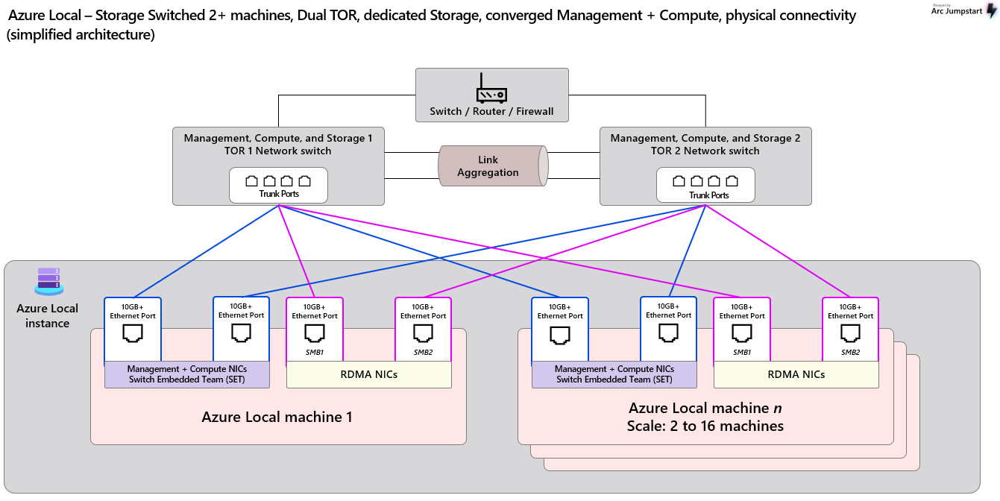
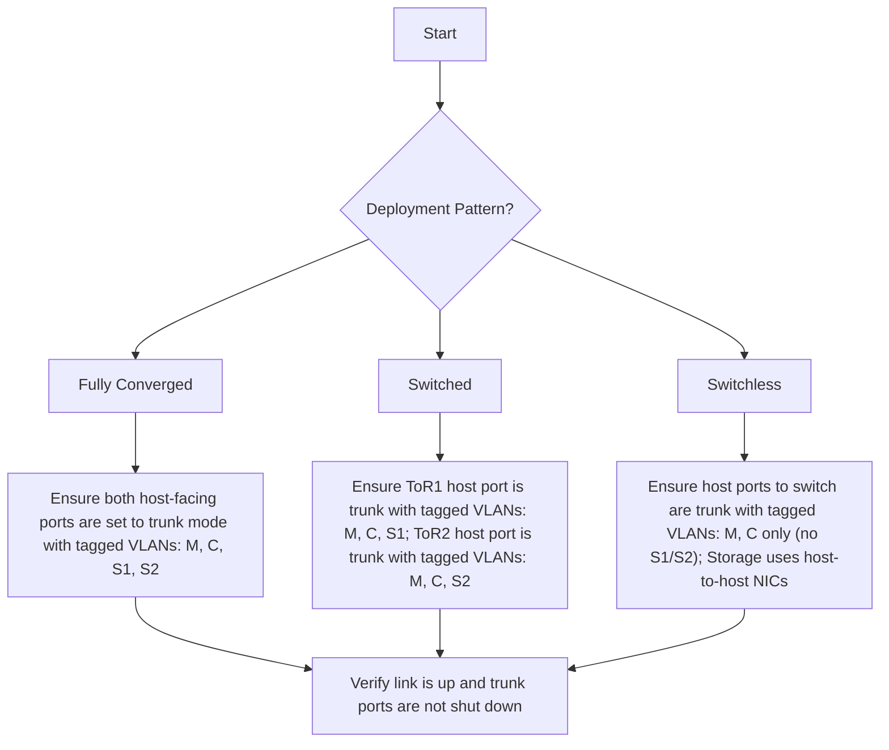
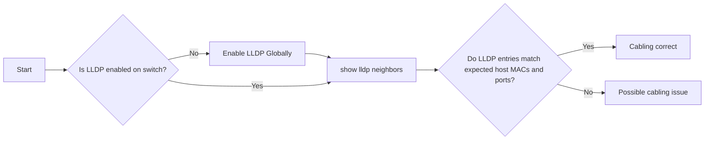
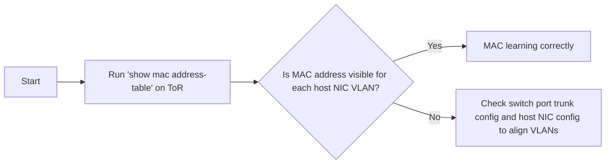

# Azure Local – Physical Network Overview & Troubleshooting Guide

_A comprehensive reference covering Azure Local physical network deployment patterns, configuration requirements, validation procedures, and troubleshooting methodologies for enterprise deployments._

---

## Table of Contents

- [1. Introduction](#1-introduction)
- [2. Deployment Patterns Overview](#2-deployment-patterns-overview)
- [3. Physical Network Hardware & Configuration Requirements](#3-physical-network-hardware--configuration-requirements)
- [4. Network Troubleshooting Methodology](#4-network-troubleshooting-methodology)
  - [4.1 Deployment Pattern & Interface Configuration Verification](#41-deployment-pattern--interface-configuration-verification)
  - [4.2 Physical Connectivity Verification](#42-physical-connectivity-verification)
  - [4.3 MAC Address Learning Verification](#43-mac-address-learning-verification)
  - [4.4 Advanced Troubleshooting](#44-advanced-troubleshooting)
- [5. Frequently Asked Questions](#5-frequently-asked-questions)
- [6. Additional Resources](#6-additional-resources)

---

## 1. Introduction

This document provides comprehensive guidance for **Azure Local physical networking**, covering deployment patterns, configuration requirements, and systematic troubleshooting methodologies. It includes practical examples, validation procedures, and frequently asked questions to support enterprise deployments.

This guide complements the official Azure Local documentation and provides practical implementation guidance for IT professionals, network architects, and system integrators working with Azure Local infrastructure.

> [!NOTE]
> This document focuses specifically on physical network infrastructure. For logical networking, SDN configuration, and advanced topics, please refer to the dedicated Azure Local documentation resources listed in the Additional Resources section.


### Key Terminology

This section defines essential terms and acronyms used throughout this document:

| Term | Definition |
|------|------------|
| **ToR (Top-of-Rack Switch)** | Physical network switch directly connected to Azure Local nodes, providing Layer 2/3 connectivity |
| **Management VLAN (M)** | Network segment dedicated to cluster management and administrative traffic |
| **Compute VLAN (C)** | Network segment for virtual machine workloads and tenant traffic |
| **Storage VLAN 1 (S1)** | Primary storage network segment for SMB over RDMA traffic |
| **Storage VLAN 2 (S2)** | Secondary storage network segment for SMB over RDMA traffic |
| **SET (Switch Embedded Teaming)** | Windows-native NIC aggregation technology providing redundancy without switch-based LACP |
| **RDMA (Remote Direct Memory Access)** | High-performance networking technology enabling direct memory-to-memory communication |
| **LLDP (Link Layer Discovery Protocol)** | IEEE 802.1AB standard for network topology discovery and cable verification |
| **PFC (Priority Flow Control)** | IEEE 802.1Qbb standard enabling lossless Ethernet for RDMA traffic |
| **ETS (Enhanced Transmission Selection)** | IEEE 802.1Qaz standard for bandwidth allocation and traffic class management |
| **DCB (Data Center Bridging)** | IEEE standards suite (PFC, ETS) enhancing Ethernet for data center environments |


---

## 2. Deployment Patterns Overview

Azure Local supports three primary physical network deployment patterns, each optimized for different use cases, scale requirements, and operational considerations. The fundamental difference between these patterns lies in how storage traffic is handled and isolated:

### Deployment Pattern Descriptions

**Switchless Deployment**
A cost-effective design optimized for smaller deployments where storage traffic flows directly between nodes without dedicated switching infrastructure. This pattern minimizes hardware requirements and is ideal for edge locations and remote sites where simplicity and cost optimization are priorities.


**Switched Deployment**  
A high-performance design utilizing dedicated NICs for management/compute and storage traffic, providing storage physical isolation. This pattern is recommended for enterprise deployments requiring maximum storage performance and dedicated bandwidth allocation for storage workloads.



**Fully Converged Deployment**
A balanced design where all traffic types (management, compute, storage) share the same physical NICs through VLAN segmentation. This pattern minimizes hardware footprint while maintaining high scalability. **Design Consistency**: Follows the same storage VLAN pattern as Switched deployment with "One Storage VLAN per TOR" as the baseline configuration to ensure RDMA traffic utilization and prevent storage traffic cross the ToR peer links.


### Deployment Pattern Comparison

| Deployment Pattern  | Host NIC Configuration | ToR Switch VLAN Configuration | Primary Use Cases |
|---------------------|------------------------|-------------------------------|-------------------|
| **Switchless** | 2 NICs to switches (M+C traffic) + (N−1) direct inter-node NICs (S traffic) | Trunk ports with M, C VLANs only; no storage VLANs on ToRs | Edge deployments, remote sites, cost-sensitive environments |
| **Switched** | 4 NICs per host: 2 for M+C traffic, 2 dedicated for storage | M and C VLANs on both ToRs; S1 VLAN exclusive to ToR1, S2 VLAN exclusive to ToR2 | Enterprise deployments requiring dedicated storage performance and traffic isolation |
| **Fully Converged** | 2 NICs per host carrying all traffic types (M+C+S) via VLAN segmentation | **Baseline**: One Storage VLAN per TOR (S1→ToR1, S2→ToR2). **Optional**: Both storage VLANs on both ToRs for enhanced resilience | General-purpose deployments balancing performance, simplicity, and hardware efficiency |

> [!NOTE]
> **Storage VLAN Configuration**: Customers can configure Storage VLANs as either **Layer 3 (L3) networks with IP subnets** or **Layer 2 (L2) networks without IP subnets**, but **we prefer L2 configuration**. With L2, it's just VLAN tagging, which makes it easy for Azure Local hosts to use any IP addresses without hardcoding subnet configurations on the switch or requiring predefined IP ranges. Since Azure Local nodes handle storage traffic tagging, ensure these VLANs are configured as **tagged VLANs on trunk ports** across all ToR switches.


---

## 3. Physical Network Hardware & Configuration Requirements

### Network Switch Requirements

Azure Local requires specific capabilities from physical network switches to ensure performance, compatibility, and integration with RDMA, SET, and VLAN-based traffic separation.

You can find the official list of switch requirements here:  
🔗 [Azure Local – Physical Network Switch Requirements](https://learn.microsoft.com/en-us/azure/azure-local/concepts/physical-network-requirements?view=azloc-2506&tabs=overview%2C24H2reqs#network-switch-requirements)

If you're an **OEM** and wish to qualify your switches for Azure Local deployments, Microsoft provides an open-source validation tool:  
🛠️ [AzureLocal-Network-Switch-Validation](https://github.com/microsoft/AzureLocal-Network-Switch-Validation)


### Network Configuration Requirements

The physical network must be configured in alignment with Azure Local’s host networking requirements, and details and official configuration guidance are available here:  
🔗 [Azure Local – Host Network Requirements](https://learn.microsoft.com/en-us/azure/azure-local/concepts/host-network-requirements)


| Requirement           | Notes                                                                 |
|------------------------|-----------------------------------------------------------------------|
| **VLAN**              | Support separate VLANs for M, C, and S networks.                    |
| **Jumbo Frames**      | MTU must support 1514–9174 bytes to enable SDN encapsulation.          |
| **DCB (PFC + ETS)**   | Required for lossless RDMA; must support IEEE 802.1Qbb and 802.1Qaz.  |
| **LLDP with TLVs**    | Switches must support LLDP with VLAN, ETS, and PFC TLVs, which will be used for network discovery and monitoring.              |
| **BGP Support**       | Required for SDN compute overlays.                                    |

> [!NOTE]
>  These are high-level requirements. Please refer to the official documentation to ensure full alignment with your specific deployment needs.

This tool is designed to automate the generation of Azure Local switch configurations based on input JSON files. In addition to automation, it includes sample configuration files that can be used as reference. The tool is actively maintained and will continue to evolve in alignment with Azure Local's latest requirements.
🔗 [AzureStack_Network_Switch_Config_Generator](https://github.com/microsoft/AzureStack_Network_Switch_Config_Generator)


---

## 4. Network Troubleshooting Methodology

This section provides systematic troubleshooting procedures for identifying and resolving common physical network issues in Azure Local environments. Follow these procedures in sequence for efficient problem isolation and resolution.

### 4.1 Deployment Pattern & Interface Configuration Verification

#### Troubleshooting Flowchart


#### Log Collection & Analysis

> [!NOTE]
> The following examples use Cisco NX-OS for reference. Please adjust the commands based on your switch vendor's CLI.

##### Interface Configuration Verification
- `show run interface <interface_name>`  
  - Verify the interface is configured in **trunk mode**
  - Confirm that required VLANs (M, C, S1, S2) are **allowed** based on the deployment pattern
  - Ensure the interface is **not shutdown** (`no shutdown`)


In this example, the Azure Local is deployed with **Switched** pattern, **7 is M, 201 is C, 711 is S1, and 712 is S2**. So the ToR1 and ToR2 Hosts-Facing ports should be configured as follows:

###### TOR1
``` console
TOR1# show run int ethernet 1/1

interface Ethernet1/1
  description Switched-Compute
  no cdp enable
  switchport
  switchport mode trunk
  switchport trunk native vlan 7
  switchport trunk allowed vlan 7,201
  spanning-tree port type edge trunk
  mtu 9216
  no logging event port link-status
  no shutdown

TOR1# show run int ethernet 1/21

interface Ethernet1/21
  description Switched-Storage
  no cdp enable
  switchport
  switchport mode trunk
  switchport trunk native vlan 99
  switchport trunk allowed vlan 711
  priority-flow-control mode on
  spanning-tree port type edge trunk
  mtu 9216
  no logging event port link-status
  service-policy type qos input AZS_SERVICES no-stats
  no shutdown

```
###### TOR2
``` console
TOR2# show run int ethernet 1/1

interface Ethernet1/1
  description Switched-Compute
  no cdp enable
  switchport
  switchport mode trunk
  switchport trunk native vlan 7
  switchport trunk allowed vlan 7,201
  spanning-tree port type edge trunk
  mtu 9216
  no logging event port link-status
  no shutdown

TOR2# show run int ethernet 1/21

interface Ethernet1/21
  description Switched-Storage
  no cdp enable
  switchport
  switchport mode trunk
  switchport trunk native vlan 99
  switchport trunk allowed vlan 712
  priority-flow-control mode on
  spanning-tree port type edge trunk
  mtu 9216
  no logging event port link-status
  service-policy type qos input AZS_SERVICES no-stats
  no shutdown
```

##### Interface Status Verification

- `show interface <interface_name>`  
  - Confirm the interface is **up and operational**
  - Check for absence of **errors**, or **drops**, especially **CRC errors**.


``` console
TOR1# show int ethernet 1/1
Ethernet1/1 is up
admin state is up, Dedicated Interface
  Hardware: 10000/25000/40000/50000/100000 Ethernet, address: 4874
.1039.e2e8 (bia 4874.1039.e2e8)
  Description: Switched-Compute
  MTU 9216 bytes, BW 100000000 Kbit , DLY 10 usec
  reliability 255/255, txload 1/255, rxload 1/255
  Encapsulation ARPA, medium is broadcast
  Port mode is trunk
  full-duplex, 100 Gb/s, media type is 100G
  Beacon is turned off
  Auto-Negotiation is turned on  FEC mode is Auto
  Input flow-control is off, output flow-control is off
  Auto-mdix is turned off
  Rate mode is dedicated
  Switchport monitor is off
  EtherType is 0x8100
  EEE (efficient-ethernet) : n/a
    admin fec state is auto, oper fec state is Rs-fec
  Last link flapped 1week(s) 1day(s)
  Last clearing of "show interface" counters never
  402 interface resets
  Load-Interval #1: 30 seconds
    30 seconds input rate 58976 bits/sec, 24 packets/sec
    30 seconds output rate 89304 bits/sec, 42 packets/sec
    input rate 58.98 Kbps, 24 pps; output rate 89.30 Kbps, 42 pps
  Load-Interval #2: 5 minute (300 seconds)
    300 seconds input rate 60440 bits/sec, 13 packets/sec
    300 seconds output rate 83152 bits/sec, 27 packets/sec
    input rate 60.44 Kbps, 13 pps; output rate 83.15 Kbps, 27 pps
  RX
    1803016069 unicast packets  1930412 multicast packets  84859 b
roadcast packets
    1805031341 input packets  1886271661338 bytes
    83702 jumbo packets  0 storm suppression bytes
    0 runts  0 giants  0 CRC  0 no buffer
    0 input error  0 short frame  0 overrun   0 underrun  0 ignore
d
    0 watchdog  0 bad etype drop  0 bad proto drop  0 if down drop
    0 input with dribble  0 input discard
    0 Rx pause
    0 Stomped CRC
  TX
    2459465706 unicast packets  389073841 multicast packets  65260
69 broadcast packets
    2855065616 output packets  3119994074289 bytes
    72934 jumbo packets
    0 output error  0 collision  0 deferred  0 late collision
    0 lost carrier  0 no carrier  0 babble  0 output discard
    0 Tx pause

```

### 4.2 Physical Connectivity Verification

#### Troubleshooting Flowchart


##### Log Collection & Analysis
- `show lldp neighbors`  
  - Verify LLDP entries match expected host MAC addresses and ports
  - Check for any discrepancies in neighbor information

###### On Azure Local Host
``` console
[Host1]: PS C:\Users\Administrator\Documents> Get-NetAdapter | select Name,MacAddress,Status

Name                                 MacAddress        Status
----                                 ----------        ------
ethernet 2                           C8-4B-D6-90-C7-E6 Up
ethernet 4                           C8-4B-D6-90-C7-E8 Up
ethernet                             C8-4B-D6-90-C7-E5 Up
ethernet 3                           C8-4B-D6-90-C7-E7 Up

```

###### On ToR Switch

``` console
# on TOR1
TOR1# show lldp neighbors
Capability codes:
  (R) Router, (B) Bridge, (T) Telephone, (C) DOCSIS Cable Device
  (W) WLAN Access Point, (P) Repeater, (S) Station, (O) Other
Device ID            Local Intf      Hold-time  Capability  Port ID
c84b.d690.c7e5       Eth1/1          30                     c84b.d690.c7e5
...
c84b.d690.c7e7       Eth1/21         30                     c84b.d690.c7e7
...

# on TOR2
TOR2# show lldp neighbors
Capability codes:
  (R) Router, (B) Bridge, (T) Telephone, (C) DOCSIS Cable Device
  (W) WLAN Access Point, (P) Repeater, (S) Station, (O) Other
Device ID            Local Intf      Hold-time  Capability  Port ID
c84b.d690.c7e6       Eth1/1          30                     c84b.d690.c7e6
...
c84b.d690.c7e8       Eth1/21         30                     c84b.d690.c7e8
...
```

So the cable mapping based on the lldp neighbors output is as follows:

| Host Name | NIC Name     | MAC Address           | Connected ToR | ToR Interface     |
|-----------|--------------|------------------------|---------------|-------------------|
| Host1     | Ethernet     | C8-4B-D6-90-C7-E5      | ToR1          | Ethernet1/1     |
| Host1     | Ethernet 2   | C8-4B-D6-90-C7-E6      | ToR2          | Ethernet1/1   |
| Host1     | Ethernet 3   | C8-4B-D6-90-C7-E7      | ToR1          | Ethernet1/21    |
| Host1     | Ethernet 4   | C8-4B-D6-90-C7-E8      | ToR2          | Ethernet1/21   |


---

### 4.3 MAC Address Learning Verification

Switches learn which MAC addresses are connected to which ports and VLANs. If a switch doesn’t learn the correct MAC for a host’s NICs, traffic won’t reach the intended host. This step ensures each host is properly connected and the network knows where to send traffic.

#### Troubleshooting Flowchart



##### Log Collection & Analysis
- `show mac address-table`  
  - Verify that the MAC addresses of each host NIC are learned on the expected VLANs
  - Check for any missing or incorrect entries

###### On Azure Local Host
``` Powershell
[Host1]: PS C:\Users\Administrator\Documents> Get-NetAdapter | ft InterfaceAlias, VlanID, MacAddress
 
InterfaceAlias VlanID MacAddress
-------------- ------ ----------
ethernet 4        712 C8-4B-D6-90-C7-E8
ethernet 3        711 C8-4B-D6-90-C7-E7
ethernet 2        0   C8-4B-D6-90-C7-E6
ethernet          0   C8-4B-D6-90-C7-E5

```

###### On ToR Switch
``` console
# On TOR1
TOR1# show mac address-table interface ethernet 1/1
Legend:
        * - primary entry, G - Gateway MAC, (R) - Routed MAC, O - Overlay MAC
        age - seconds since last seen,+ - primary entry using vPC Peer-Link,
        (T) - True, (F) - False, C - ControlPlane MAC, ~ - vsan
   VLAN     MAC Address      Type      age     Secure NTFY Ports
---------+-----------------+--------+---------+------+----+------------------
*    7     cb4b.d690.c7e5   dynamic  0         F      F    Eth1/1

TOR1# show mac address-table interface ethernet 1/21
Legend:
        * - primary entry, G - Gateway MAC, (R) - Routed MAC, O - Overlay MAC
        age - seconds since last seen,+ - primary entry using vPC Peer-Link,
        (T) - True, (F) - False, C - ControlPlane MAC, ~ - vsan
   VLAN     MAC Address      Type      age     Secure NTFY Ports
---------+-----------------+--------+---------+------+----+------------------
*  711     cb4b.d690.c7e7   dynamic  0         F      F    Eth1/21


# On TOR2
TOR2# show mac address-table interface ethernet 1/1
Legend:
        * - primary entry, G - Gateway MAC, (R) - Routed MAC, O - Overlay MAC
        age - seconds since last seen,+ - primary entry using vPC Peer-Link,
        (T) - True, (F) - False, C - ControlPlane MAC, ~ - vsan
   VLAN     MAC Address      Type      age     Secure NTFY Ports
---------+-----------------+--------+---------+------+----+------------------
*    7     cb4b.d690.c7e6   dynamic  0         F      F    Eth1/1

TOR2# show mac address-table interface ethernet 1/21
Legend:
        * - primary entry, G - Gateway MAC, (R) - Routed MAC, O - Overlay MAC
        age - seconds since last seen,+ - primary entry using vPC Peer-Link,
        (T) - True, (F) - False, C - ControlPlane MAC, ~ - vsan
   VLAN     MAC Address      Type      age     Secure NTFY Ports
---------+-----------------+--------+---------+------+----+------------------
*  712     cb4b.d690.c7e8   dynamic  0         F      F    Eth1/21
```

### 4.4 Advanced Troubleshooting

This document covers fundamental physical network troubleshooting procedures. For advanced networking topics including RDMA optimization, latency tuning, Software Defined Networking (SDN) configuration, BGP routing, MLAG implementation, and Spanning Tree Protocol troubleshooting, please refer to the dedicated technical documentation available in the Azure Local documentation library.

## 5. Frequently Asked Questions

### Q: Why does Azure Local utilize two storage networks in the design architecture? Can a single storage network be implemented instead?

**A:**  
Azure Local implements **dual storage VLANs** (typically VLAN 711 and VLAN 712) to ensure **high availability and fault tolerance** for storage traffic. The core design principle follows **"One Storage VLAN per TOR"** architecture for consistency across deployment patterns.

It’s true that **Windows SET (Switch Embedded Teaming)** provides NIC-level fault tolerance. However, **RDMA (Remote Direct Memory Access)** traffic is **tied to a specific physical NIC and its upstream switch**. If there’s only **one storage VLAN**, RDMA traffic may be forced to cross the **peer link** between the ToR switches — which is undesirable in performance-sensitive scenarios.

- In a **Fully Converged** deployment, **Network Intent with SET** is used because all VLANs (Management, Compute, Storage) must be available across the teamed NICs.

- In contrast, for a **Switched** deployment, only **Network Intent** is applied — **SET is not used** — because **storage (SMB) traffic uses dedicated RDMA NICs directly**, without teaming.


For example, in a **switched scenario**:
- If **Host1** uses **NIC1 → ToR1**
- And **Host2** uses **NIC2 → ToR2**
- Then all RDMA storage traffic between them must **cross the peer link**

```txt
          +--------+            +--------+
          |  ToR1  | <--------> |  ToR2  |
          +--------+  peer link +--------+
             |  |                  |  |
             |  |                  |  |
         +---+--+--+           +---+--+--+
         | NIC1   |           | NIC2   |
     Host1       Host2     Host1       Host2
     VLAN711     VLAN711   VLAN711     VLAN711

```

This introduces **unnecessary latency and jitter**, which can degrade RDMA performance.

By using **two storage VLANs** (e.g., 711 and 712), each mapped to separate NICs and switches, the design allows RDMA traffic to **stay local** to the switch as much as possible. Traffic only crosses the peer link **when a failover occurs**, not during normal operation.

```txt
          +--------+            +--------+
          |  ToR1  | <--------> |  ToR2  |
          +--------+  peer link +--------+
             |  |                  |  |
             |  |                  |  |
         +---+--+--+           +---+--+--+
         | NIC1   |           | NIC2   |
     Host1       Host2     Host1       Host2
     VLAN711     VLAN711   VLAN712     VLAN712

```

#### Summary:
- ✅ SET provides link-level redundancy
- ✅ Two storage VLANs ensure **RDMA-level failover** and **ToR-local communication**
- 🚫 One VLAN risks **cross-ToR RDMA**, which reduces performance

### Q: Management and Compute VLANs are allowed across the ToRs peer link. Do I also need to allow the Storage VLANs across the peer link between the two ToR switches?

**A:** 
- In a **Switched** deployment, **Storage VLANs do not need to be allowed** across the ToR peer link. Each host uses a dedicated Storage VLAN that maps to a specific ToR switch. This keeps storage traffic local, avoiding cross-ToR paths.

- In a **Fully Converged** deployment, **Storage VLANs must be allowed** on the ToR peer link. While regular storage traffic doesn’t cross ToRs, **failover scenarios** make the peer link critical.

#### Fully Converged Deployment - Baseline Configuration (Recommended)

- **TOR1**: Handles Storage VLAN 711 only  
- **TOR2**: Handles Storage VLAN 712 only  
- Host1 → NIC1 → Storage VLAN 711 → ToR1  
- Host1 → NIC2 → Storage VLAN 712 → ToR2  
- Each ToR handles its own storage traffic  
- **No need to allow Storage VLANs across the peer link**
- **Ensures consistent design pattern** and **guaranteed RDMA usage**

#### Fully Converged Deployment - Optional Enhanced Configuration

- Both Storage VLANs (711 and 712) configured on both ToRs  
- Host1 → NIC1 → ToR1 (can use either VLAN 711 or 712)  
- Host1 → NIC2 → ToR2 (can use either VLAN 711 or 712)  
- **Storage VLANs must be allowed** on the ToR peer link for failover scenarios
- **Enhanced resilience primarily benefits physical NIC failure scenarios**

**Key Considerations:**
- **Application Layer**: Storage applications only care about available SMB channels and whether they support RDMA
- **Network Layer**: Physical network provides the underlying connectivity paths
- **Failover Behavior**: If RDMA channels are unavailable, SMB will automatically fall back to standard TCP traffic
- **Two-Layer Design**: Application layer (SMB channels) operates independently of network layer (VLAN paths)
- **Additional Complexity**: Enhanced configuration increases network complexity without significant performance benefits under normal operations

#### Switched Deployment

- Host1 → NIC1 → Storage VLAN 711 → ToR1  
- Host1 → NIC2 → Storage VLAN 712 → ToR2  
- Each ToR handles its own storage traffic  
- No cross-ToR forwarding needed  
- **No need to allow Storage VLANs across the peer link**


### Q: Are **DCB (Data Center Bridging)** features like **PFC** and **ETS** needed for RDMA in Azure Local, including both **RoCEv2** and **iWARP**?

**A:**  
While **DCB features** such as **Priority Flow Control (PFC)** and **Enhanced Transmission Selection (ETS)** are not strictly required, they are **highly recommended** for both **RoCEv2** and **iWARP** to optimize RDMA performance in Azure Local environments.

Overall Comparison:

- **RoCEv2** uses **UDP**, which is fast but **cannot tolerate packet loss**.  
  → It **needs PFC** to prevent packet drops, and DCB is **required** for optimal performance.

- **iWARP** uses **TCP**, which can handle **packet loss** but is **slower**.  
  → It **doesn’t require PFC**, but enabling **DCB** can still help reduce latency.

> [!NOTE]
>  Even though **iWARP** uses reliable TCP transport and does **not mandate DCB**, enabling **PFC and ETS** can still help minimize congestion and latency, especially in mixed RDMA environments.  
> Enabling DCB across the fabric ensures **consistent, predictable low-latency** behavior for RDMA workloads.

### Q: Why can't I see the storage IP in the ARP table, while the Compute and Management IPs are visible?

**A:**
This is expected behavior in Azure Local deployments.

In the reference design, the **Storage VLAN is configured as a Layer 2 (L2) network without an IP subnet**. Storage traffic is **VLAN-tagged and handled entirely at Layer 2**, so it doesn't involve IP-based communication or ARP resolution. In contrast, **Management and Compute VLANs are Layer 3 networks** with IP addresses, which is why their entries appear in the ARP table.


## 6. Additional Resources

For comprehensive Azure Local networking guidance, refer to these official Microsoft documentation resources:

### Official Documentation
- **[Physical network requirements for Azure Local](https://learn.microsoft.com/en-us/azure/azure-local/concepts/physical-network-requirements)**  
  Complete hardware and configuration requirements for Azure Local network infrastructure

- **[Host network requirements for Azure Local](https://learn.microsoft.com/en-us/azure/azure-local/concepts/host-network-requirements)**  
  Detailed guidance for host-level networking configuration and requirements

- **[Software Defined Networking (SDN) in Azure Local](https://learn.microsoft.com/en-us/azure/azure-local/concepts/software-defined-networking-23h2)**  
  Comprehensive guide to SDN implementation and configuration in Azure Local environments