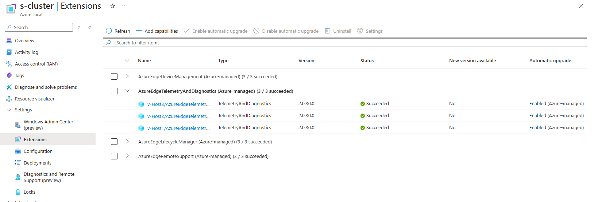

# TSG | Resolving TelemetryAndDiagnostics ARC Extension 2.0.31.0 Uninstallation Failure 
 
### Issue Description

Due to a [high memory consumption issue](./MonitoringPlatformAgent-MemoryConsumption.md) identified in **TelemetryAndDiagnostics extension version 2.0.31.0**, the extension is being rolled back to **version 2.0.30.0**. During the rollback process, the extension downgrade may fail and become stuck in one of the following states:
 
- **Uninstalling** — while attempting to remove version **2.0.31.0**
- **Installing** — while attempting to install version **2.0.30.0**
 
### Symptoms
On the Azure Portal, in the Extensions tab of the Azure Local cluster resource, the **Version** will be either 2.0.31.0 or 2.0.30.0, and the **Status** will be Failed. This TSG only needs to be done on nodes for which the Status is Failed. After using this TSG to resolve this rollback issue, the portal should look similar to this: 

### Root Cause
This issue is caused by **lingering process handles** on extension folders or binaries from either extension version. These open handles prevent the uninstall or install operations from completing successfully, which in turn blocks the downgrade proc
 
 
# Mitigation Details
In order to mitigate this issue, we must close these lingering process handles and manually trigger extension downgrade. The most straightforward way to do so is to reboot the node. If that is doable, then after rebooting, skip to step 5. However, for scenarios where the node cannot be rebooted, proceed through the mitigation steps starting from step 1.
 
1. Copy the following script somewhere onto the node: [Close-ProcessHandles.ps1](https://supportability.visualstudio.com/302ca1dd-50d9-463d-bfbc-88998bd9d1e3/_apis/git/repositories/91d6a157-e801-46e6-853a-c964171c84bd/Items?path=/.attachments/Close-ProcessHandles-ed2b075c-d138-464f-b492-884f0f9ec237.ps1&download=false&resolveLfs=true&%24format=octetStream&api-version=5.0-preview.1&sanitize=true&includeContentMetadata=true&versionDescriptor.version=wikiMaster) (You may need to rename it to "Close-ProcessHandles.ps1" if it is downloaded with a guid suffix)
2. Open a new PowerShell session to the node and navigate to the above path.
3. Unblock Close-ProcessHandles.ps1 (we need to run this command because the script is not signed):
 
```PowerShell
Unblock-File -Path ".\Close-ProcessHandles.ps1"
```
4. Execute this file **only on the affected nodes**. 

```PowerShell
$obsNugetStoreLocation = (Get-ChildItem "C:\Obs_*").Name
.\Close-ProcessHandles.ps1 -FolderPathToClean "C:\$obsNugetStoreLocation\Nugets\"
```
 
The output of the script execution will include the path of a transcript file generated by the script execution. Save this transcript file in case it is needed for further triage.
 
**Note:** On some stamps, copying a script to the node is not allowed. In that case, copy and paste the contents of the script into the PS session and execute it line by line.
 
5. Run the following commands. The output is necessary to supply variables to Connect-AzAccount
 
```Powershell
$arcInfo = & azcmagent show -j | ConvertFrom-Json
$rgName = $arcInfo.resourceGroup
$subscriptionId = $arcInfo.subscriptionId
$tenantId = $arcInfo.TenantId
$region = $arcInfo.location
```
6. Connect to Azure. For example, if using Device authentication, the command would be:
 
```Powershell
Connect-AzAccount -UseDeviceAuthentication -SubscriptionId $subscriptionId -TenantId $tenantId
```

7. After successful exection of Close-ProcessHandles.ps1 and connection to Azure, we must get the latest version of the TelemetryAndDiagnostics extension onto the node.
To get the latest extension version, we will remove the old extension and install the new one directly.
```Powershell
Remove-AzConnectedMachineExtension -ResourceGroupName $rgName -MachineName $env:COMPUTERNAME -Name "AzureEdgeTelemetryAndDiagnostics"
New-AzConnectedMachineExtension `
    -Name "AzureEdgeTelemetryAndDiagnostics" `
    -ResourceGroupName $rgName `
    -SubscriptionId $subscriptionId `
    -MachineName $($env:COMPUTERNAME) `
    -Location $region `
    -Publisher "Microsoft.AzureStack.Observability" `
    -ExtensionType "TelemetryAndDiagnostics" `
    -NoWait
 
```
 
8. To verify that the correct version of the extension has been installed, run the following command and confirm that the version is **2.0.30.0**:
```Powershell
Get-AzConnectedMachineExtension -ResourceGroupName $rgName -SubscriptionId $subscriptionId -MachineName $($env:COMPUTERNAME) -Name "AzureEdgeTelemetryAndDiagnostics"
```

<font color='red'>**If the Remove-AzConnectedMachineExtension command fails, please follow the [Excessive Memory Consumption by MonitoringPlatformAgent](./MonitoringPlatformAgent-MemoryConsumption.md) TSG to ensure you do not encounter issues with excessive Memory consumption.** </font> If step 7 succeeds, no need to do this.