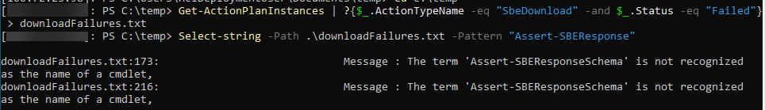

# SBE download fails on 12.2601.x initial release with `'Assert-SBEResponseSchema' is not recognized`
After deploying or updating to 12.2601.1002.38 attempts to install an SBE where it is automatically downloaded (via SBE download connector feature) will fail.

## Symptoms
At the highest level, the attempt to install an SBE-only update will report `DownloadFailed` state in Get-SolutionUpdate output and if you investigate the details of that failure you will see this as the underlying failure (perhaps as reported in the portal):

```
CloudEngine.Actions.InterfaceInvocationFailedException: Type 'SBEPartnerDownloadConnectorCheckHealth' of Role 'SBE' raised an exception:

[SBEPartnerDownloadConnectorCheckHealth]  SBE_xxx_xxxx_x.x.x.x download connector failure getting version 'x.x.x.x' files. The download connector health check failed. Exception Message : The term 'Assert-SBEResponseSchema' is not recognized as the name of a cmdlet, function, script file, or operable program. Check the spelling of the name, or if a path was included, verify that the path is correct and try again.
```
Note: as this can happen with any vendor SBE the above example has replaced partner name, SBE family, and SBE version with `xxx` entries
  
## Issue Validation
To confirm the scenario that you are encountering is the issue documented in this article, confirm the SBE download failure is caused by a failure that includes the message `The term 'Assert-SBEResponseSchema' is not recognized as the name of a cmdlet`.

### Failure/Errors seen on Portal/CLI

Will be reported as DownloadFailed by `Get-SolutionUpdate` for a SBE update for a cluster with 2601 installed.

### PowerShell script

PowerShell code to confirm/detect this issue occurred.

```Powershell
Get-ActionPlanInstances | ?{$_.ActionTypeName -eq "SbeDownload" -and $_.Status -eq "Failed"} > downloadFailures.txt

Select-string -Path .\downloadFailures.txt -Pattern "Assert-SBEResponse"
```
As shown below, if there are matches to this search there were download failures caused by this issue:


## Cause
Azure Local 12.2601.1002.38 removed a deprecated helper module from the `c:\Program Files\WindowsPowerShell\Module` directory.  This caused a regression in the SBE download actionplan which had a dependency on the `Assert-SBEResponseSchema` method from that module being auto-imported. Without that method being available the download health check fails as per the exception above.

This will be addressed in future Azure Local updates by refactoring the SBE download logic to no longer depend on this deprecated module.  

## Mitigation Details

Depending on when you become aware of this known issue different mitigation options can be used.  Choose the best option for your situation

### Option 1 - Install any pending SBE updates BEFORE updating to 2601
Since this issue is introduced by the 12.2601.1002.38 update, the problem can be avoided by installing any available SBE updates first and then updating to Azure Local 2601 second.  Since this issue will be addressed in the 12.2602 release, by installing the SBE first this will likely avoid this issue entirely (as it is unlikely that a new SBE update will be available prior to the availability of Azure Local 2602).

### Option 2 - Defer installing SBE updates until a version newer than 12.2601.1002.38 is released
Microsoft intends to patch this issue in the next release. If Get-SolutionUpdateEnvironment reports the CurrentVersion is newer than `12.2601.1002.38` then you should be able to install SBE updates without experiencing the download failure.

### Option 3 - Avoid the download by importing the SBE
If you are experiencing this issue and do not wish to wait for the next Azure Local release you can use `Add-SolutionUpdate -SkipSbeVersionValidation` to import the SBE after manually downloading the 3 SBE files from your hardware vendor. Once the SBE has imported you should be able to start the SBE update as per the normal documented process.

**Note:** Refer to your hardware vendor SBE documentation for how to download and import your SBE.  Microsoft describes the [general process for importing](https://learn.microsoft.com/en-us/azure/azure-local/update/update-via-powershell-23h2?view=azloc-2512#step-3-import-and-rediscover-updates), but some hardware vendors require additional steps (such as extracting the 3 SBE files from a larger bundle) and thus you should primarily refer to hardware vendor documentation for specific guidance. 